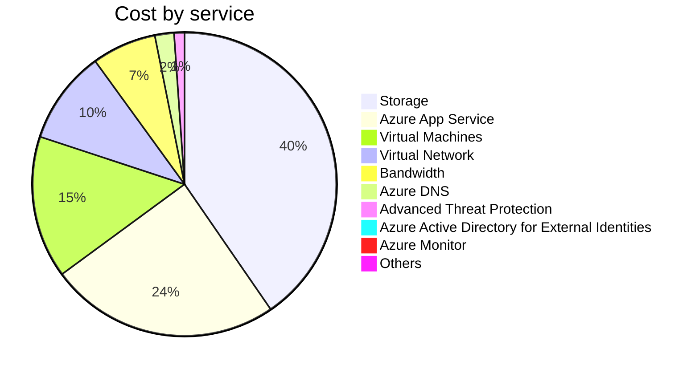

Fetching subscription details...
Fetching cost data...
Fetching forecasted cost data...
Fetching cost data by service name...
Fetching cost data by location...
Fetching cost data by resource group...
# Azure Cost Overview

> Accumulated cost for subscription id `JPF Pay-As-You-Go` from **10/01/2023** to **10/18/2023**

## Totals

|Period|Amount|
|---|---:|
|Today|0.12 USD|
|Yesterday|1.94 USD|
|Last 7 days|14.74 USD|
|Last 30 days|40.77 USD|

```mermaid
gantt
   title Accumulated cost
   dateFormat  X
   axisFormat %s
   section 01 Oct
   USD 3.83 :0, 383
   section 02 Oct
   USD 7.06 :0, 706
   section 03 Oct
   USD 9.56 :0, 956
   section 04 Oct
   USD 12.08 :0, 1208
   section 05 Oct
   USD 14.49 :0, 1449
   section 06 Oct
   USD 17.05 :0, 1705
   section 07 Oct
   USD 19.51 :0, 1951
   section 08 Oct
   USD 21.67 :0, 2167
   section 09 Oct
   USD 23.92 :0, 2392
   section 10 Oct
   USD 26.03 :0, 2603
   section 11 Oct
   USD 28.15 :0, 2815
   section 12 Oct
   USD 30.27 :0, 3027
   section 13 Oct
   USD 32.39 :0, 3239
   section 14 Oct
   USD 34.49 :0, 3449
   section 15 Oct
   USD 36.58 :0, 3658
   section 16 Oct
   USD 38.71 :0, 3871
   section 17 Oct
   USD 40.65 :0, 4065
   section 18 Oct
   USD 40.77 :0, 4077
   section 19 Oct
   USD 42.47 : done, 0, 4247
   section 20 Oct
   USD 44.06 : done, 0, 4406
   section 21 Oct
   USD 45.44 : done, 0, 4544
   section 22 Oct
   USD 46.58 : done, 0, 4658
   section 23 Oct
   USD 47.43 : done, 0, 4743
   section 24 Oct
   USD 47.93 : done, 0, 4793
   section 25 Oct
   USD 48.35 : done, 0, 4835
   section 26 Oct
   USD 49.34 : done, 0, 4934
   section 27 Oct
   USD 50.20 : done, 0, 5020
   section 28 Oct
   USD 50.86 : done, 0, 5086
   section 29 Oct
   USD 51.29 : done, 0, 5129
   section 30 Oct
   USD 51.42 : done, 0, 5142
   section 31 Oct
   USD 51.42 : done, 0, 5142
```

## By Service Name

|Service|Amount|
|---|---:|
|Storage|16.48 USD|
|Azure App Service|9.99 USD|
|Virtual Machines|6.18 USD|
|Virtual Network|4.06 USD|
|Bandwidth|2.79 USD|
|Azure DNS|0.83 USD|
|Advanced Threat Protection|0.45 USD|
|Azure Active Directory for External Identities|0.00 USD|
|Azure Monitor|0.00 USD|
|Others|0.00 USD|

## By Location

|Location|Amount|
|---|---:|
|US North Central|29.30 USD|
|US Central|10.03 USD|
|Unknown|0.83 USD|
|Unassigned|0.45 USD|
|US East|0.16 USD|
|AP East|0.00 USD|
|EU West|0.00 USD|
|US East 2|0.00 USD|
|US West 2|0.00 USD|

## By Resource Group

|Resource Group|Amount|
|---|---:|
|personal-network|29.57 USD|
|personal-site|10.03 USD|
|personal-dns|0.55 USD|
||0.45 USD|
|cloud-shell-storage-eastus|0.16 USD|
|azureapp-auto-alerts-873533-jpatrick_fulton_gmail_com|0.00 USD|

Generated at 2023-10-18 11:32:36 for subscription with id `4913be3f-a345-4652-9bba-767418dd25e3`
