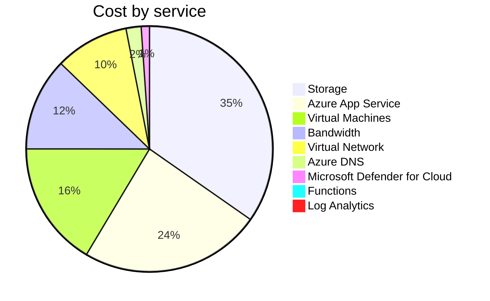

Fetching subscription details...
Fetching cost data...
Fetching forecasted cost data...
Fetching cost data by service name...
Fetching cost data by location...
Fetching cost data by resource group...
# Azure Cost Overview

> Accumulated cost for subscription id `JPF Pay-As-You-Go` from **12/01/2023** to **12/10/2023**

## Totals

|Period|Amount|
|---|---:|
|Today|0.11 USD|
|Yesterday|2.31 USD|
|Last 7 days|17.23 USD|
|Last 30 days|22.16 USD|

## By Service Name

|Service|Amount|
|---|---:|
|Storage|7.70 USD|
|Azure App Service|5.28 USD|
|Virtual Machines|3.65 USD|
|Bandwidth|2.71 USD|
|Virtual Network|2.15 USD|
|Azure DNS|0.44 USD|
|Microsoft Defender for Cloud|0.24 USD|
|Functions|0.00 USD|
|Log Analytics|0.00 USD|

## By Location

|Location|Amount|
|---|---:|
|US North Central|16.10 USD|
|US Central|5.30 USD|
|Unknown|0.44 USD|
|Unassigned|0.24 USD|
|US East|0.09 USD|
|AP East|0.00 USD|
|EU West|0.00 USD|
|US East 2|0.00 USD|
|US West 2|0.00 USD|

## By Resource Group

|Resource Group|Amount|
|---|---:|
|personal-network|16.24 USD|
|personal-site|5.30 USD|
|personal-dns|0.29 USD|
||0.24 USD|
|cloud-shell-storage-eastus|0.09 USD|

Generated at 2023-12-10 11:35:03 for subscription with id `4913be3f-a345-4652-9bba-767418dd25e3`
