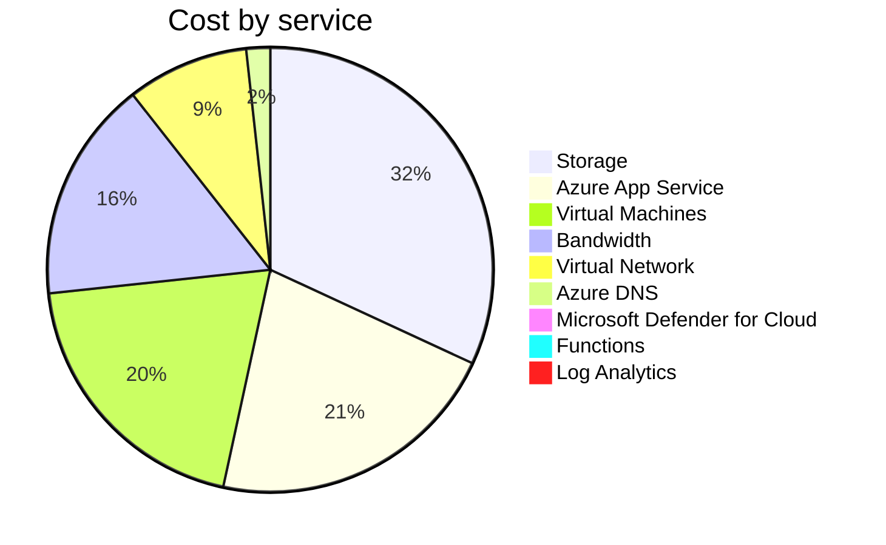
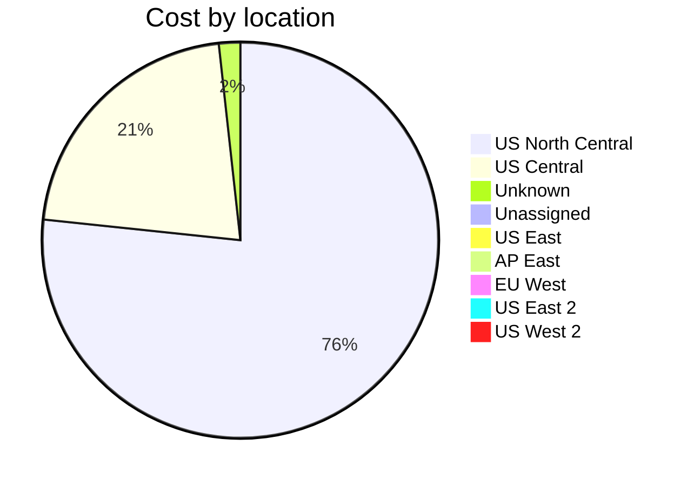
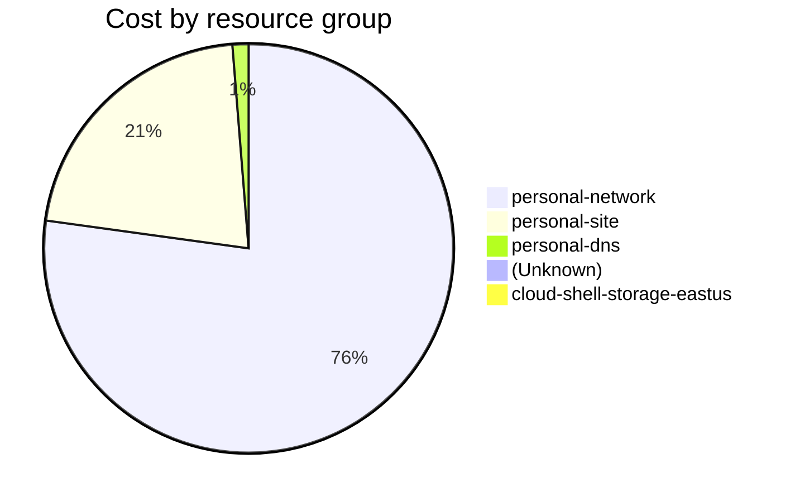

Fetching subscription details...
Fetching cost data...
Fetching forecasted cost data...
Fetching cost data by service name...
Fetching cost data by location...
Fetching cost data by resource group...
# Azure Cost Overview

> Accumulated cost for subscription id `JPF Pay-As-You-Go` from **12/01/2023** to **12/04/2023**

## Totals

|Period|Amount|
|---|---:|
|Today|0.08 USD|
|Yesterday|1.49 USD|
|Last 7 days|6.38 USD|
|Last 30 days|6.38 USD|

```mermaid
gantt
   title Accumulated cost
   dateFormat  X
   axisFormat %s
   section 01 Dec
   USD 2.36 :0, 236
   section 02 Dec
   USD 4.81 :0, 481
   section 03 Dec
   USD 6.30 :0, 630
   section 04 Dec
   USD 6.38 :0, 638
   section 05 Dec
   USD 8.91 : done, 0, 891
   section 06 Dec
   USD 11.25 : done, 0, 1125
   section 07 Dec
   USD 13.61 : done, 0, 1361
   section 08 Dec
   USD 15.94 : done, 0, 1594
   section 09 Dec
   USD 18.33 : done, 0, 1833
   section 10 Dec
   USD 20.64 : done, 0, 2064
   section 11 Dec
   USD 23.04 : done, 0, 2304
   section 12 Dec
   USD 25.55 : done, 0, 2555
   section 13 Dec
   USD 27.87 : done, 0, 2787
   section 14 Dec
   USD 30.22 : done, 0, 3022
   section 15 Dec
   USD 32.54 : done, 0, 3254
   section 16 Dec
   USD 34.91 : done, 0, 3491
   section 17 Dec
   USD 37.20 : done, 0, 3720
   section 18 Dec
   USD 39.59 : done, 0, 3959
   section 19 Dec
   USD 42.08 : done, 0, 4208
   section 20 Dec
   USD 44.39 : done, 0, 4439
   section 21 Dec
   USD 46.72 : done, 0, 4672
   section 22 Dec
   USD 49.03 : done, 0, 4903
   section 23 Dec
   USD 51.39 : done, 0, 5139
   section 24 Dec
   USD 53.67 : done, 0, 5367
   section 25 Dec
   USD 56.04 : done, 0, 5604
   section 26 Dec
   USD 58.52 : done, 0, 5852
   section 27 Dec
   USD 60.82 : done, 0, 6082
   section 28 Dec
   USD 63.13 : done, 0, 6313
   section 29 Dec
   USD 65.43 : done, 0, 6543
   section 30 Dec
   USD 67.77 : done, 0, 6777
   section 31 Dec
   USD 70.03 : done, 0, 7003
```

## By Service Name

|Service|Amount|
|---|---:|
|Storage|2.02 USD|
|Azure App Service|1.36 USD|
|Virtual Machines|1.26 USD|
|Bandwidth|1.02 USD|
|Virtual Network|0.56 USD|
|Azure DNS|0.11 USD|
|Microsoft Defender for Cloud|0.06 USD|
|Functions|0.00 USD|
|Log Analytics|0.00 USD|

## By Location

|Location|Amount|
|---|---:|
|US North Central|4.83 USD|
|US Central|1.36 USD|
|Unknown|0.11 USD|
|Unassigned|0.06 USD|
|US East|0.02 USD|
|AP East|0.00 USD|
|EU West|0.00 USD|
|US East 2|0.00 USD|
|US West 2|0.00 USD|

## By Resource Group

|Resource Group|Amount|
|---|---:|
|personal-network|4.87 USD|
|personal-site|1.36 USD|
|personal-dns|0.08 USD|
||0.06 USD|
|cloud-shell-storage-eastus|0.02 USD|

Generated at 2023-12-04 11:35:24 for subscription with id `4913be3f-a345-4652-9bba-767418dd25e3`
