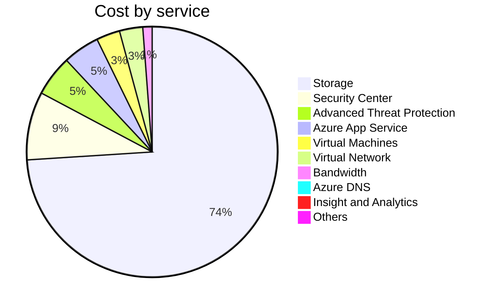

Fetching subscription details...
Fetching cost data...
Fetching forecasted cost data...
Fetching cost data by service name...
Fetching cost data by location...
Fetching cost data by resource group...
# Azure Cost Overview

> Accumulated cost for subscription id `JPF Pay-As-You-Go` from **09/01/2023** to **09/19/2023**

## Totals

|Period|Amount|
|---|---:|
|Today|0.12 USD|
|Yesterday|14.48 USD|
|Last 7 days|157.81 USD|
|Last 30 days|225.66 USD|

```mermaid
gantt
   title Accumulated cost
   dateFormat  X
   axisFormat %s
   section 01 Sep
   USD 6.35 :0, 635
   section 02 Sep
   USD 12.48 :0, 1248
   section 03 Sep
   USD 18.76 :0, 1876
   section 04 Sep
   USD 24.93 :0, 2493
   section 05 Sep
   USD 31.24 :0, 3124
   section 06 Sep
   USD 37.37 :0, 3737
   section 07 Sep
   USD 43.61 :0, 4361
   section 08 Sep
   USD 49.87 :0, 4987
   section 09 Sep
   USD 56.00 :0, 5600
   section 10 Sep
   USD 61.91 :0, 6191
   section 11 Sep
   USD 67.84 :0, 6784
   section 12 Sep
   USD 81.11 :0, 8111
   section 13 Sep
   USD 127.92 :0, 12792
   section 14 Sep
   USD 163.01 :0, 16301
   section 15 Sep
   USD 169.25 :0, 16925
   section 16 Sep
   USD 182.94 :0, 18294
   section 17 Sep
   USD 211.06 :0, 21106
   section 18 Sep
   USD 225.54 :0, 22554
   section 19 Sep
   USD 225.66 :0, 22566
   section 20 Sep
   USD 245.34 : done, 0, 24534
   section 21 Sep
   USD 265.60 : done, 0, 26560
   section 22 Sep
   USD 286.46 : done, 0, 28646
   section 23 Sep
   USD 308.01 : done, 0, 30801
   section 24 Sep
   USD 330.01 : done, 0, 33001
   section 25 Sep
   USD 352.46 : done, 0, 35246
   section 26 Sep
   USD 375.54 : done, 0, 37554
   section 27 Sep
   USD 399.25 : done, 0, 39925
   section 28 Sep
   USD 423.55 : done, 0, 42355
   section 29 Sep
   USD 448.45 : done, 0, 44845
   section 30 Sep
   USD 474.03 : done, 0, 47403
```

## By Service Name

|Service|Amount|
|---|---:|
|Storage|166.28 USD|
|Security Center|19.78 USD|
|Advanced Threat Protection|11.83 USD|
|Azure App Service|10.60 USD|
|Virtual Machines|6.84 USD|
|Virtual Network|6.74 USD|
|Bandwidth|2.69 USD|
|Azure DNS|0.87 USD|
|Insight and Analytics|0.00 USD|
|Others|0.00 USD|

## By Location

|Location|Amount|
|---|---:|
|US North Central|186.01 USD|
|US Central|21.45 USD|
|Unassigned|11.74 USD|
|US East|5.57 USD|
|Unknown|0.87 USD|
|AP East|0.00 USD|
|EU West|0.00 USD|
|Intercontinental|0.00 USD|
|US East 2|0.00 USD|
|Others|0.00 USD|

## By Resource Group

|Resource Group|Amount|
|---|---:|
|personal-network|186.30 USD|
|personal-site|21.45 USD|
||11.74 USD|
|cloud-shell-storage-eastus|5.57 USD|
|personal-dns|0.59 USD|
|defaultresourcegroup-ncus|0.00 USD|
|azureapp-auto-alerts-873533-jpatrick_fulton_gmail_com|0.00 USD|

Generated at 2023-09-19 11:44:09 for subscription with id `4913be3f-a345-4652-9bba-767418dd25e3`
