Fetching subscription details...
Fetching cost data...
Fetching forecasted cost data...
Fetching cost data by service name...
Fetching cost data by location...
Fetching cost data by resource group...
# Azure Cost Overview

> Accumulated cost for subscription id `JPF Pay-As-You-Go` from **06/01/2024** to **06/28/2024**

## Totals

|Period|Amount|
|---|---:|
|Today|0.00 USD|
|Yesterday|0.56 USD|
|Last 7 days|4.38 USD|
|Last 30 days|17.74 USD|

```mermaid
gantt
   title Accumulated cost
   dateFormat  X
   axisFormat %s
   section 01 Jun
   USD 0.64 :0, 64
   section 02 Jun
   USD 1.27 :0, 127
   section 03 Jun
   USD 1.91 :0, 191
   section 04 Jun
   USD 2.55 :0, 255
   section 05 Jun
   USD 3.18 :0, 318
   section 06 Jun
   USD 3.82 :0, 382
   section 07 Jun
   USD 4.46 :0, 446
   section 08 Jun
   USD 5.09 :0, 509
   section 09 Jun
   USD 5.73 :0, 573
   section 10 Jun
   USD 6.37 :0, 637
   section 11 Jun
   USD 7.00 :0, 700
   section 12 Jun
   USD 7.64 :0, 764
   section 13 Jun
   USD 8.28 :0, 828
   section 14 Jun
   USD 8.91 :0, 891
   section 15 Jun
   USD 9.55 :0, 955
   section 16 Jun
   USD 10.19 :0, 1019
   section 17 Jun
   USD 10.82 :0, 1082
   section 18 Jun
   USD 11.46 :0, 1146
   section 19 Jun
   USD 12.09 :0, 1209
   section 20 Jun
   USD 12.73 :0, 1273
   section 21 Jun
   USD 13.37 :0, 1337
   section 22 Jun
   USD 14.00 :0, 1400
   section 23 Jun
   USD 14.64 :0, 1464
   section 24 Jun
   USD 15.28 :0, 1528
   section 25 Jun
   USD 15.91 :0, 1591
   section 26 Jun
   USD 16.55 :0, 1655
   section 27 Jun
   USD 17.19 :0, 1719
   section 28 Jun
   USD 17.74 :0, 1774
   section 29 Jun
   USD 18.38 : done, 0, 1838
   section 30 Jun
   USD 19.02 : done, 0, 1902
```

## By Service Name

|Service|Amount|
|---|---:|
|Azure App Service|16.50 USD|
|Azure DNS|0.92 USD|
|Storage|0.33 USD|
|Bandwidth|0.00 USD|
|Functions|0.00 USD|
|Log Analytics|0.00 USD|

## By Location

|Location|Amount|
|---|---:|
|US Central|16.55 USD|
|Unknown|0.92 USD|
|US East|0.28 USD|
|AP East|0.00 USD|
|EU West|0.00 USD|
|US East 2|0.00 USD|
|US West 2|0.00 USD|

## By Resource Group

|Resource Group|Amount|
|---|---:|
|personal-site|16.55 USD|
|personal-dns|0.92 USD|
|cloud-shell-storage-eastus|0.28 USD|

Generated at 2024-06-29 11:23:16 for subscription with id `4913be3f-a345-4652-9bba-767418dd25e3`
