Fetching subscription details...
Fetching cost data...
Fetching forecasted cost data...
Fetching cost data by service name...
Fetching cost data by location...
Fetching cost data by resource group...
# Azure Cost Overview

> Accumulated cost for subscription id `JPF Pay-As-You-Go` from **05/01/2024** to **05/18/2024**

## Totals

|Period|Amount|
|---|---:|
|Today|0.00 USD|
|Yesterday|0.56 USD|
|Last 7 days|4.37 USD|
|Last 30 days|11.40 USD|

```mermaid
gantt
   title Accumulated cost
   dateFormat  X
   axisFormat %s
   section 01 May
   USD 0.64 :0, 64
   section 02 May
   USD 1.27 :0, 127
   section 03 May
   USD 1.91 :0, 191
   section 04 May
   USD 2.55 :0, 255
   section 05 May
   USD 3.19 :0, 319
   section 06 May
   USD 3.82 :0, 382
   section 07 May
   USD 4.46 :0, 446
   section 08 May
   USD 5.09 :0, 509
   section 09 May
   USD 5.75 :0, 575
   section 10 May
   USD 6.39 :0, 639
   section 11 May
   USD 7.03 :0, 703
   section 12 May
   USD 7.66 :0, 766
   section 13 May
   USD 8.30 :0, 830
   section 14 May
   USD 8.93 :0, 893
   section 15 May
   USD 9.57 :0, 957
   section 16 May
   USD 10.20 :0, 1020
   section 17 May
   USD 10.84 :0, 1084
   section 18 May
   USD 11.40 :0, 1140
   section 19 May
   USD 12.04 : done, 0, 1204
   section 20 May
   USD 12.67 : done, 0, 1267
   section 21 May
   USD 13.31 : done, 0, 1331
   section 22 May
   USD 13.95 : done, 0, 1395
   section 23 May
   USD 14.58 : done, 0, 1458
   section 24 May
   USD 15.22 : done, 0, 1522
   section 25 May
   USD 15.86 : done, 0, 1586
   section 26 May
   USD 16.50 : done, 0, 1650
   section 27 May
   USD 17.14 : done, 0, 1714
   section 28 May
   USD 17.77 : done, 0, 1777
   section 29 May
   USD 18.41 : done, 0, 1841
   section 30 May
   USD 19.05 : done, 0, 1905
   section 31 May
   USD 19.69 : done, 0, 1969
```

## By Service Name

|Service|Amount|
|---|---:|
|Azure App Service|10.60 USD|
|Azure DNS|0.59 USD|
|Storage|0.21 USD|
|Bandwidth|0.00 USD|
|Functions|0.00 USD|
|Log Analytics|0.00 USD|

## By Location

|Location|Amount|
|---|---:|
|US Central|10.63 USD|
|Unknown|0.59 USD|
|US East|0.17 USD|
|AP East|0.00 USD|
|EU West|0.00 USD|
|US East 2|0.00 USD|
|US West 2|0.00 USD|

## By Resource Group

|Resource Group|Amount|
|---|---:|
|personal-site|10.63 USD|
|personal-dns|0.59 USD|
|cloud-shell-storage-eastus|0.17 USD|

Generated at 2024-05-19 11:23:58 for subscription with id `4913be3f-a345-4652-9bba-767418dd25e3`
