Fetching subscription details...
Fetching cost data...
Fetching forecasted cost data...
Fetching cost data by service name...
Fetching cost data by location...
Fetching cost data by resource group...
# Azure Cost Overview

> Accumulated cost for subscription id `JPF Pay-As-You-Go` from **02/01/2024** to **02/21/2024**

## Totals

|Period|Amount|
|---|---:|
|Today|0.00 USD|
|Yesterday|2.01 USD|
|Last 7 days|15.74 USD|
|Last 30 days|54.98 USD|

```mermaid
gantt
   title Accumulated cost
   dateFormat  X
   axisFormat %s
   section 01 Feb
   USD 2.99 :0, 299
   section 02 Feb
   USD 6.68 :0, 668
   section 03 Feb
   USD 9.81 :0, 981
   section 04 Feb
   USD 12.83 :0, 1283
   section 05 Feb
   USD 15.90 :0, 1590
   section 06 Feb
   USD 18.73 :0, 1873
   section 07 Feb
   USD 21.64 :0, 2164
   section 08 Feb
   USD 25.07 :0, 2507
   section 09 Feb
   USD 27.83 :0, 2783
   section 10 Feb
   USD 30.22 :0, 3022
   section 11 Feb
   USD 32.38 :0, 3238
   section 12 Feb
   USD 34.52 :0, 3452
   section 13 Feb
   USD 36.92 :0, 3692
   section 14 Feb
   USD 39.24 :0, 3924
   section 15 Feb
   USD 41.52 :0, 4152
   section 16 Feb
   USD 43.89 :0, 4389
   section 17 Feb
   USD 46.11 :0, 4611
   section 18 Feb
   USD 48.39 :0, 4839
   section 19 Feb
   USD 50.66 :0, 5066
   section 20 Feb
   USD 52.97 :0, 5297
   section 21 Feb
   USD 54.98 :0, 5498
   section 22 Feb
   USD 57.36 : done, 0, 5736
   section 23 Feb
   USD 59.88 : done, 0, 5988
   section 24 Feb
   USD 62.17 : done, 0, 6217
   section 25 Feb
   USD 64.22 : done, 0, 6422
   section 26 Feb
   USD 65.94 : done, 0, 6594
   section 27 Feb
   USD 68.19 : done, 0, 6819
   section 28 Feb
   USD 70.11 : done, 0, 7011
   section 29 Feb
   USD 72.28 : done, 0, 7228
```

## By Service Name

|Service|Amount|
|---|---:|
|Storage|19.34 USD|
|Azure App Service|12.38 USD|
|Bandwidth|9.49 USD|
|Virtual Machines|7.21 USD|
|Virtual Network|5.03 USD|
|Azure DNS|1.03 USD|
|Microsoft Defender for Cloud|0.50 USD|
|Azure Monitor|0.00 USD|
|Functions|0.00 USD|
|Log Analytics|0.00 USD|

## By Location

|Location|Amount|
|---|---:|
|US North Central|40.81 USD|
|US Central|12.43 USD|
|Unknown|1.03 USD|
|Unassigned|0.50 USD|
|US East|0.22 USD|
|AP East|0.00 USD|
|EU West|0.00 USD|
|US East 2|0.00 USD|
|US West|0.00 USD|
|US West 2|0.00 USD|

## By Resource Group

|Resource Group|Amount|
|---|---:|
|personal-network|41.14 USD|
|personal-site|12.43 USD|
|personal-dns|0.69 USD|
||0.50 USD|
|cloud-shell-storage-eastus|0.22 USD|
|azureapp-auto-alerts-873533-jpatrick_fulton_gmail_com|0.00 USD|

Generated at 2024-02-22 11:34:27 for subscription with id `4913be3f-a345-4652-9bba-767418dd25e3`
