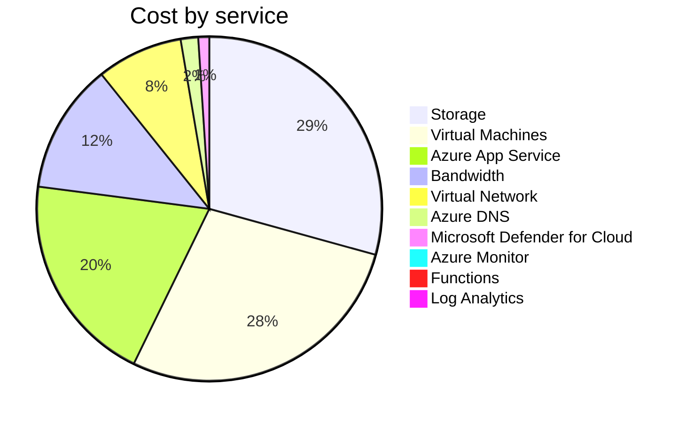
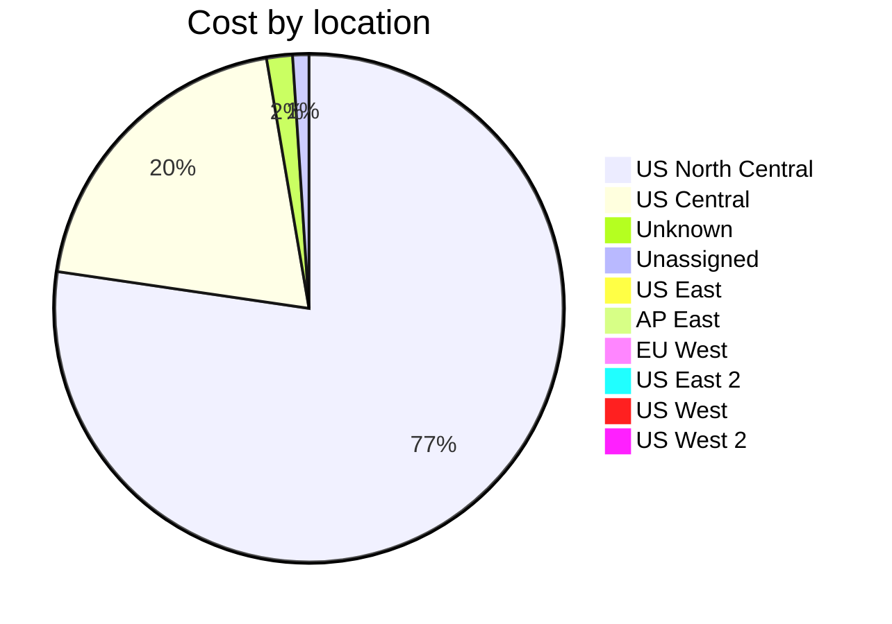
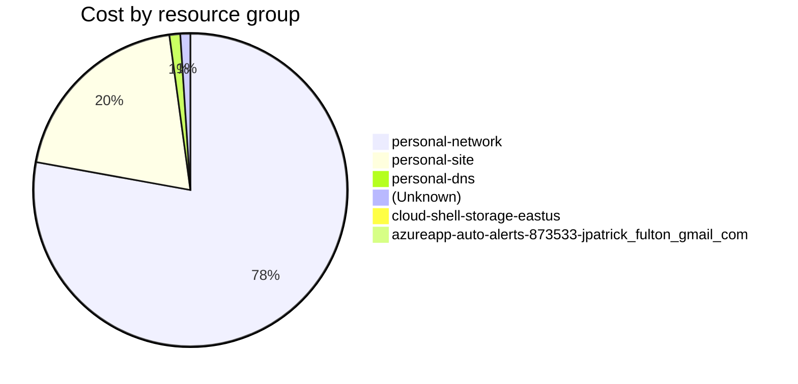

Fetching subscription details...
Fetching cost data...
Fetching forecasted cost data...
Fetching cost data by service name...
Fetching cost data by location...
Fetching cost data by resource group...
# Azure Cost Overview

> Accumulated cost for subscription id `JPF Pay-As-You-Go` from **01/01/2024** to **01/22/2024**

## Totals

|Period|Amount|
|---|---:|
|Today|0.07 USD|
|Yesterday|2.59 USD|
|Last 7 days|20.12 USD|
|Last 30 days|62.20 USD|

```mermaid
gantt
   title Accumulated cost
   dateFormat  X
   axisFormat %s
   section 01 Jan
   USD 3.09 :0, 309
   section 02 Jan
   USD 6.64 :0, 664
   section 03 Jan
   USD 9.52 :0, 952
   section 04 Jan
   USD 12.53 :0, 1253
   section 05 Jan
   USD 15.55 :0, 1555
   section 06 Jan
   USD 18.88 :0, 1888
   section 07 Jan
   USD 21.71 :0, 2171
   section 08 Jan
   USD 25.20 :0, 2520
   section 09 Jan
   USD 28.21 :0, 2821
   section 10 Jan
   USD 30.88 :0, 3088
   section 11 Jan
   USD 33.67 :0, 3367
   section 12 Jan
   USD 36.46 :0, 3646
   section 13 Jan
   USD 39.49 :0, 3949
   section 14 Jan
   USD 42.08 :0, 4208
   section 15 Jan
   USD 44.73 :0, 4473
   section 16 Jan
   USD 47.92 :0, 4792
   section 17 Jan
   USD 50.80 :0, 5080
   section 18 Jan
   USD 53.63 :0, 5363
   section 19 Jan
   USD 56.47 :0, 5647
   section 20 Jan
   USD 59.54 :0, 5954
   section 21 Jan
   USD 62.13 :0, 6213
   section 22 Jan
   USD 62.20 :0, 6220
   section 23 Jan
   USD 65.42 : done, 0, 6542
   section 24 Jan
   USD 68.32 : done, 0, 6832
   section 25 Jan
   USD 71.26 : done, 0, 7126
   section 26 Jan
   USD 74.30 : done, 0, 7430
   section 27 Jan
   USD 77.51 : done, 0, 7751
   section 28 Jan
   USD 80.37 : done, 0, 8037
   section 29 Jan
   USD 83.39 : done, 0, 8339
   section 30 Jan
   USD 86.65 : done, 0, 8665
   section 31 Jan
   USD 89.59 : done, 0, 8959
```

## By Service Name

|Service|Amount|
|---|---:|
|Storage|18.22 USD|
|Virtual Machines|17.36 USD|
|Azure App Service|12.35 USD|
|Bandwidth|7.58 USD|
|Virtual Network|5.02 USD|
|Azure DNS|1.02 USD|
|Microsoft Defender for Cloud|0.64 USD|
|Azure Monitor|0.00 USD|
|Functions|0.00 USD|
|Log Analytics|0.00 USD|

## By Location

|Location|Amount|
|---|---:|
|US North Central|47.93 USD|
|US Central|12.40 USD|
|Unknown|1.02 USD|
|Unassigned|0.64 USD|
|US East|0.20 USD|
|AP East|0.00 USD|
|EU West|0.00 USD|
|US East 2|0.00 USD|
|US West|0.00 USD|
|US West 2|0.00 USD|

## By Resource Group

|Resource Group|Amount|
|---|---:|
|personal-network|48.27 USD|
|personal-site|12.40 USD|
|personal-dns|0.69 USD|
||0.64 USD|
|cloud-shell-storage-eastus|0.20 USD|
|azureapp-auto-alerts-873533-jpatrick_fulton_gmail_com|0.00 USD|

Generated at 2024-01-22 11:36:36 for subscription with id `4913be3f-a345-4652-9bba-767418dd25e3`
