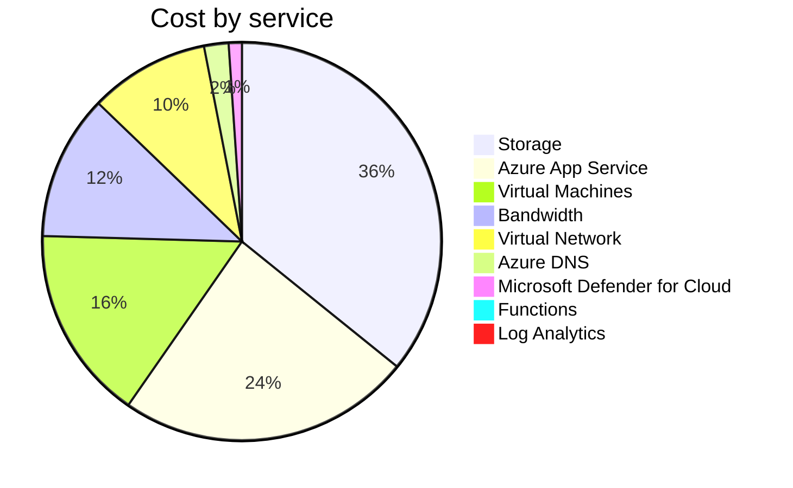
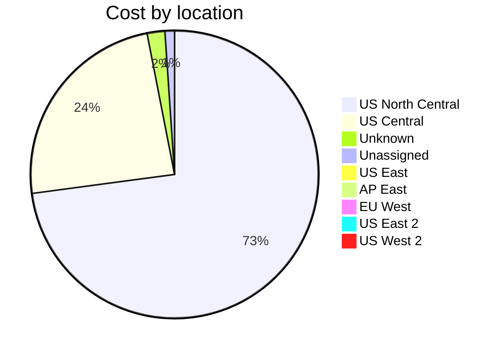

Fetching subscription details...
Fetching cost data...
Fetching forecasted cost data...
Fetching cost data by service name...
Fetching cost data by location...
Fetching cost data by resource group...
# Azure Cost Overview

> Accumulated cost for subscription id `JPF Pay-As-You-Go` from **11/01/2023** to **11/09/2023**

## Totals

|Period|Amount|
|---|---:|
|Today|0.10 USD|
|Yesterday|2.39 USD|
|Last 7 days|17.14 USD|
|Last 30 days|19.63 USD|

```mermaid
gantt
   title Accumulated cost
   dateFormat  X
   axisFormat %s
   section 01 Nov
   USD 2.49 :0, 249
   section 02 Nov
   USD 4.85 :0, 485
   section 03 Nov
   USD 7.48 :0, 748
   section 04 Nov
   USD 9.92 :0, 992
   section 05 Nov
   USD 12.29 :0, 1229
   section 06 Nov
   USD 14.75 :0, 1475
   section 07 Nov
   USD 17.14 :0, 1714
   section 08 Nov
   USD 19.53 :0, 1953
   section 09 Nov
   USD 19.63 :0, 1963
   section 10 Nov
   USD 22.18 : done, 0, 2218
   section 11 Nov
   USD 24.54 : done, 0, 2454
   section 12 Nov
   USD 26.75 : done, 0, 2675
   section 13 Nov
   USD 29.16 : done, 0, 2916
   section 14 Nov
   USD 31.59 : done, 0, 3159
   section 15 Nov
   USD 34.05 : done, 0, 3405
   section 16 Nov
   USD 36.50 : done, 0, 3650
   section 17 Nov
   USD 39.04 : done, 0, 3904
   section 18 Nov
   USD 41.39 : done, 0, 4139
   section 19 Nov
   USD 43.60 : done, 0, 4360
   section 20 Nov
   USD 46.01 : done, 0, 4601
   section 21 Nov
   USD 48.43 : done, 0, 4843
   section 22 Nov
   USD 50.88 : done, 0, 5088
   section 23 Nov
   USD 53.32 : done, 0, 5332
   section 24 Nov
   USD 55.86 : done, 0, 5586
   section 25 Nov
   USD 58.21 : done, 0, 5821
   section 26 Nov
   USD 60.41 : done, 0, 6041
   section 27 Nov
   USD 62.81 : done, 0, 6281
   section 28 Nov
   USD 65.22 : done, 0, 6522
   section 29 Nov
   USD 67.67 : done, 0, 6767
   section 30 Nov
   USD 70.10 : done, 0, 7010
```

## By Service Name

|Service|Amount|
|---|---:|
|Storage|7.03 USD|
|Azure App Service|4.68 USD|
|Virtual Machines|3.10 USD|
|Bandwidth|2.31 USD|
|Virtual Network|1.91 USD|
|Azure DNS|0.39 USD|
|Microsoft Defender for Cloud|0.21 USD|
|Functions|0.00 USD|
|Log Analytics|0.00 USD|

## By Location

|Location|Amount|
|---|---:|
|US North Central|14.25 USD|
|US Central|4.70 USD|
|Unknown|0.39 USD|
|Unassigned|0.21 USD|
|US East|0.08 USD|
|AP East|0.00 USD|
|EU West|0.00 USD|
|US East 2|0.00 USD|
|US West 2|0.00 USD|

## By Resource Group

|Resource Group|Amount|
|---|---:|
|personal-network|14.37 USD|
|personal-site|4.70 USD|
|personal-dns|0.26 USD|
||0.21 USD|
|cloud-shell-storage-eastus|0.08 USD|

Generated at 2023-11-09 11:35:27 for subscription with id `4913be3f-a345-4652-9bba-767418dd25e3`
