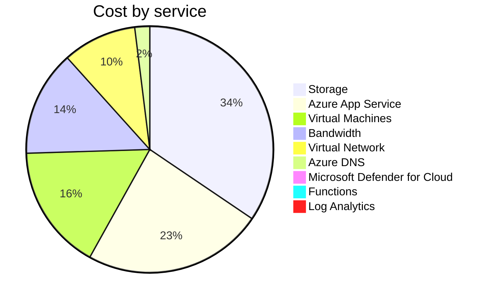
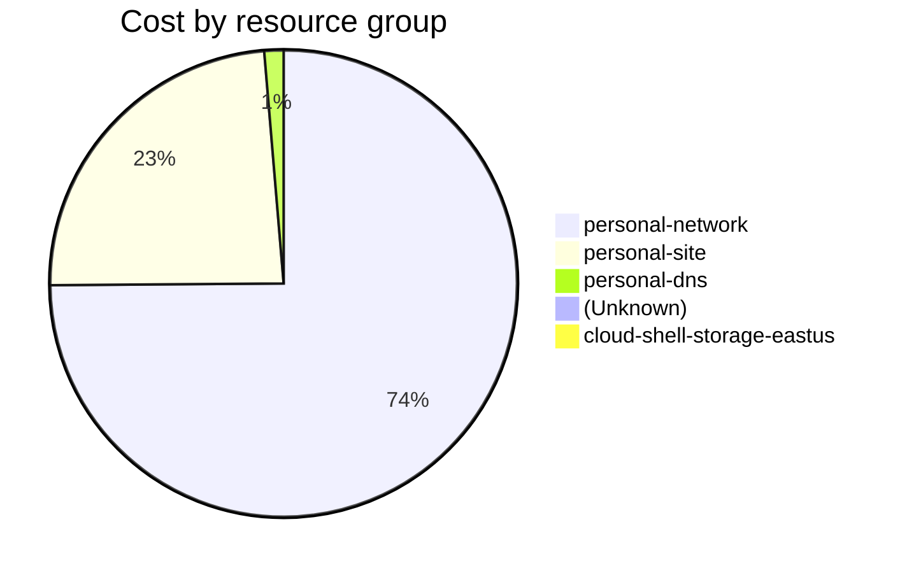

Fetching subscription details...
Fetching cost data...
Fetching forecasted cost data...
Fetching cost data by service name...
Fetching cost data by location...
Fetching cost data by resource group...
# Azure Cost Overview

> Accumulated cost for subscription id `JPF Pay-As-You-Go` from **12/01/2023** to **12/08/2023**

## Totals

|Period|Amount|
|---|---:|
|Today|0.10 USD|
|Yesterday|2.37 USD|
|Last 7 days|17.52 USD|
|Last 30 days|17.52 USD|

```mermaid
gantt
   title Accumulated cost
   dateFormat  X
   axisFormat %s
   section 01 Dec
   USD 2.41 :0, 241
   section 02 Dec
   USD 4.91 :0, 491
   section 03 Dec
   USD 7.75 :0, 775
   section 04 Dec
   USD 10.01 :0, 1001
   section 05 Dec
   USD 12.23 :0, 1223
   section 06 Dec
   USD 15.06 :0, 1506
   section 07 Dec
   USD 17.42 :0, 1742
   section 08 Dec
   USD 17.52 :0, 1752
   section 09 Dec
   USD 20.02 : done, 0, 2002
   section 10 Dec
   USD 22.51 : done, 0, 2251
   section 11 Dec
   USD 24.96 : done, 0, 2496
   section 12 Dec
   USD 27.56 : done, 0, 2756
   section 13 Dec
   USD 30.07 : done, 0, 3007
   section 14 Dec
   USD 32.57 : done, 0, 3257
   section 15 Dec
   USD 35.07 : done, 0, 3507
   section 16 Dec
   USD 37.58 : done, 0, 3758
   section 17 Dec
   USD 40.09 : done, 0, 4009
   section 18 Dec
   USD 42.55 : done, 0, 4255
   section 19 Dec
   USD 45.17 : done, 0, 4517
   section 20 Dec
   USD 47.69 : done, 0, 4769
   section 21 Dec
   USD 50.21 : done, 0, 5021
   section 22 Dec
   USD 52.72 : done, 0, 5272
   section 23 Dec
   USD 55.25 : done, 0, 5525
   section 24 Dec
   USD 57.77 : done, 0, 5777
   section 25 Dec
   USD 60.24 : done, 0, 6024
   section 26 Dec
   USD 62.87 : done, 0, 6287
   section 27 Dec
   USD 65.41 : done, 0, 6541
   section 28 Dec
   USD 67.94 : done, 0, 6794
   section 29 Dec
   USD 70.47 : done, 0, 7047
   section 30 Dec
   USD 73.01 : done, 0, 7301
   section 31 Dec
   USD 75.55 : done, 0, 7555
```

## By Service Name

|Service|Amount|
|---|---:|
|Storage|5.98 USD|
|Azure App Service|4.09 USD|
|Virtual Machines|2.85 USD|
|Bandwidth|2.40 USD|
|Virtual Network|1.68 USD|
|Azure DNS|0.34 USD|
|Microsoft Defender for Cloud|0.17 USD|
|Functions|0.00 USD|
|Log Analytics|0.00 USD|

## By Location

|Location|Amount|
|---|---:|
|US North Central|12.83 USD|
|US Central|4.11 USD|
|Unknown|0.34 USD|
|Unassigned|0.17 USD|
|US East|0.07 USD|
|AP East|0.00 USD|
|EU West|0.00 USD|
|US East 2|0.00 USD|
|US West 2|0.00 USD|

## By Resource Group

|Resource Group|Amount|
|---|---:|
|personal-network|12.94 USD|
|personal-site|4.11 USD|
|personal-dns|0.23 USD|
||0.17 USD|
|cloud-shell-storage-eastus|0.07 USD|

Generated at 2023-12-08 11:34:31 for subscription with id `4913be3f-a345-4652-9bba-767418dd25e3`
