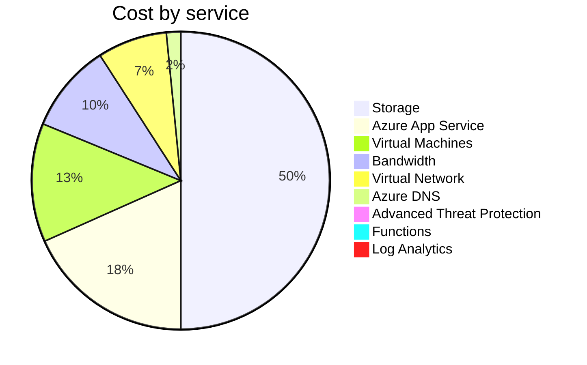
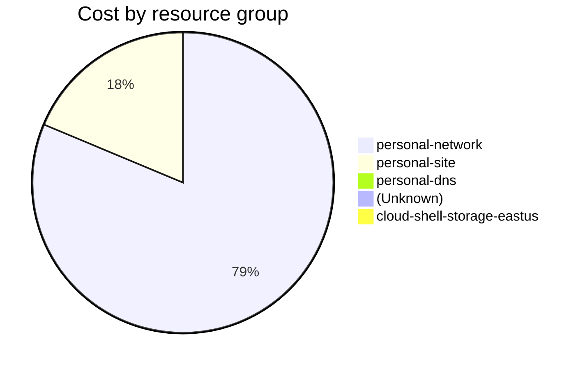

Fetching subscription details...
Fetching cost data...
Fetching forecasted cost data...
Fetching cost data by service name...
Fetching cost data by location...
Fetching cost data by resource group...
# Azure Cost Overview

> Accumulated cost for subscription id `JPF Pay-As-You-Go` from **10/01/2023** to **10/04/2023**

## Totals

|Period|Amount|
|---|---:|
|Today|0.09 USD|
|Yesterday|2.04 USD|
|Last 7 days|9.09 USD|
|Last 30 days|9.09 USD|

```mermaid
gantt
   title Accumulated cost
   dateFormat  X
   axisFormat %s
   section 01 Oct
   USD 3.77 :0, 377
   section 02 Oct
   USD 6.96 :0, 696
   section 03 Oct
   USD 9.00 :0, 900
   section 04 Oct
   USD 9.09 :0, 909
   section 05 Oct
   USD 13.18 : done, 0, 1318
   section 06 Oct
   USD 17.31 : done, 0, 1731
   section 07 Oct
   USD 20.66 : done, 0, 2066
   section 08 Oct
   USD 24.91 : done, 0, 2491
   section 09 Oct
   USD 28.97 : done, 0, 2897
   section 10 Oct
   USD 36.48 : done, 0, 3648
   section 11 Oct
   USD 38.88 : done, 0, 3888
   section 12 Oct
   USD 41.21 : done, 0, 4121
   section 13 Oct
   USD 43.58 : done, 0, 4358
   section 14 Oct
   USD 45.17 : done, 0, 4517
   section 15 Oct
   USD 47.66 : done, 0, 4766
   section 16 Oct
   USD 49.96 : done, 0, 4996
   section 17 Oct
   USD 55.70 : done, 0, 5570
   section 18 Oct
   USD 56.35 : done, 0, 5635
   section 19 Oct
   USD 56.91 : done, 0, 5691
   section 20 Oct
   USD 57.52 : done, 0, 5752
   section 21 Oct
   USD 57.52 : done, 0, 5752
   section 22 Oct
   USD 58.26 : done, 0, 5826
   section 23 Oct
   USD 58.79 : done, 0, 5879
   section 24 Oct
   USD 62.77 : done, 0, 6277
   section 25 Oct
   USD 62.77 : done, 0, 6277
   section 26 Oct
   USD 62.77 : done, 0, 6277
   section 27 Oct
   USD 62.77 : done, 0, 6277
   section 28 Oct
   USD 62.77 : done, 0, 6277
   section 29 Oct
   USD 62.77 : done, 0, 6277
   section 30 Oct
   USD 62.77 : done, 0, 6277
   section 31 Oct
   USD 64.99 : done, 0, 6499
```

## By Service Name

|Service|Amount|
|---|---:|
|Storage|4.50 USD|
|Azure App Service|1.65 USD|
|Virtual Machines|1.16 USD|
|Bandwidth|0.87 USD|
|Virtual Network|0.68 USD|
|Azure DNS|0.14 USD|
|Advanced Threat Protection|0.09 USD|
|Functions|0.00 USD|
|Log Analytics|0.00 USD|

## By Location

|Location|Amount|
|---|---:|
|US North Central|7.17 USD|
|US Central|1.66 USD|
|Unknown|0.14 USD|
|Unassigned|0.09 USD|
|US East|0.03 USD|
|AP East|0.00 USD|
|EU West|0.00 USD|
|US East 2|0.00 USD|
|US West 2|0.00 USD|

## By Resource Group

|Resource Group|Amount|
|---|---:|
|personal-network|7.22 USD|
|personal-site|1.66 USD|
|personal-dns|0.09 USD|
||0.09 USD|
|cloud-shell-storage-eastus|0.03 USD|

Generated at 2023-10-04 11:31:32 for subscription with id `4913be3f-a345-4652-9bba-767418dd25e3`
