Fetching subscription details...
Fetching cost data...
Fetching forecasted cost data...
Fetching cost data by service name...
Fetching cost data by location...
Fetching cost data by resource group...
# Azure Cost Overview

> Accumulated cost for subscription id `JPF Pay-As-You-Go` from **09/01/2024** to **09/07/2024**

## Totals

|Period|Amount|
|---|---:|
|Today|0.00 USD|
|Yesterday|0.37 USD|
|Last 7 days|4.19 USD|
|Last 30 days|4.19 USD|

```mermaid
gantt
   title Accumulated cost
   dateFormat  X
   axisFormat %s
   section 01 Sep
   USD 0.64 :0, 64
   section 02 Sep
   USD 1.27 :0, 127
   section 03 Sep
   USD 1.91 :0, 191
   section 04 Sep
   USD 2.55 :0, 255
   section 05 Sep
   USD 3.18 :0, 318
   section 06 Sep
   USD 3.82 :0, 382
   section 07 Sep
   USD 4.19 :0, 419
   section 08 Sep
   USD 4.83 : done, 0, 483
   section 09 Sep
   USD 5.47 : done, 0, 547
   section 10 Sep
   USD 6.10 : done, 0, 610
   section 11 Sep
   USD 6.74 : done, 0, 674
   section 12 Sep
   USD 7.38 : done, 0, 738
   section 13 Sep
   USD 8.01 : done, 0, 801
   section 14 Sep
   USD 8.65 : done, 0, 865
   section 15 Sep
   USD 9.29 : done, 0, 929
   section 16 Sep
   USD 9.92 : done, 0, 992
   section 17 Sep
   USD 10.56 : done, 0, 1056
   section 18 Sep
   USD 11.20 : done, 0, 1120
   section 19 Sep
   USD 11.83 : done, 0, 1183
   section 20 Sep
   USD 12.47 : done, 0, 1247
   section 21 Sep
   USD 13.11 : done, 0, 1311
   section 22 Sep
   USD 13.74 : done, 0, 1374
   section 23 Sep
   USD 14.38 : done, 0, 1438
   section 24 Sep
   USD 15.02 : done, 0, 1502
   section 25 Sep
   USD 15.65 : done, 0, 1565
   section 26 Sep
   USD 16.29 : done, 0, 1629
   section 27 Sep
   USD 16.93 : done, 0, 1693
   section 28 Sep
   USD 17.57 : done, 0, 1757
   section 29 Sep
   USD 18.20 : done, 0, 1820
   section 30 Sep
   USD 18.84 : done, 0, 1884
```

## By Service Name

|Service|Amount|
|---|---:|
|Azure App Service|3.90 USD|
|Azure DNS|0.22 USD|
|Storage|0.08 USD|
|Bandwidth|0.00 USD|
|Functions|0.00 USD|
|Log Analytics|0.00 USD|

## By Location

|Location|Amount|
|---|---:|
|US Central|3.91 USD|
|Unknown|0.22 USD|
|US East|0.07 USD|
|AP East|0.00 USD|
|EU West|0.00 USD|
|US East 2|0.00 USD|
|US West 2|0.00 USD|

## By Resource Group

|Resource Group|Amount|
|---|---:|
|personal-site|3.91 USD|
|personal-dns|0.22 USD|
|cloud-shell-storage-eastus|0.07 USD|

Generated at 2024-09-08 11:22:05 for subscription with id `4913be3f-a345-4652-9bba-767418dd25e3`
