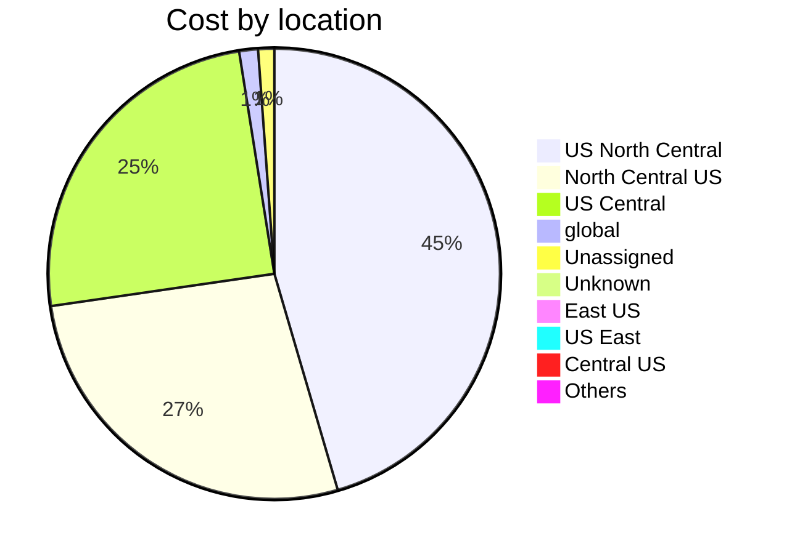

Fetching subscription details...
Fetching cost data...
Fetching forecasted cost data...
Fetching cost data by service name...
Fetching cost data by location...
Fetching cost data by resource group...
# Azure Cost Overview

> Accumulated cost for subscription id `JPF Pay-As-You-Go` from **10/01/2023** to **10/27/2023**

## Totals

|Period|Amount|
|---|---:|
|Today|0.09 USD|
|Yesterday|1.87 USD|
|Last 7 days|15.63 USD|
|Last 30 days|62.38 USD|

```mermaid
gantt
   title Accumulated cost
   dateFormat  X
   axisFormat %s
   section 01 Oct
   USD 3.83 :0, 383
   section 02 Oct
   USD 7.06 :0, 706
   section 03 Oct
   USD 9.56 :0, 956
   section 04 Oct
   USD 12.08 :0, 1208
   section 05 Oct
   USD 14.49 :0, 1449
   section 06 Oct
   USD 17.05 :0, 1705
   section 07 Oct
   USD 19.51 :0, 1951
   section 08 Oct
   USD 21.67 :0, 2167
   section 09 Oct
   USD 23.94 :0, 2394
   section 10 Oct
   USD 26.16 :0, 2616
   section 11 Oct
   USD 28.40 :0, 2840
   section 12 Oct
   USD 30.68 :0, 3068
   section 13 Oct
   USD 32.94 :0, 3294
   section 14 Oct
   USD 35.04 :0, 3504
   section 15 Oct
   USD 37.16 :0, 3716
   section 16 Oct
   USD 39.50 :0, 3950
   section 17 Oct
   USD 41.91 :0, 4191
   section 18 Oct
   USD 44.34 :0, 4434
   section 19 Oct
   USD 46.75 :0, 4675
   section 20 Oct
   USD 49.20 :0, 4920
   section 21 Oct
   USD 51.56 :0, 5156
   section 22 Oct
   USD 53.72 :0, 5372
   section 23 Oct
   USD 55.93 :0, 5593
   section 24 Oct
   USD 58.18 :0, 5818
   section 25 Oct
   USD 60.42 :0, 6042
   section 26 Oct
   USD 62.29 :0, 6229
   section 27 Oct
   USD 62.38 :0, 6238
   section 28 Oct
   USD 64.16 : done, 0, 6416
   section 29 Oct
   USD 65.64 : done, 0, 6564
   section 30 Oct
   USD 67.22 : done, 0, 6722
   section 31 Oct
   USD 68.77 : done, 0, 6877
```

## By Service Name

|Service|Amount|
|---|---:|
|Storage|24.14 USD|
|Azure App Service|15.26 USD|
|Virtual Machines|9.35 USD|
|Virtual Network|6.20 USD|
|Bandwidth|5.45 USD|
|Azure DNS|1.26 USD|
|Advanced Threat Protection|0.71 USD|
|Azure Active Directory for External Identities|0.00 USD|
|Azure Monitor|0.00 USD|
|Others|0.00 USD|

## By Location

|Location|Amount|
|---|---:|
|US North Central|28.04 USD|
|North Central US|16.80 USD|
|US Central|15.29 USD|
|global|0.83 USD|
|Unassigned|0.71 USD|
|Unknown|0.43 USD|
|East US|0.16 USD|
|US East|0.09 USD|
|Central US|0.04 USD|
|Others|0.00 USD|

## By Resource Group

|Resource Group|Amount|
|---|---:|
|personal-network|45.25 USD|
|personal-site|15.32 USD|
|personal-dns|0.85 USD|
||0.71 USD|
|cloud-shell-storage-eastus|0.25 USD|
|azureapp-auto-alerts-873533-jpatrick_fulton_gmail_com|0.00 USD|

Generated at 2023-10-27 11:33:40 for subscription with id `4913be3f-a345-4652-9bba-767418dd25e3`
