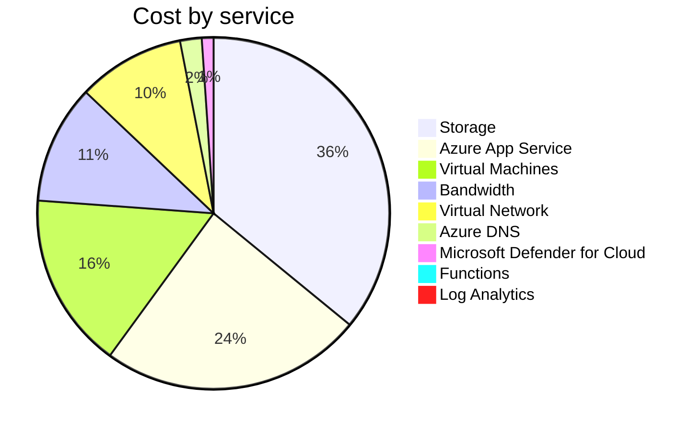

Fetching subscription details...
Fetching cost data...
Fetching forecasted cost data...
Fetching cost data by service name...
Fetching cost data by location...
Fetching cost data by resource group...
# Azure Cost Overview

> Accumulated cost for subscription id `JPF Pay-As-You-Go` from **11/01/2023** to **11/06/2023**

## Totals

|Period|Amount|
|---|---:|
|Today|0.08 USD|
|Yesterday|2.22 USD|
|Last 7 days|12.09 USD|
|Last 30 days|12.09 USD|

## By Service Name

|Service|Amount|
|---|---:|
|Storage|4.34 USD|
|Azure App Service|2.91 USD|
|Virtual Machines|1.95 USD|
|Bandwidth|1.32 USD|
|Virtual Network|1.19 USD|
|Azure DNS|0.24 USD|
|Microsoft Defender for Cloud|0.13 USD|
|Functions|0.00 USD|
|Log Analytics|0.00 USD|

## By Location

|Location|Amount|
|---|---:|
|US North Central|8.74 USD|
|US Central|2.92 USD|
|Unknown|0.24 USD|
|Unassigned|0.13 USD|
|US East|0.05 USD|
|AP East|0.00 USD|
|EU West|0.00 USD|
|US East 2|0.00 USD|
|US West 2|0.00 USD|

## By Resource Group

|Resource Group|Amount|
|---|---:|
|personal-network|8.82 USD|
|personal-site|2.92 USD|
|personal-dns|0.16 USD|
||0.13 USD|
|cloud-shell-storage-eastus|0.05 USD|

Generated at 2023-11-06 11:34:28 for subscription with id `4913be3f-a345-4652-9bba-767418dd25e3`
