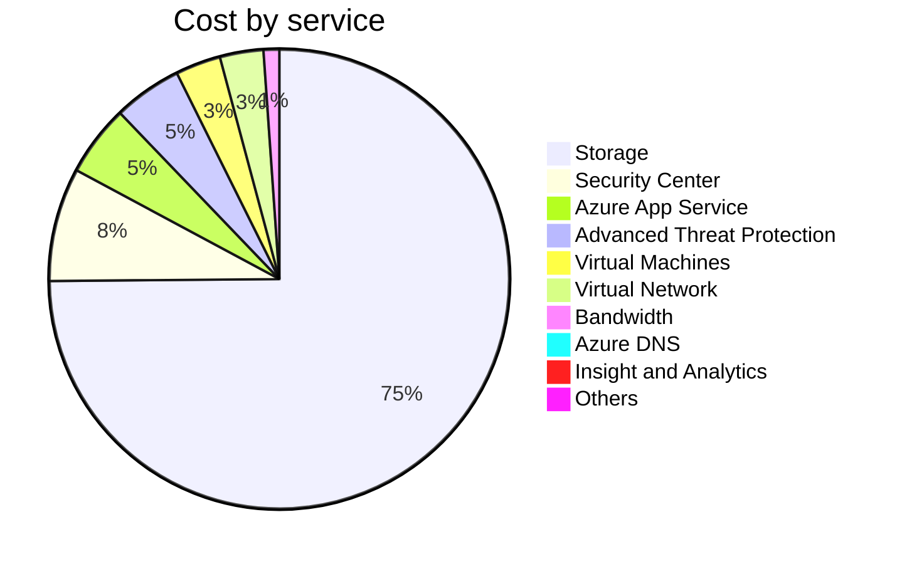

Fetching subscription details...
Fetching cost data...
Fetching forecasted cost data...
Fetching cost data by service name...
Fetching cost data by location...
Fetching cost data by resource group...
# Azure Cost Overview

> Accumulated cost for subscription id `JPF Pay-As-You-Go` from **09/01/2023** to **09/22/2023**

## Totals

|Period|Amount|
|---|---:|
|Today|0.12 USD|
|Yesterday|3.37 USD|
|Last 7 days|85.90 USD|
|Last 30 days|248.93 USD|

```mermaid
gantt
   title Accumulated cost
   dateFormat  X
   axisFormat %s
   section 01 Sep
   USD 6.35 :0, 635
   section 02 Sep
   USD 12.48 :0, 1248
   section 03 Sep
   USD 18.76 :0, 1876
   section 04 Sep
   USD 24.93 :0, 2493
   section 05 Sep
   USD 31.24 :0, 3124
   section 06 Sep
   USD 37.37 :0, 3737
   section 07 Sep
   USD 43.61 :0, 4361
   section 08 Sep
   USD 49.87 :0, 4987
   section 09 Sep
   USD 56.00 :0, 5600
   section 10 Sep
   USD 61.91 :0, 6191
   section 11 Sep
   USD 67.85 :0, 6785
   section 12 Sep
   USD 81.12 :0, 8112
   section 13 Sep
   USD 127.93 :0, 12793
   section 14 Sep
   USD 163.02 :0, 16302
   section 15 Sep
   USD 169.27 :0, 16927
   section 16 Sep
   USD 182.96 :0, 18296
   section 17 Sep
   USD 211.08 :0, 21108
   section 18 Sep
   USD 226.25 :0, 22625
   section 19 Sep
   USD 241.91 :0, 24191
   section 20 Sep
   USD 245.44 :0, 24544
   section 21 Sep
   USD 248.81 :0, 24881
   section 22 Sep
   USD 248.93 :0, 24893
   section 23 Sep
   USD 267.55 : done, 0, 26755
   section 24 Sep
   USD 286.51 : done, 0, 28651
   section 25 Sep
   USD 305.88 : done, 0, 30588
   section 26 Sep
   USD 329.39 : done, 0, 32939
   section 27 Sep
   USD 349.74 : done, 0, 34974
   section 28 Sep
   USD 370.74 : done, 0, 37074
   section 29 Sep
   USD 392.27 : done, 0, 39227
   section 30 Sep
   USD 414.41 : done, 0, 41441
```

## By Service Name

|Service|Amount|
|---|---:|
|Storage|185.59 USD|
|Security Center|19.78 USD|
|Azure App Service|12.38 USD|
|Advanced Threat Protection|11.94 USD|
|Virtual Machines|7.89 USD|
|Virtual Network|7.58 USD|
|Bandwidth|2.74 USD|
|Azure DNS|1.02 USD|
|Insight and Analytics|0.00 USD|
|Others|0.00 USD|

## By Location

|Location|Amount|
|---|---:|
|US North Central|207.22 USD|
|US Central|23.23 USD|
|Unassigned|11.85 USD|
|US East|5.60 USD|
|Unknown|1.02 USD|
|AP East|0.00 USD|
|EU West|0.00 USD|
|Intercontinental|0.00 USD|
|US East 2|0.00 USD|
|Others|0.00 USD|

## By Resource Group

|Resource Group|Amount|
|---|---:|
|personal-network|207.56 USD|
|personal-site|23.23 USD|
||11.85 USD|
|cloud-shell-storage-eastus|5.60 USD|
|personal-dns|0.68 USD|
|defaultresourcegroup-ncus|0.00 USD|
|azureapp-auto-alerts-873533-jpatrick_fulton_gmail_com|0.00 USD|

Generated at 2023-09-22 11:33:19 for subscription with id `4913be3f-a345-4652-9bba-767418dd25e3`
