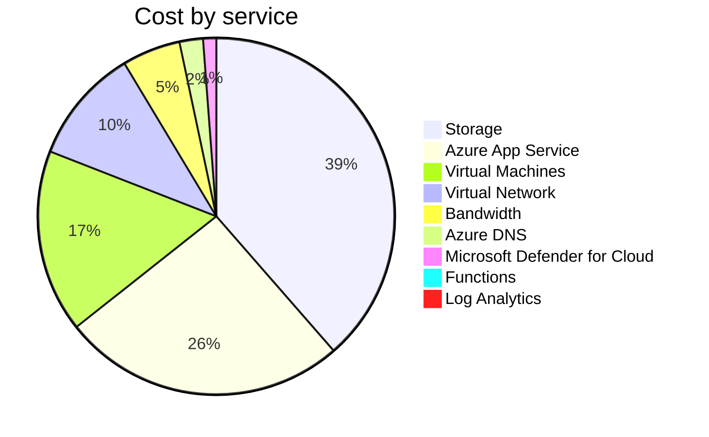

Fetching subscription details...
Fetching cost data...
Fetching forecasted cost data...
Fetching cost data by service name...
Fetching cost data by location...
Fetching cost data by resource group...
# Azure Cost Overview

> Accumulated cost for subscription id `JPF Pay-As-You-Go` from **11/01/2023** to **11/23/2023**

## Totals

|Period|Amount|
|---|---:|
|Today|0.09 USD|
|Yesterday|1.99 USD|
|Last 7 days|15.09 USD|
|Last 30 days|50.25 USD|

```mermaid
gantt
   title Accumulated cost
   dateFormat  X
   axisFormat %s
   section 01 Nov
   USD 2.50 :0, 250
   section 02 Nov
   USD 4.87 :0, 487
   section 03 Nov
   USD 7.51 :0, 751
   section 04 Nov
   USD 9.95 :0, 995
   section 05 Nov
   USD 12.34 :0, 1234
   section 06 Nov
   USD 14.80 :0, 1480
   section 07 Nov
   USD 17.20 :0, 1720
   section 08 Nov
   USD 19.70 :0, 1970
   section 09 Nov
   USD 22.15 :0, 2215
   section 10 Nov
   USD 24.33 :0, 2433
   section 11 Nov
   USD 26.50 :0, 2650
   section 12 Nov
   USD 28.68 :0, 2868
   section 13 Nov
   USD 30.85 :0, 3085
   section 14 Nov
   USD 33.00 :0, 3300
   section 15 Nov
   USD 35.16 :0, 3516
   section 16 Nov
   USD 37.32 :0, 3732
   section 17 Nov
   USD 39.49 :0, 3949
   section 18 Nov
   USD 41.64 :0, 4164
   section 19 Nov
   USD 43.81 :0, 4381
   section 20 Nov
   USD 45.98 :0, 4598
   section 21 Nov
   USD 48.16 :0, 4816
   section 22 Nov
   USD 50.15 :0, 5015
   section 23 Nov
   USD 50.25 :0, 5025
   section 24 Nov
   USD 52.41 : done, 0, 5241
   section 25 Nov
   USD 54.47 : done, 0, 5447
   section 26 Nov
   USD 56.49 : done, 0, 5649
   section 27 Nov
   USD 58.57 : done, 0, 5857
   section 28 Nov
   USD 60.81 : done, 0, 6081
   section 29 Nov
   USD 63.08 : done, 0, 6308
   section 30 Nov
   USD 65.23 : done, 0, 6523
```

## By Service Name

|Service|Amount|
|---|---:|
|Storage|19.39 USD|
|Azure App Service|12.95 USD|
|Virtual Machines|8.33 USD|
|Virtual Network|5.26 USD|
|Bandwidth|2.66 USD|
|Azure DNS|1.07 USD|
|Microsoft Defender for Cloud|0.60 USD|
|Functions|0.00 USD|
|Log Analytics|0.00 USD|

## By Location

|Location|Amount|
|---|---:|
|US North Central|35.36 USD|
|US Central|13.00 USD|
|Unknown|1.07 USD|
|Unassigned|0.60 USD|
|US East|0.22 USD|
|AP East|0.00 USD|
|EU West|0.00 USD|
|US East 2|0.00 USD|
|US West 2|0.00 USD|

## By Resource Group

|Resource Group|Amount|
|---|---:|
|personal-network|35.71 USD|
|personal-site|13.00 USD|
|personal-dns|0.72 USD|
||0.60 USD|
|cloud-shell-storage-eastus|0.22 USD|

Generated at 2023-11-23 11:33:13 for subscription with id `4913be3f-a345-4652-9bba-767418dd25e3`
