Fetching subscription details...
Fetching cost data...
Fetching forecasted cost data...
Fetching cost data by service name...
Fetching cost data by location...
Fetching cost data by resource group...
# Azure Cost Overview

> Accumulated cost for subscription id `JPF Pay-As-You-Go` from **09/01/2023** to **09/26/2023**

## Totals

|Period|Amount|
|---|---:|
|Today|0.10 USD|
|Yesterday|3.51 USD|
|Last 7 days|38.61 USD|
|Last 30 days|266.67 USD|

```mermaid
gantt
   title Accumulated cost
   dateFormat  X
   axisFormat %s
   section 01 Sep
   USD 6.35 :0, 635
   section 02 Sep
   USD 12.48 :0, 1248
   section 03 Sep
   USD 18.76 :0, 1876
   section 04 Sep
   USD 24.93 :0, 2493
   section 05 Sep
   USD 31.24 :0, 3124
   section 06 Sep
   USD 37.37 :0, 3737
   section 07 Sep
   USD 43.61 :0, 4361
   section 08 Sep
   USD 49.87 :0, 4987
   section 09 Sep
   USD 56.01 :0, 5601
   section 10 Sep
   USD 62.05 :0, 6205
   section 11 Sep
   USD 68.17 :0, 6817
   section 12 Sep
   USD 81.53 :0, 8153
   section 13 Sep
   USD 128.51 :0, 12851
   section 14 Sep
   USD 163.78 :0, 16378
   section 15 Sep
   USD 170.17 :0, 17017
   section 16 Sep
   USD 184.11 :0, 18411
   section 17 Sep
   USD 212.45 :0, 21245
   section 18 Sep
   USD 228.06 :0, 22806
   section 19 Sep
   USD 243.92 :0, 24392
   section 20 Sep
   USD 247.68 :0, 24768
   section 21 Sep
   USD 251.59 :0, 25159
   section 22 Sep
   USD 255.84 :0, 25584
   section 23 Sep
   USD 259.43 :0, 25943
   section 24 Sep
   USD 263.05 :0, 26305
   section 25 Sep
   USD 266.56 :0, 26656
   section 26 Sep
   USD 266.67 :0, 26667
   section 27 Sep
   USD 280.40 : done, 0, 28040
   section 28 Sep
   USD 294.42 : done, 0, 29442
   section 29 Sep
   USD 308.83 : done, 0, 30883
   section 30 Sep
   USD 323.32 : done, 0, 32332
```

## By Service Name

|Service|Amount|
|---|---:|
|Storage|194.57 USD|
|Security Center|19.78 USD|
|Azure App Service|14.74 USD|
|Advanced Threat Protection|12.06 USD|
|Virtual Machines|9.28 USD|
|Virtual Network|8.55 USD|
|Bandwidth|6.46 USD|
|Azure DNS|1.22 USD|
|Insight and Analytics|0.00 USD|
|Others|0.00 USD|

## By Location

|Location|Amount|
|---|---:|
|US North Central|222.23 USD|
|US Central|25.61 USD|
|Unassigned|11.97 USD|
|US East|5.64 USD|
|Unknown|1.22 USD|
|AP East|0.00 USD|
|EU West|0.00 USD|
|Intercontinental|0.00 USD|
|US East 2|0.00 USD|
|Others|0.00 USD|

## By Resource Group

|Resource Group|Amount|
|---|---:|
|personal-network|222.63 USD|
|personal-site|25.61 USD|
||11.97 USD|
|cloud-shell-storage-eastus|5.64 USD|
|personal-dns|0.82 USD|
|defaultresourcegroup-ncus|0.00 USD|
|azureapp-auto-alerts-873533-jpatrick_fulton_gmail_com|0.00 USD|

Generated at 2023-09-26 11:29:43 for subscription with id `4913be3f-a345-4652-9bba-767418dd25e3`
