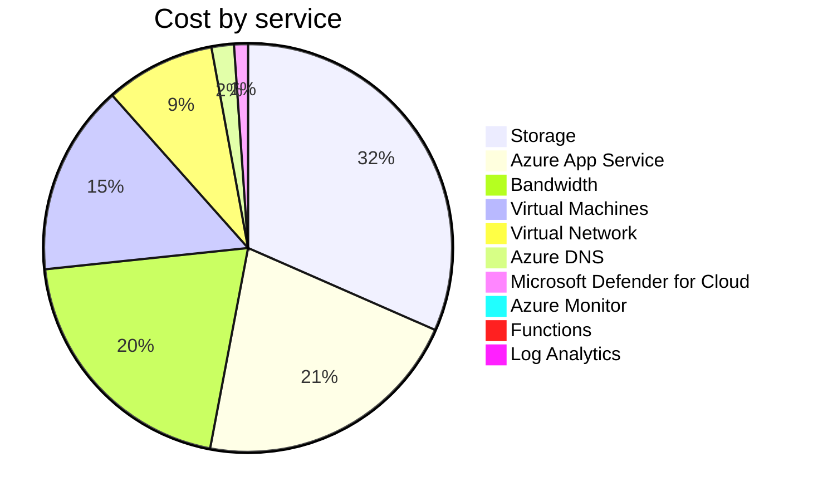
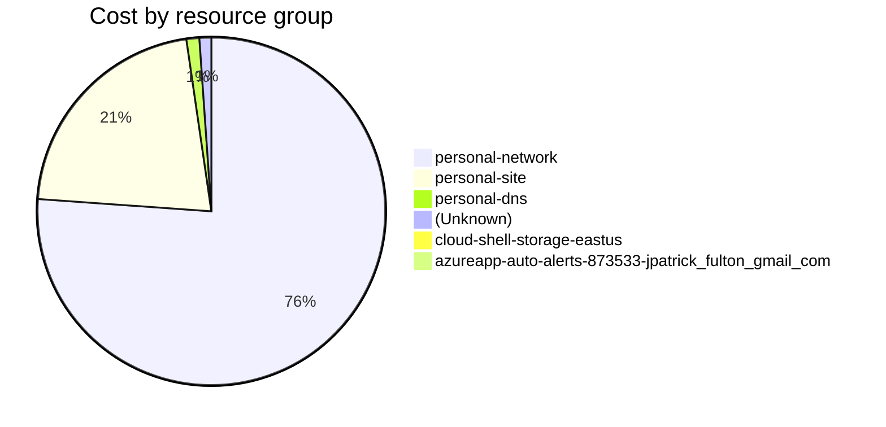

Fetching subscription details...
Fetching cost data...
Fetching forecasted cost data...
Fetching cost data by service name...
Fetching cost data by location...
Fetching cost data by resource group...
# Azure Cost Overview

> Accumulated cost for subscription id `JPF Pay-As-You-Go` from **01/01/2024** to **01/29/2024**

## Totals

|Period|Amount|
|---|---:|
|Today|0.10 USD|
|Yesterday|2.58 USD|
|Last 7 days|19.83 USD|
|Last 30 days|77.18 USD|

```mermaid
gantt
   title Accumulated cost
   dateFormat  X
   axisFormat %s
   section 01 Jan
   USD 2.68 :0, 268
   section 02 Jan
   USD 5.81 :0, 581
   section 03 Jan
   USD 8.29 :0, 829
   section 04 Jan
   USD 10.88 :0, 1088
   section 05 Jan
   USD 13.49 :0, 1349
   section 06 Jan
   USD 16.41 :0, 1641
   section 07 Jan
   USD 18.82 :0, 1882
   section 08 Jan
   USD 21.90 :0, 2190
   section 09 Jan
   USD 24.54 :0, 2454
   section 10 Jan
   USD 26.87 :0, 2687
   section 11 Jan
   USD 29.47 :0, 2947
   section 12 Jan
   USD 32.10 :0, 3210
   section 13 Jan
   USD 35.24 :0, 3524
   section 14 Jan
   USD 37.44 :0, 3744
   section 15 Jan
   USD 39.76 :0, 3976
   section 16 Jan
   USD 43.24 :0, 4324
   section 17 Jan
   USD 46.03 :0, 4603
   section 18 Jan
   USD 48.71 :0, 4871
   section 19 Jan
   USD 51.44 :0, 5144
   section 20 Jan
   USD 54.64 :0, 5464
   section 21 Jan
   USD 57.34 :0, 5734
   section 22 Jan
   USD 60.07 :0, 6007
   section 23 Jan
   USD 62.74 :0, 6274
   section 24 Jan
   USD 65.18 :0, 6518
   section 25 Jan
   USD 67.67 :0, 6767
   section 26 Jan
   USD 70.61 :0, 7061
   section 27 Jan
   USD 74.50 :0, 7450
   section 28 Jan
   USD 77.07 :0, 7707
   section 29 Jan
   USD 77.18 :0, 7718
   section 30 Jan
   USD 80.24 : done, 0, 8024
   section 31 Jan
   USD 82.86 : done, 0, 8286
```

## By Service Name

|Service|Amount|
|---|---:|
|Storage|24.37 USD|
|Azure App Service|16.52 USD|
|Bandwidth|15.71 USD|
|Virtual Machines|11.65 USD|
|Virtual Network|6.71 USD|
|Azure DNS|1.37 USD|
|Microsoft Defender for Cloud|0.85 USD|
|Azure Monitor|0.00 USD|
|Functions|0.00 USD|
|Log Analytics|0.00 USD|

## By Location

|Location|Amount|
|---|---:|
|US North Central|58.10 USD|
|US Central|16.59 USD|
|Unknown|1.37 USD|
|Unassigned|0.85 USD|
|US East|0.27 USD|
|AP East|0.00 USD|
|EU West|0.00 USD|
|US East 2|0.00 USD|
|US West|0.00 USD|
|US West 2|0.00 USD|

## By Resource Group

|Resource Group|Amount|
|---|---:|
|personal-network|58.55 USD|
|personal-site|16.59 USD|
|personal-dns|0.92 USD|
||0.85 USD|
|cloud-shell-storage-eastus|0.27 USD|
|azureapp-auto-alerts-873533-jpatrick_fulton_gmail_com|0.00 USD|

Generated at 2024-01-29 11:39:21 for subscription with id `4913be3f-a345-4652-9bba-767418dd25e3`
