Fetching subscription details...
Fetching cost data...
Fetching forecasted cost data...
Fetching cost data by service name...
Fetching cost data by location...
Fetching cost data by resource group...
# Azure Cost Overview

> Accumulated cost for subscription id `JPF Pay-As-You-Go` from **02/01/2024** to **02/21/2024**

## Totals

|Period|Amount|
|---|---:|
|Today|0.09 USD|
|Yesterday|2.15 USD|
|Last 7 days|15.68 USD|
|Last 30 days|52.41 USD|

```mermaid
gantt
   title Accumulated cost
   dateFormat  X
   axisFormat %s
   section 01 Feb
   USD 2.99 :0, 299
   section 02 Feb
   USD 6.68 :0, 668
   section 03 Feb
   USD 9.81 :0, 981
   section 04 Feb
   USD 12.83 :0, 1283
   section 05 Feb
   USD 15.90 :0, 1590
   section 06 Feb
   USD 18.73 :0, 1873
   section 07 Feb
   USD 21.64 :0, 2164
   section 08 Feb
   USD 25.07 :0, 2507
   section 09 Feb
   USD 27.83 :0, 2783
   section 10 Feb
   USD 30.13 :0, 3013
   section 11 Feb
   USD 32.28 :0, 3228
   section 12 Feb
   USD 34.42 :0, 3442
   section 13 Feb
   USD 36.73 :0, 3673
   section 14 Feb
   USD 38.99 :0, 3899
   section 15 Feb
   USD 41.22 :0, 4122
   section 16 Feb
   USD 43.52 :0, 4352
   section 17 Feb
   USD 45.71 :0, 4571
   section 18 Feb
   USD 47.94 :0, 4794
   section 19 Feb
   USD 50.17 :0, 5017
   section 20 Feb
   USD 52.32 :0, 5232
   section 21 Feb
   USD 52.41 :0, 5241
   section 22 Feb
   USD 54.75 : done, 0, 5475
   section 23 Feb
   USD 57.24 : done, 0, 5724
   section 24 Feb
   USD 59.45 : done, 0, 5945
   section 25 Feb
   USD 61.44 : done, 0, 6144
   section 26 Feb
   USD 63.10 : done, 0, 6310
   section 27 Feb
   USD 65.31 : done, 0, 6531
   section 28 Feb
   USD 67.19 : done, 0, 6719
   section 29 Feb
   USD 69.31 : done, 0, 6931
```

## By Service Name

|Service|Amount|
|---|---:|
|Storage|18.42 USD|
|Azure App Service|11.79 USD|
|Bandwidth|8.85 USD|
|Virtual Machines|7.10 USD|
|Virtual Network|4.79 USD|
|Azure DNS|0.98 USD|
|Microsoft Defender for Cloud|0.48 USD|
|Azure Monitor|0.00 USD|
|Functions|0.00 USD|
|Log Analytics|0.00 USD|

## By Location

|Location|Amount|
|---|---:|
|US North Central|38.91 USD|
|US Central|11.84 USD|
|Unknown|0.98 USD|
|Unassigned|0.48 USD|
|US East|0.21 USD|
|AP East|0.00 USD|
|EU West|0.00 USD|
|US East 2|0.00 USD|
|US West|0.00 USD|
|US West 2|0.00 USD|

## By Resource Group

|Resource Group|Amount|
|---|---:|
|personal-network|39.23 USD|
|personal-site|11.84 USD|
|personal-dns|0.66 USD|
||0.48 USD|
|cloud-shell-storage-eastus|0.21 USD|
|azureapp-auto-alerts-873533-jpatrick_fulton_gmail_com|0.00 USD|

Generated at 2024-02-21 11:35:48 for subscription with id `4913be3f-a345-4652-9bba-767418dd25e3`
