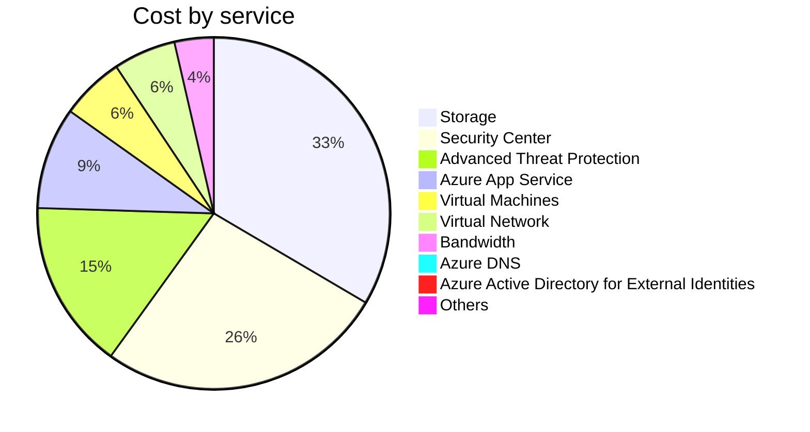
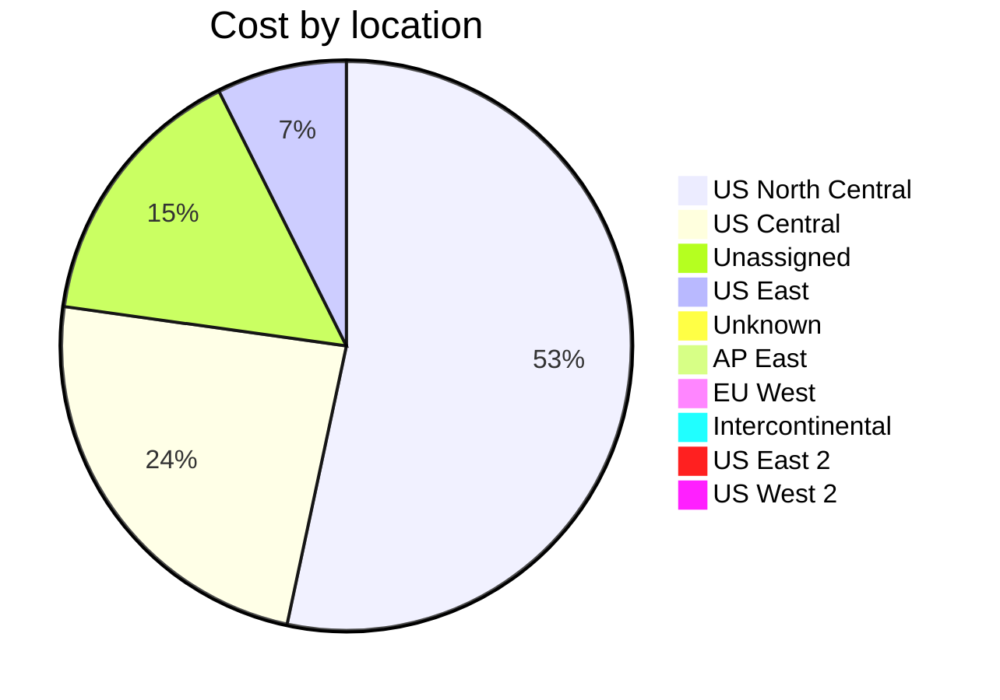
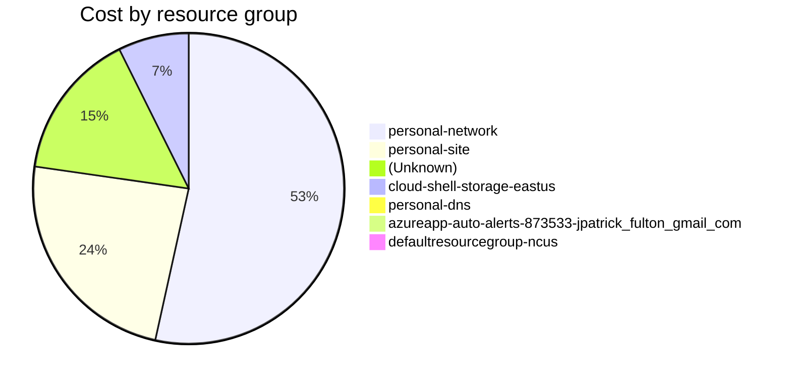

Fetching subscription details...
Fetching cost data...
Fetching forecasted cost data...
Fetching cost data by service name...
Fetching cost data by location...
Fetching cost data by resource group...
# Azure Cost Overview

> Accumulated cost for subscription id `JPF Pay-As-You-Go` from **09/01/2023** to **09/13/2023**

## Totals

|Period|Amount|
|---|---:|
|Today|0.10 USD|
|Yesterday|7.37 USD|
|Last 7 days|44.08 USD|
|Last 30 days|75.32 USD|

```mermaid
gantt
   title Accumulated cost
   dateFormat  X
   axisFormat %s
   section 01 Sep
   USD 6.35 :0, 635
   section 02 Sep
   USD 12.48 :0, 1248
   section 03 Sep
   USD 18.76 :0, 1876
   section 04 Sep
   USD 24.93 :0, 2493
   section 05 Sep
   USD 31.24 :0, 3124
   section 06 Sep
   USD 37.37 :0, 3737
   section 07 Sep
   USD 43.61 :0, 4361
   section 08 Sep
   USD 49.87 :0, 4987
   section 09 Sep
   USD 56.00 :0, 5600
   section 10 Sep
   USD 61.91 :0, 6191
   section 11 Sep
   USD 67.84 :0, 6784
   section 12 Sep
   USD 75.21 :0, 7521
   section 13 Sep
   USD 75.32 :0, 7532
   section 14 Sep
   USD 82.04 : done, 0, 8204
   section 15 Sep
   USD 89.08 : done, 0, 8908
   section 16 Sep
   USD 96.06 : done, 0, 9606
   section 17 Sep
   USD 103.01 : done, 0, 10301
   section 18 Sep
   USD 109.93 : done, 0, 10993
   section 19 Sep
   USD 116.84 : done, 0, 11684
   section 20 Sep
   USD 123.83 : done, 0, 12383
   section 21 Sep
   USD 130.92 : done, 0, 13092
   section 22 Sep
   USD 138.32 : done, 0, 13832
   section 23 Sep
   USD 145.65 : done, 0, 14565
   section 24 Sep
   USD 152.97 : done, 0, 15297
   section 25 Sep
   USD 160.24 : done, 0, 16024
   section 26 Sep
   USD 167.51 : done, 0, 16751
   section 27 Sep
   USD 174.87 : done, 0, 17487
   section 28 Sep
   USD 182.31 : done, 0, 18231
   section 29 Sep
   USD 190.07 : done, 0, 19007
   section 30 Sep
   USD 197.77 : done, 0, 19777
```

## By Service Name

|Service|Amount|
|---|---:|
|Storage|25.01 USD|
|Security Center|19.78 USD|
|Advanced Threat Protection|11.62 USD|
|Azure App Service|7.00 USD|
|Virtual Machines|4.35 USD|
|Virtual Network|4.28 USD|
|Bandwidth|2.69 USD|
|Azure DNS|0.58 USD|
|Azure Active Directory for External Identities|0.00 USD|
|Others|0.00 USD|

## By Location

|Location|Amount|
|---|---:|
|US North Central|39.86 USD|
|US Central|17.84 USD|
|Unassigned|11.52 USD|
|US East|5.51 USD|
|Unknown|0.58 USD|
|AP East|0.00 USD|
|EU West|0.00 USD|
|Intercontinental|0.00 USD|
|US East 2|0.00 USD|
|US West 2|0.00 USD|

## By Resource Group

|Resource Group|Amount|
|---|---:|
|personal-network|40.05 USD|
|personal-site|17.84 USD|
||11.52 USD|
|cloud-shell-storage-eastus|5.51 USD|
|personal-dns|0.39 USD|
|azureapp-auto-alerts-873533-jpatrick_fulton_gmail_com|0.00 USD|
|defaultresourcegroup-ncus|0.00 USD|

Generated at 2023-09-13 11:03:31 for subscription with id `4913be3f-a345-4652-9bba-767418dd25e3`
