Fetching subscription details...
Fetching cost data...
Fetching forecasted cost data...
Fetching cost data by service name...
Fetching cost data by location...
Fetching cost data by resource group...
# Azure Cost Overview

> Accumulated cost for subscription id `JPF Pay-As-You-Go` from **11/01/2023** to **11/21/2023**

## Totals

|Period|Amount|
|---|---:|
|Today|0.11 USD|
|Yesterday|0.37 USD|
|Last 7 days|12.70 USD|
|Last 30 days|43.54 USD|

```mermaid
gantt
   title Accumulated cost
   dateFormat  X
   axisFormat %s
   section 01 Nov
   USD 2.50 :0, 250
   section 02 Nov
   USD 4.87 :0, 487
   section 03 Nov
   USD 7.51 :0, 751
   section 04 Nov
   USD 9.95 :0, 995
   section 05 Nov
   USD 12.34 :0, 1234
   section 06 Nov
   USD 14.80 :0, 1480
   section 07 Nov
   USD 17.20 :0, 1720
   section 08 Nov
   USD 19.70 :0, 1970
   section 09 Nov
   USD 22.15 :0, 2215
   section 10 Nov
   USD 24.33 :0, 2433
   section 11 Nov
   USD 26.50 :0, 2650
   section 12 Nov
   USD 28.68 :0, 2868
   section 13 Nov
   USD 30.85 :0, 3085
   section 14 Nov
   USD 33.00 :0, 3300
   section 15 Nov
   USD 35.16 :0, 3516
   section 16 Nov
   USD 37.32 :0, 3732
   section 17 Nov
   USD 39.49 :0, 3949
   section 18 Nov
   USD 41.64 :0, 4164
   section 19 Nov
   USD 43.06 :0, 4306
   section 20 Nov
   USD 43.43 :0, 4343
   section 21 Nov
   USD 43.54 :0, 4354
   section 22 Nov
   USD 45.77 : done, 0, 4577
   section 23 Nov
   USD 47.88 : done, 0, 4788
   section 24 Nov
   USD 49.94 : done, 0, 4994
   section 25 Nov
   USD 51.89 : done, 0, 5189
   section 26 Nov
   USD 53.81 : done, 0, 5381
   section 27 Nov
   USD 55.85 : done, 0, 5585
   section 28 Nov
   USD 57.97 : done, 0, 5797
   section 29 Nov
   USD 60.12 : done, 0, 6012
   section 30 Nov
   USD 62.14 : done, 0, 6214
```

## By Service Name

|Service|Amount|
|---|---:|
|Storage|16.41 USD|
|Azure App Service|11.00 USD|
|Virtual Machines|7.59 USD|
|Virtual Network|4.47 USD|
|Bandwidth|2.66 USD|
|Azure DNS|0.91 USD|
|Microsoft Defender for Cloud|0.51 USD|
|Functions|0.00 USD|
|Log Analytics|0.00 USD|

## By Location

|Location|Amount|
|---|---:|
|US North Central|31.45 USD|
|US Central|11.31 USD|
|Unknown|0.93 USD|
|Unassigned|0.52 USD|
|US East|0.19 USD|
|AP East|0.00 USD|
|EU West|0.00 USD|
|US East 2|0.00 USD|
|US West 2|0.00 USD|

## By Resource Group

|Resource Group|Amount|
|---|---:|
|personal-network|31.20 USD|
|personal-site|11.04 USD|
|personal-dns|0.61 USD|
||0.51 USD|
|cloud-shell-storage-eastus|0.19 USD|

Generated at 2023-11-21 11:34:30 for subscription with id `4913be3f-a345-4652-9bba-767418dd25e3`
