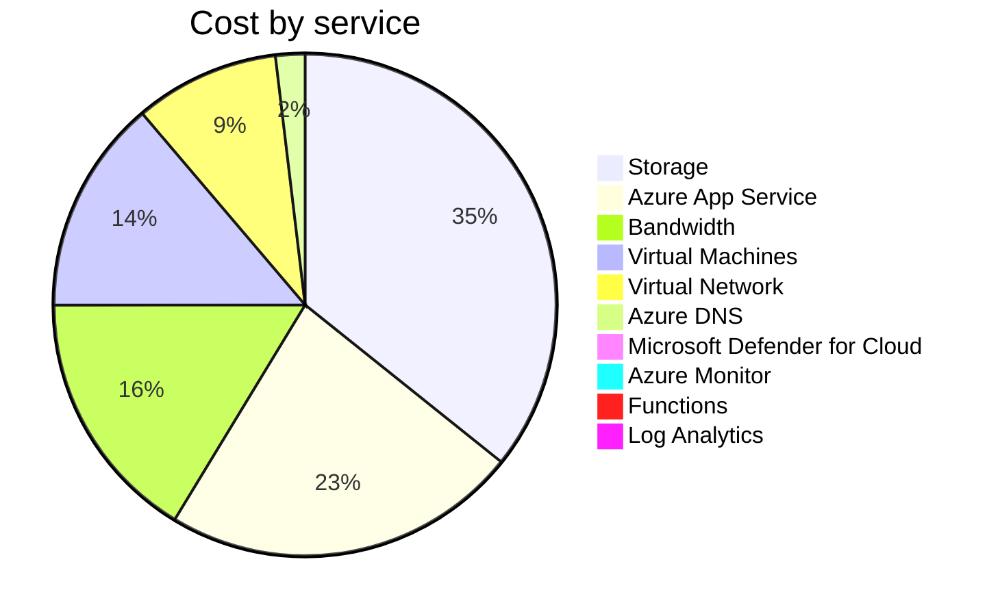
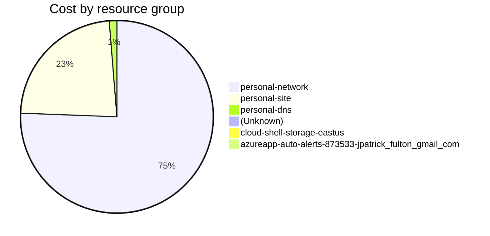

Fetching subscription details...
Fetching cost data...
Fetching forecasted cost data...
Fetching cost data by service name...
Fetching cost data by location...
Fetching cost data by resource group...
# Azure Cost Overview

> Accumulated cost for subscription id `JPF Pay-As-You-Go` from **02/01/2024** to **02/24/2024**

## Totals

|Period|Amount|
|---|---:|
|Today|0.10 USD|
|Yesterday|2.04 USD|
|Last 7 days|15.70 USD|
|Last 30 days|59.68 USD|

```mermaid
gantt
   title Accumulated cost
   dateFormat  X
   axisFormat %s
   section 01 Feb
   USD 2.99 :0, 299
   section 02 Feb
   USD 6.68 :0, 668
   section 03 Feb
   USD 9.81 :0, 981
   section 04 Feb
   USD 12.83 :0, 1283
   section 05 Feb
   USD 15.90 :0, 1590
   section 06 Feb
   USD 18.73 :0, 1873
   section 07 Feb
   USD 21.64 :0, 2164
   section 08 Feb
   USD 25.07 :0, 2507
   section 09 Feb
   USD 27.83 :0, 2783
   section 10 Feb
   USD 30.24 :0, 3024
   section 11 Feb
   USD 32.40 :0, 3240
   section 12 Feb
   USD 34.54 :0, 3454
   section 13 Feb
   USD 36.96 :0, 3696
   section 14 Feb
   USD 39.30 :0, 3930
   section 15 Feb
   USD 41.58 :0, 4158
   section 16 Feb
   USD 43.97 :0, 4397
   section 17 Feb
   USD 46.20 :0, 4620
   section 18 Feb
   USD 48.48 :0, 4848
   section 19 Feb
   USD 50.77 :0, 5077
   section 20 Feb
   USD 53.09 :0, 5309
   section 21 Feb
   USD 55.36 :0, 5536
   section 22 Feb
   USD 57.53 :0, 5753
   section 23 Feb
   USD 59.58 :0, 5958
   section 24 Feb
   USD 59.68 :0, 5968
   section 25 Feb
   USD 61.74 : done, 0, 6174
   section 26 Feb
   USD 63.46 : done, 0, 6346
   section 27 Feb
   USD 65.51 : done, 0, 6551
   section 28 Feb
   USD 67.33 : done, 0, 6733
   section 29 Feb
   USD 69.29 : done, 0, 6929
```

## By Service Name

|Service|Amount|
|---|---:|
|Storage|21.14 USD|
|Azure App Service|13.56 USD|
|Bandwidth|9.64 USD|
|Virtual Machines|8.16 USD|
|Virtual Network|5.51 USD|
|Azure DNS|1.12 USD|
|Microsoft Defender for Cloud|0.54 USD|
|Azure Monitor|0.00 USD|
|Functions|0.00 USD|
|Log Analytics|0.00 USD|

## By Location

|Location|Amount|
|---|---:|
|US North Central|44.15 USD|
|US Central|13.62 USD|
|Unknown|1.12 USD|
|Unassigned|0.54 USD|
|US East|0.24 USD|
|AP East|0.00 USD|
|EU West|0.00 USD|
|US East 2|0.00 USD|
|US West|0.00 USD|
|US West 2|0.00 USD|

## By Resource Group

|Resource Group|Amount|
|---|---:|
|personal-network|44.52 USD|
|personal-site|13.62 USD|
|personal-dns|0.75 USD|
||0.54 USD|
|cloud-shell-storage-eastus|0.24 USD|
|azureapp-auto-alerts-873533-jpatrick_fulton_gmail_com|0.00 USD|

Generated at 2024-02-24 11:34:13 for subscription with id `4913be3f-a345-4652-9bba-767418dd25e3`
