Fetching subscription details...
Fetching cost data...
Fetching forecasted cost data...
Fetching cost data by service name...
Fetching cost data by location...
Fetching cost data by resource group...
# Azure Cost Overview

> Accumulated cost for subscription id `JPF Pay-As-You-Go` from **08/01/2024** to **08/13/2024**

## Totals

|Period|Amount|
|---|---:|
|Today|0.00 USD|
|Yesterday|0.56 USD|
|Last 7 days|4.37 USD|
|Last 30 days|8.19 USD|

```mermaid
gantt
   title Accumulated cost
   dateFormat  X
   axisFormat %s
   section 01 Aug
   USD 0.64 :0, 64
   section 02 Aug
   USD 1.27 :0, 127
   section 03 Aug
   USD 1.91 :0, 191
   section 04 Aug
   USD 2.54 :0, 254
   section 05 Aug
   USD 3.18 :0, 318
   section 06 Aug
   USD 3.82 :0, 382
   section 07 Aug
   USD 4.45 :0, 445
   section 08 Aug
   USD 5.09 :0, 509
   section 09 Aug
   USD 5.72 :0, 572
   section 10 Aug
   USD 6.36 :0, 636
   section 11 Aug
   USD 7.00 :0, 700
   section 12 Aug
   USD 7.63 :0, 763
   section 13 Aug
   USD 8.19 :0, 819
   section 14 Aug
   USD 8.81 : done, 0, 881
   section 15 Aug
   USD 9.44 : done, 0, 944
   section 16 Aug
   USD 10.06 : done, 0, 1006
   section 17 Aug
   USD 10.68 : done, 0, 1068
   section 18 Aug
   USD 11.30 : done, 0, 1130
   section 19 Aug
   USD 11.91 : done, 0, 1191
   section 20 Aug
   USD 12.53 : done, 0, 1253
   section 21 Aug
   USD 13.14 : done, 0, 1314
   section 22 Aug
   USD 13.76 : done, 0, 1376
   section 23 Aug
   USD 14.37 : done, 0, 1437
   section 24 Aug
   USD 14.98 : done, 0, 1498
   section 25 Aug
   USD 15.59 : done, 0, 1559
   section 26 Aug
   USD 16.20 : done, 0, 1620
   section 27 Aug
   USD 16.81 : done, 0, 1681
   section 28 Aug
   USD 17.41 : done, 0, 1741
   section 29 Aug
   USD 18.02 : done, 0, 1802
   section 30 Aug
   USD 18.62 : done, 0, 1862
   section 31 Aug
   USD 19.22 : done, 0, 1922
```

## By Service Name

|Service|Amount|
|---|---:|
|Azure App Service|7.62 USD|
|Azure DNS|0.42 USD|
|Storage|0.15 USD|
|Bandwidth|0.00 USD|
|Functions|0.00 USD|
|Log Analytics|0.00 USD|

## By Location

|Location|Amount|
|---|---:|
|US Central|7.64 USD|
|Unknown|0.42 USD|
|US East|0.12 USD|
|AP East|0.00 USD|
|EU West|0.00 USD|
|US East 2|0.00 USD|
|US West 2|0.00 USD|

## By Resource Group

|Resource Group|Amount|
|---|---:|
|personal-site|7.64 USD|
|personal-dns|0.42 USD|
|cloud-shell-storage-eastus|0.12 USD|

Generated at 2024-08-14 11:24:43 for subscription with id `4913be3f-a345-4652-9bba-767418dd25e3`
