Fetching subscription details...
Fetching cost data...
Fetching forecasted cost data...
Fetching cost data by service name...
Fetching cost data by location...
Fetching cost data by resource group...
# Azure Cost Overview

> Accumulated cost for subscription id `JPF Pay-As-You-Go` from **01/01/2024** to **01/16/2024**

## Totals

|Period|Amount|
|---|---:|
|Today|0.10 USD|
|Yesterday|2.02 USD|
|Last 7 days|15.61 USD|
|Last 30 days|37.51 USD|

```mermaid
gantt
   title Accumulated cost
   dateFormat  X
   axisFormat %s
   section 01 Jan
   USD 2.68 :0, 268
   section 02 Jan
   USD 5.81 :0, 581
   section 03 Jan
   USD 8.29 :0, 829
   section 04 Jan
   USD 10.88 :0, 1088
   section 05 Jan
   USD 13.49 :0, 1349
   section 06 Jan
   USD 16.41 :0, 1641
   section 07 Jan
   USD 18.82 :0, 1882
   section 08 Jan
   USD 21.90 :0, 2190
   section 09 Jan
   USD 24.47 :0, 2447
   section 10 Jan
   USD 26.66 :0, 2666
   section 11 Jan
   USD 28.86 :0, 2886
   section 12 Jan
   USD 31.03 :0, 3103
   section 13 Jan
   USD 33.23 :0, 3323
   section 14 Jan
   USD 35.39 :0, 3539
   section 15 Jan
   USD 37.41 :0, 3741
   section 16 Jan
   USD 37.51 :0, 3751
   section 17 Jan
   USD 39.79 : done, 0, 3979
   section 18 Jan
   USD 42.08 : done, 0, 4208
   section 19 Jan
   USD 44.55 : done, 0, 4455
   section 20 Jan
   USD 47.16 : done, 0, 4716
   section 21 Jan
   USD 49.62 : done, 0, 4962
   section 22 Jan
   USD 52.38 : done, 0, 5238
   section 23 Jan
   USD 55.15 : done, 0, 5515
   section 24 Jan
   USD 57.45 : done, 0, 5745
   section 25 Jan
   USD 59.76 : done, 0, 5976
   section 26 Jan
   USD 62.24 : done, 0, 6224
   section 27 Jan
   USD 64.87 : done, 0, 6487
   section 28 Jan
   USD 67.36 : done, 0, 6736
   section 29 Jan
   USD 70.13 : done, 0, 7013
   section 30 Jan
   USD 72.93 : done, 0, 7293
   section 31 Jan
   USD 75.25 : done, 0, 7525
```

## By Service Name

|Service|Amount|
|---|---:|
|Storage|12.94 USD|
|Azure App Service|8.83 USD|
|Virtual Machines|6.29 USD|
|Bandwidth|4.68 USD|
|Virtual Network|3.58 USD|
|Azure DNS|0.73 USD|
|Microsoft Defender for Cloud|0.46 USD|
|Azure Monitor|0.00 USD|
|Functions|0.00 USD|
|Log Analytics|0.00 USD|

## By Location

|Location|Amount|
|---|---:|
|US North Central|27.32 USD|
|US Central|8.86 USD|
|Unknown|0.73 USD|
|Unassigned|0.46 USD|
|US East|0.14 USD|
|AP East|0.00 USD|
|EU West|0.00 USD|
|US East 2|0.00 USD|
|US West|0.00 USD|
|US West 2|0.00 USD|

## By Resource Group

|Resource Group|Amount|
|---|---:|
|personal-network|27.56 USD|
|personal-site|8.86 USD|
|personal-dns|0.49 USD|
||0.46 USD|
|cloud-shell-storage-eastus|0.14 USD|
|azureapp-auto-alerts-873533-jpatrick_fulton_gmail_com|0.00 USD|

Generated at 2024-01-16 11:35:18 for subscription with id `4913be3f-a345-4652-9bba-767418dd25e3`
