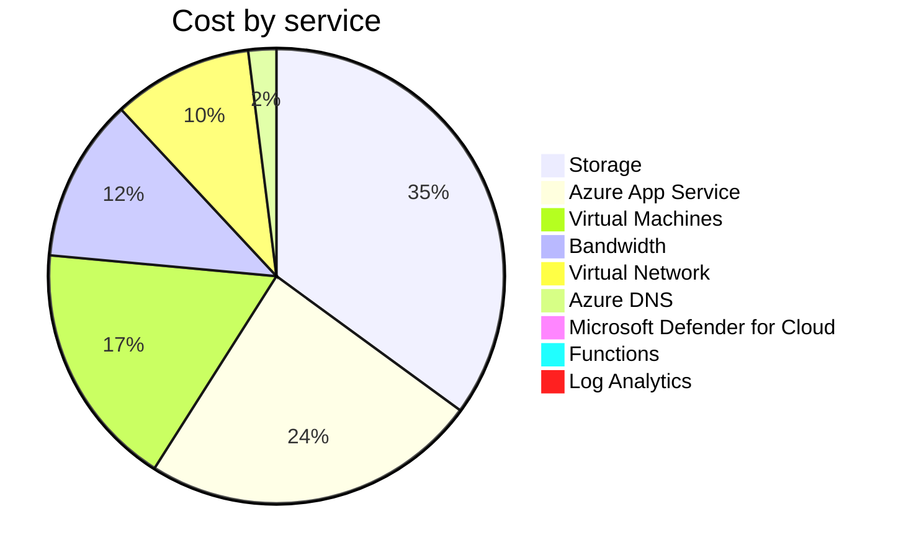

Fetching subscription details...
Fetching cost data...
Fetching forecasted cost data...
Fetching cost data by service name...
Fetching cost data by location...
Fetching cost data by resource group...
# Azure Cost Overview

> Accumulated cost for subscription id `JPF Pay-As-You-Go` from **12/01/2023** to **12/05/2023**

## Totals

|Period|Amount|
|---|---:|
|Today|0.10 USD|
|Yesterday|2.00 USD|
|Last 7 days|9.66 USD|
|Last 30 days|9.66 USD|

```mermaid
gantt
   title Accumulated cost
   dateFormat  X
   axisFormat %s
   section 01 Dec
   USD 2.37 :0, 237
   section 02 Dec
   USD 4.82 :0, 482
   section 03 Dec
   USD 7.56 :0, 756
   section 04 Dec
   USD 9.56 :0, 956
   section 05 Dec
   USD 9.66 :0, 966
   section 06 Dec
   USD 12.10 : done, 0, 1210
   section 07 Dec
   USD 14.56 : done, 0, 1456
   section 08 Dec
   USD 17.00 : done, 0, 1700
   section 09 Dec
   USD 19.45 : done, 0, 1945
   section 10 Dec
   USD 21.89 : done, 0, 2189
   section 11 Dec
   USD 24.41 : done, 0, 2441
   section 12 Dec
   USD 27.05 : done, 0, 2705
   section 13 Dec
   USD 29.51 : done, 0, 2951
   section 14 Dec
   USD 31.99 : done, 0, 3199
   section 15 Dec
   USD 34.45 : done, 0, 3445
   section 16 Dec
   USD 36.93 : done, 0, 3693
   section 17 Dec
   USD 39.39 : done, 0, 3939
   section 18 Dec
   USD 41.93 : done, 0, 4193
   section 19 Dec
   USD 44.59 : done, 0, 4459
   section 20 Dec
   USD 47.06 : done, 0, 4706
   section 21 Dec
   USD 49.56 : done, 0, 4956
   section 22 Dec
   USD 52.05 : done, 0, 5205
   section 23 Dec
   USD 54.54 : done, 0, 5454
   section 24 Dec
   USD 57.02 : done, 0, 5702
   section 25 Dec
   USD 59.58 : done, 0, 5958
   section 26 Dec
   USD 62.26 : done, 0, 6226
   section 27 Dec
   USD 64.76 : done, 0, 6476
   section 28 Dec
   USD 67.28 : done, 0, 6728
   section 29 Dec
   USD 69.78 : done, 0, 6978
   section 30 Dec
   USD 72.30 : done, 0, 7230
   section 31 Dec
   USD 74.79 : done, 0, 7479
```

## By Service Name

|Service|Amount|
|---|---:|
|Storage|3.35 USD|
|Azure App Service|2.29 USD|
|Virtual Machines|1.67 USD|
|Bandwidth|1.11 USD|
|Virtual Network|0.95 USD|
|Azure DNS|0.19 USD|
|Microsoft Defender for Cloud|0.09 USD|
|Functions|0.00 USD|
|Log Analytics|0.00 USD|

## By Location

|Location|Amount|
|---|---:|
|US North Central|7.03 USD|
|US Central|2.30 USD|
|Unknown|0.19 USD|
|Unassigned|0.09 USD|
|US East|0.04 USD|
|AP East|0.00 USD|
|EU West|0.00 USD|
|US East 2|0.00 USD|
|US West 2|0.00 USD|

## By Resource Group

|Resource Group|Amount|
|---|---:|
|personal-network|7.10 USD|
|personal-site|2.30 USD|
|personal-dns|0.13 USD|
||0.09 USD|
|cloud-shell-storage-eastus|0.04 USD|

Generated at 2023-12-05 11:29:30 for subscription with id `4913be3f-a345-4652-9bba-767418dd25e3`
