Fetching subscription details...
Fetching cost data...
Fetching forecasted cost data...
Fetching cost data by service name...
Fetching cost data by location...
Fetching cost data by resource group...
# Azure Cost Overview

> Accumulated cost for subscription id `JPF Pay-As-You-Go` from **12/01/2023** to **12/19/2023**

## Totals

|Period|Amount|
|---|---:|
|Today|0.10 USD|
|Yesterday|1.89 USD|
|Last 7 days|15.01 USD|
|Last 30 days|41.58 USD|

```mermaid
gantt
   title Accumulated cost
   dateFormat  X
   axisFormat %s
   section 01 Dec
   USD 2.41 :0, 241
   section 02 Dec
   USD 4.93 :0, 493
   section 03 Dec
   USD 7.79 :0, 779
   section 04 Dec
   USD 10.04 :0, 1004
   section 05 Dec
   USD 12.27 :0, 1227
   section 06 Dec
   USD 15.11 :0, 1511
   section 07 Dec
   USD 17.58 :0, 1758
   section 08 Dec
   USD 19.73 :0, 1973
   section 09 Dec
   USD 22.14 :0, 2214
   section 10 Dec
   USD 24.36 :0, 2436
   section 11 Dec
   USD 26.56 :0, 2656
   section 12 Dec
   USD 28.75 :0, 2875
   section 13 Dec
   USD 30.93 :0, 3093
   section 14 Dec
   USD 33.12 :0, 3312
   section 15 Dec
   USD 35.26 :0, 3526
   section 16 Dec
   USD 37.43 :0, 3743
   section 17 Dec
   USD 39.59 :0, 3959
   section 18 Dec
   USD 41.48 :0, 4148
   section 19 Dec
   USD 41.58 :0, 4158
   section 20 Dec
   USD 43.67 : done, 0, 4367
   section 21 Dec
   USD 45.82 : done, 0, 4582
   section 22 Dec
   USD 47.84 : done, 0, 4784
   section 23 Dec
   USD 50.02 : done, 0, 5002
   section 24 Dec
   USD 52.04 : done, 0, 5204
   section 25 Dec
   USD 53.98 : done, 0, 5398
   section 26 Dec
   USD 56.21 : done, 0, 5621
   section 27 Dec
   USD 58.20 : done, 0, 5820
   section 28 Dec
   USD 60.24 : done, 0, 6024
   section 29 Dec
   USD 62.15 : done, 0, 6215
   section 30 Dec
   USD 64.22 : done, 0, 6422
   section 31 Dec
   USD 66.13 : done, 0, 6613
```

## By Service Name

|Service|Amount|
|---|---:|
|Storage|15.45 USD|
|Azure App Service|10.53 USD|
|Virtual Machines|7.17 USD|
|Virtual Network|4.28 USD|
|Bandwidth|2.71 USD|
|Azure DNS|0.87 USD|
|Microsoft Defender for Cloud|0.57 USD|
|Functions|0.00 USD|
|Log Analytics|0.00 USD|

## By Location

|Location|Amount|
|---|---:|
|US North Central|29.40 USD|
|US Central|10.57 USD|
|Unknown|0.87 USD|
|Unassigned|0.57 USD|
|US East|0.17 USD|
|AP East|0.00 USD|
|EU West|0.00 USD|
|US East 2|0.00 USD|
|US West 2|0.00 USD|

## By Resource Group

|Resource Group|Amount|
|---|---:|
|personal-network|29.68 USD|
|personal-site|10.57 USD|
|personal-dns|0.59 USD|
||0.57 USD|
|cloud-shell-storage-eastus|0.17 USD|

Generated at 2023-12-19 11:35:18 for subscription with id `4913be3f-a345-4652-9bba-767418dd25e3`
