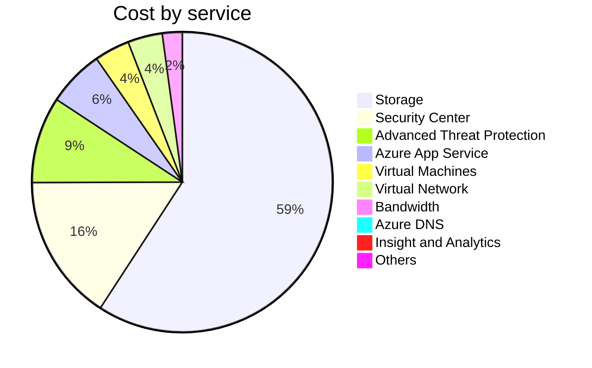
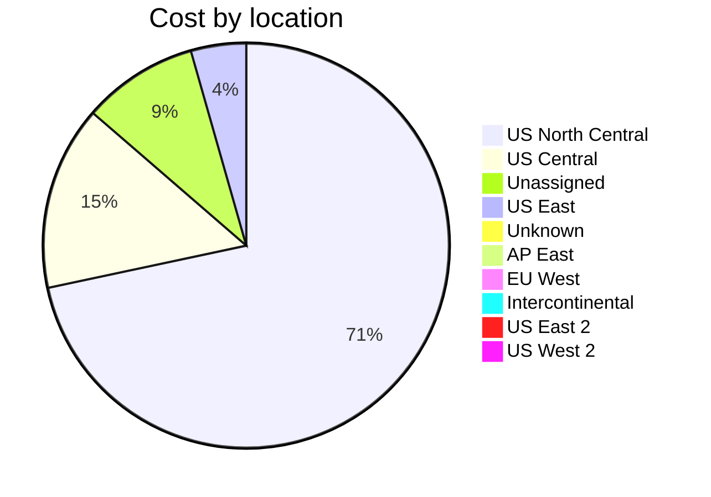
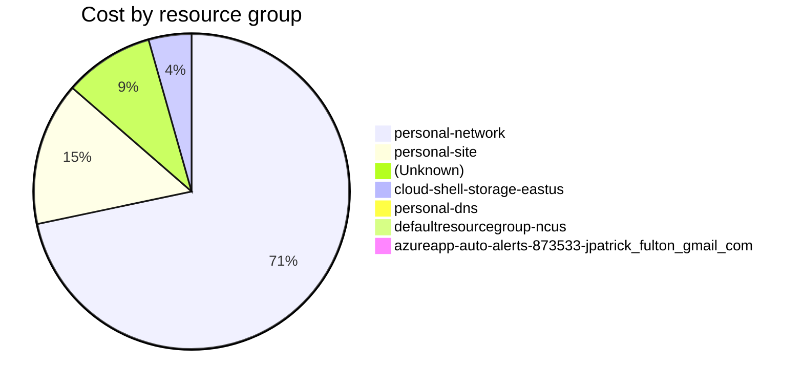

Fetching subscription details...
Fetching cost data...
Fetching forecasted cost data...
Fetching cost data by service name...
Fetching cost data by location...
Fetching cost data by resource group...
# Azure Cost Overview

> Accumulated cost for subscription id `JPF Pay-As-You-Go` from **09/01/2023** to **09/14/2023**

## Totals

|Period|Amount|
|---|---:|
|Today|0.16 USD|
|Yesterday|44.74 USD|
|Last 7 days|88.65 USD|
|Last 30 days|126.02 USD|

```mermaid
gantt
   title Accumulated cost
   dateFormat  X
   axisFormat %s
   section 01 Sep
   USD 6.35 :0, 635
   section 02 Sep
   USD 12.48 :0, 1248
   section 03 Sep
   USD 18.76 :0, 1876
   section 04 Sep
   USD 24.93 :0, 2493
   section 05 Sep
   USD 31.24 :0, 3124
   section 06 Sep
   USD 37.37 :0, 3737
   section 07 Sep
   USD 43.61 :0, 4361
   section 08 Sep
   USD 49.87 :0, 4987
   section 09 Sep
   USD 56.00 :0, 5600
   section 10 Sep
   USD 61.91 :0, 6191
   section 11 Sep
   USD 67.84 :0, 6784
   section 12 Sep
   USD 81.11 :0, 8111
   section 13 Sep
   USD 125.85 :0, 12585
   section 14 Sep
   USD 126.02 :0, 12602
   section 15 Sep
   USD 133.94 : done, 0, 13394
   section 16 Sep
   USD 141.82 : done, 0, 14182
   section 17 Sep
   USD 149.72 : done, 0, 14972
   section 18 Sep
   USD 157.63 : done, 0, 15763
   section 19 Sep
   USD 165.59 : done, 0, 16559
   section 20 Sep
   USD 173.64 : done, 0, 17364
   section 21 Sep
   USD 181.81 : done, 0, 18181
   section 22 Sep
   USD 190.34 : done, 0, 19034
   section 23 Sep
   USD 198.83 : done, 0, 19883
   section 24 Sep
   USD 207.34 : done, 0, 20734
   section 25 Sep
   USD 215.85 : done, 0, 21585
   section 26 Sep
   USD 224.42 : done, 0, 22442
   section 27 Sep
   USD 233.07 : done, 0, 23307
   section 28 Sep
   USD 241.85 : done, 0, 24185
   section 29 Sep
   USD 250.99 : done, 0, 25099
   section 30 Sep
   USD 260.09 : done, 0, 26009
```

## By Service Name

|Service|Amount|
|---|---:|
|Storage|74.19 USD|
|Security Center|19.78 USD|
|Advanced Threat Protection|11.66 USD|
|Azure App Service|7.62 USD|
|Virtual Machines|4.76 USD|
|Virtual Network|4.67 USD|
|Bandwidth|2.69 USD|
|Azure DNS|0.63 USD|
|Insight and Analytics|0.00 USD|
|Others|0.00 USD|

## By Location

|Location|Amount|
|---|---:|
|US North Central|89.84 USD|
|US Central|18.46 USD|
|Unassigned|11.57 USD|
|US East|5.52 USD|
|Unknown|0.63 USD|
|AP East|0.00 USD|
|EU West|0.00 USD|
|Intercontinental|0.00 USD|
|US East 2|0.00 USD|
|US West 2|0.00 USD|

## By Resource Group

|Resource Group|Amount|
|---|---:|
|personal-network|90.04 USD|
|personal-site|18.46 USD|
||11.57 USD|
|cloud-shell-storage-eastus|5.52 USD|
|personal-dns|0.42 USD|
|defaultresourcegroup-ncus|0.00 USD|
|azureapp-auto-alerts-873533-jpatrick_fulton_gmail_com|0.00 USD|

Generated at 2023-09-14 11:03:12 for subscription with id `4913be3f-a345-4652-9bba-767418dd25e3`
