Fetching subscription details...
Fetching cost data...
Fetching forecasted cost data...
Fetching cost data by service name...
Fetching cost data by location...
Fetching cost data by resource group...
# Azure Cost Overview

> Accumulated cost for subscription id `JPF Pay-As-You-Go` from **12/01/2023** to **12/29/2023**

## Totals

|Period|Amount|
|---|---:|
|Today|0.08 USD|
|Yesterday|2.10 USD|
|Last 7 days|15.04 USD|
|Last 30 days|64.12 USD|

```mermaid
gantt
   title Accumulated cost
   dateFormat  X
   axisFormat %s
   section 01 Dec
   USD 2.41 :0, 241
   section 02 Dec
   USD 4.93 :0, 493
   section 03 Dec
   USD 7.79 :0, 779
   section 04 Dec
   USD 10.04 :0, 1004
   section 05 Dec
   USD 12.27 :0, 1227
   section 06 Dec
   USD 15.11 :0, 1511
   section 07 Dec
   USD 17.58 :0, 1758
   section 08 Dec
   USD 19.73 :0, 1973
   section 09 Dec
   USD 22.15 :0, 2215
   section 10 Dec
   USD 24.55 :0, 2455
   section 11 Dec
   USD 26.93 :0, 2693
   section 12 Dec
   USD 29.17 :0, 2917
   section 13 Dec
   USD 31.40 :0, 3140
   section 14 Dec
   USD 33.63 :0, 3363
   section 15 Dec
   USD 35.78 :0, 3578
   section 16 Dec
   USD 37.98 :0, 3798
   section 17 Dec
   USD 40.19 :0, 4019
   section 18 Dec
   USD 42.47 :0, 4247
   section 19 Dec
   USD 44.77 :0, 4477
   section 20 Dec
   USD 46.93 :0, 4693
   section 21 Dec
   USD 49.08 :0, 4908
   section 22 Dec
   USD 51.25 :0, 5125
   section 23 Dec
   USD 53.38 :0, 5338
   section 24 Dec
   USD 55.51 :0, 5551
   section 25 Dec
   USD 57.64 :0, 5764
   section 26 Dec
   USD 59.77 :0, 5977
   section 27 Dec
   USD 61.94 :0, 6194
   section 28 Dec
   USD 64.04 :0, 6404
   section 29 Dec
   USD 64.12 :0, 6412
   section 30 Dec
   USD 66.24 : done, 0, 6624
   section 31 Dec
   USD 68.34 : done, 0, 6834
```

## By Service Name

|Service|Amount|
|---|---:|
|Storage|24.05 USD|
|Azure App Service|16.52 USD|
|Virtual Machines|11.08 USD|
|Virtual Network|6.72 USD|
|Bandwidth|3.54 USD|
|Azure DNS|1.37 USD|
|Microsoft Defender for Cloud|0.84 USD|
|Functions|0.00 USD|
|Log Analytics|0.00 USD|

## By Location

|Location|Amount|
|---|---:|
|US North Central|45.06 USD|
|US Central|16.58 USD|
|Unknown|1.37 USD|
|Unassigned|0.84 USD|
|US East|0.27 USD|
|AP East|0.00 USD|
|EU West|0.00 USD|
|US East 2|0.00 USD|
|US West 2|0.00 USD|

## By Resource Group

|Resource Group|Amount|
|---|---:|
|personal-network|45.51 USD|
|personal-site|16.58 USD|
|personal-dns|0.92 USD|
||0.84 USD|
|cloud-shell-storage-eastus|0.27 USD|

Generated at 2023-12-29 11:35:08 for subscription with id `4913be3f-a345-4652-9bba-767418dd25e3`
