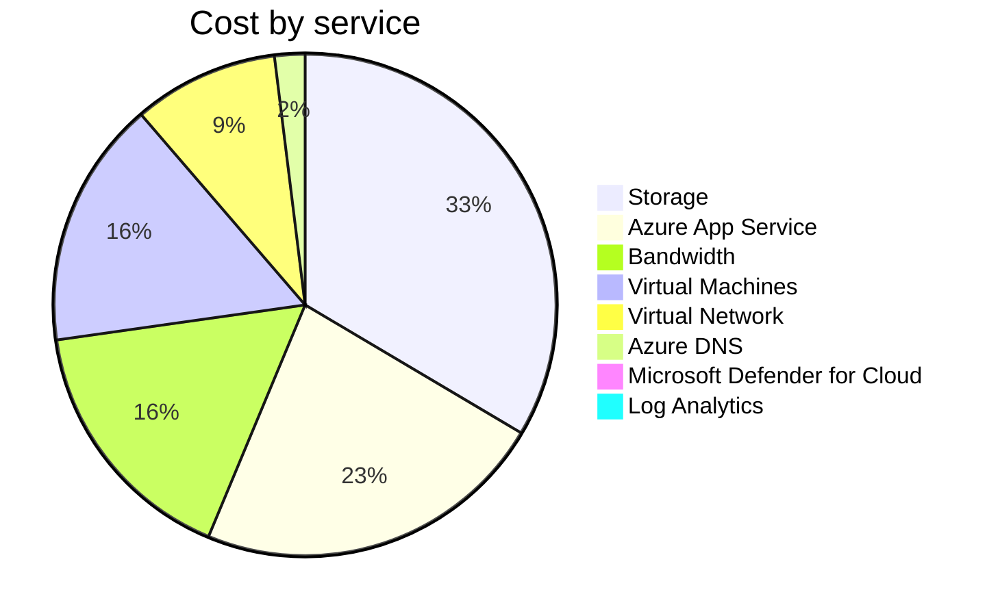
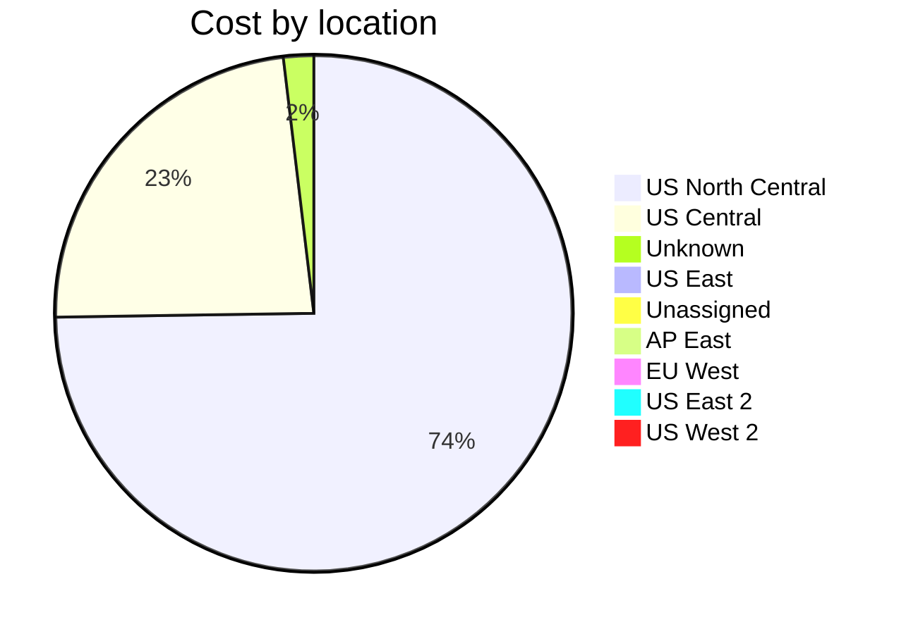
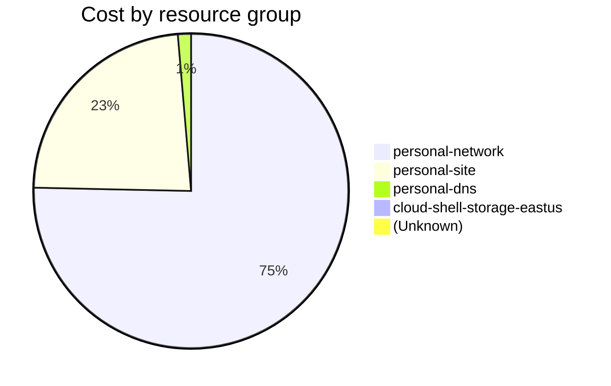

Fetching subscription details...
Fetching cost data...
Fetching forecasted cost data...
Fetching cost data by service name...
Fetching cost data by location...
Fetching cost data by resource group...
# Azure Cost Overview

> Accumulated cost for subscription id `JPF Pay-As-You-Go` from **03/01/2024** to **03/04/2024**

## Totals

|Period|Amount|
|---|---:|
|Today|0.09 USD|
|Yesterday|1.69 USD|
|Last 7 days|7.18 USD|
|Last 30 days|7.18 USD|

```mermaid
gantt
   title Accumulated cost
   dateFormat  X
   axisFormat %s
   section 01 Mar
   USD 3.32 :0, 332
   section 02 Mar
   USD 5.40 :0, 540
   section 03 Mar
   USD 7.09 :0, 709
   section 04 Mar
   USD 7.18 :0, 718
   section 05 Mar
   USD 9.49 : done, 0, 949
   section 06 Mar
   USD 11.61 : done, 0, 1161
   section 07 Mar
   USD 13.50 : done, 0, 1350
   section 08 Mar
   USD 15.78 : done, 0, 1578
   section 09 Mar
   USD 17.66 : done, 0, 1766
   section 10 Mar
   USD 19.86 : done, 0, 1986
   section 11 Mar
   USD 21.59 : done, 0, 2159
   section 12 Mar
   USD 23.71 : done, 0, 2371
   section 13 Mar
   USD 25.63 : done, 0, 2563
   section 14 Mar
   USD 27.32 : done, 0, 2732
   section 15 Mar
   USD 29.41 : done, 0, 2941
   section 16 Mar
   USD 31.09 : done, 0, 3109
   section 17 Mar
   USD 33.09 : done, 0, 3309
   section 18 Mar
   USD 34.63 : done, 0, 3463
   section 19 Mar
   USD 36.55 : done, 0, 3655
   section 20 Mar
   USD 38.27 : done, 0, 3827
   section 21 Mar
   USD 39.77 : done, 0, 3977
   section 22 Mar
   USD 41.66 : done, 0, 4166
   section 23 Mar
   USD 43.14 : done, 0, 4314
   section 24 Mar
   USD 44.94 : done, 0, 4494
   section 25 Mar
   USD 46.28 : done, 0, 4628
   section 26 Mar
   USD 48.00 : done, 0, 4800
   section 27 Mar
   USD 49.53 : done, 0, 4953
   section 28 Mar
   USD 50.83 : done, 0, 5083
   section 29 Mar
   USD 52.52 : done, 0, 5252
   section 30 Mar
   USD 53.80 : done, 0, 5380
   section 31 Mar
   USD 55.41 : done, 0, 5541
```

## By Service Name

|Service|Amount|
|---|---:|
|Storage|2.40 USD|
|Azure App Service|1.63 USD|
|Bandwidth|1.18 USD|
|Virtual Machines|1.14 USD|
|Virtual Network|0.67 USD|
|Azure DNS|0.14 USD|
|Microsoft Defender for Cloud|0.02 USD|
|Log Analytics|0.00 USD|

## By Location

|Location|Amount|
|---|---:|
|US North Central|5.54 USD|
|US Central|1.73 USD|
|Unknown|0.14 USD|
|US East|0.03 USD|
|Unassigned|0.02 USD|
|AP East|0.00 USD|
|EU West|0.00 USD|
|US East 2|0.00 USD|
|US West 2|0.00 USD|

## By Resource Group

|Resource Group|Amount|
|---|---:|
|personal-network|5.59 USD|
|personal-site|1.73 USD|
|personal-dns|0.10 USD|
|cloud-shell-storage-eastus|0.03 USD|
||0.02 USD|

Generated at 2024-03-04 12:03:09 for subscription with id `4913be3f-a345-4652-9bba-767418dd25e3`
