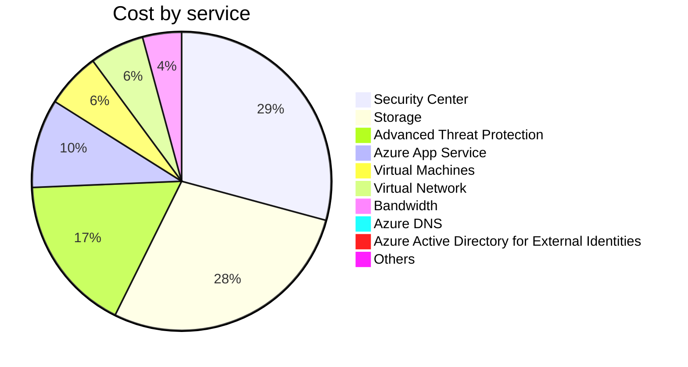

Fetching subscription details...
Fetching cost data...
Fetching forecasted cost data...
Fetching cost data by service name...
Fetching cost data by location...
Fetching cost data by resource group...
# Azure Cost Overview

> Accumulated cost for subscription id `JPF Pay-As-You-Go` from **09/01/2023** to **09/11/2023**

## Totals

|Period|Amount|
|---|---:|
|Today|2.46 USD|
|Yesterday|5.91 USD|
|Last 7 days|45.60 USD|
|Last 30 days|64.36 USD|

## By Service Name

|Service|Amount|
|---|---:|
|Security Center|18.66 USD|
|Storage|17.95 USD|
|Advanced Threat Protection|10.86 USD|
|Azure App Service|6.14 USD|
|Virtual Machines|3.80 USD|
|Virtual Network|3.76 USD|
|Bandwidth|2.69 USD|
|Azure DNS|0.51 USD|
|Azure Active Directory for External Identities|0.00 USD|
|Others|0.00 USD|

## By Location

|Location|Amount|
|---|---:|
|US North Central|31.53 USD|
|US Central|16.33 USD|
|Unassigned|10.82 USD|
|US East|5.18 USD|
|Unknown|0.51 USD|
|AP East|0.00 USD|
|EU West|0.00 USD|
|Intercontinental|0.00 USD|
|US East 2|0.00 USD|
|US West 2|0.00 USD|

## By Resource Group

|Resource Group|Amount|
|---|---:|
|personal-network|31.70 USD|
|personal-site|16.33 USD|
||10.82 USD|
|cloud-shell-storage-eastus|5.18 USD|
|personal-dns|0.34 USD|
|azureapp-auto-alerts-873533-jpatrick_fulton_gmail_com|0.00 USD|
|defaultresourcegroup-ncus|0.00 USD|

Generated at 2023-09-11 23:06:18 for subscription with id `4913be3f-a345-4652-9bba-767418dd25e3`
