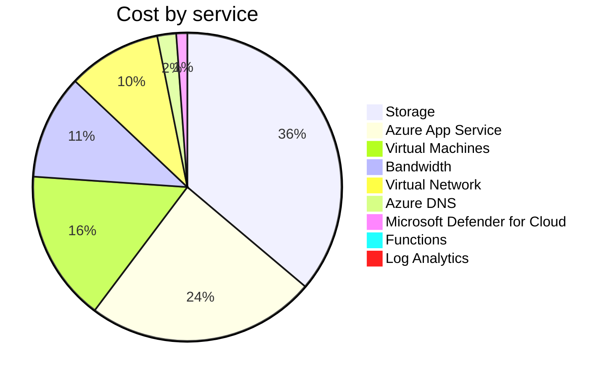

Fetching subscription details...
Fetching cost data...
Fetching forecasted cost data...
Fetching cost data by service name...
Fetching cost data by location...
Fetching cost data by resource group...
# Azure Cost Overview

> Accumulated cost for subscription id `JPF Pay-As-You-Go` from **11/01/2023** to **11/11/2023**

## Totals

|Period|Amount|
|---|---:|
|Today|0.09 USD|
|Yesterday|2.00 USD|
|Last 7 days|16.74 USD|
|Last 30 days|24.25 USD|

```mermaid
gantt
   title Accumulated cost
   dateFormat  X
   axisFormat %s
   section 01 Nov
   USD 2.50 :0, 250
   section 02 Nov
   USD 4.87 :0, 487
   section 03 Nov
   USD 7.51 :0, 751
   section 04 Nov
   USD 9.95 :0, 995
   section 05 Nov
   USD 12.33 :0, 1233
   section 06 Nov
   USD 14.80 :0, 1480
   section 07 Nov
   USD 17.20 :0, 1720
   section 08 Nov
   USD 19.69 :0, 1969
   section 09 Nov
   USD 22.15 :0, 2215
   section 10 Nov
   USD 24.15 :0, 2415
   section 11 Nov
   USD 24.25 :0, 2425
   section 12 Nov
   USD 26.42 : done, 0, 2642
   section 13 Nov
   USD 28.80 : done, 0, 2880
   section 14 Nov
   USD 31.21 : done, 0, 3121
   section 15 Nov
   USD 33.69 : done, 0, 3369
   section 16 Nov
   USD 36.12 : done, 0, 3612
   section 17 Nov
   USD 38.62 : done, 0, 3862
   section 18 Nov
   USD 40.93 : done, 0, 4093
   section 19 Nov
   USD 43.08 : done, 0, 4308
   section 20 Nov
   USD 45.43 : done, 0, 4543
   section 21 Nov
   USD 47.83 : done, 0, 4783
   section 22 Nov
   USD 50.28 : done, 0, 5028
   section 23 Nov
   USD 52.69 : done, 0, 5269
   section 24 Nov
   USD 55.17 : done, 0, 5517
   section 25 Nov
   USD 57.46 : done, 0, 5746
   section 26 Nov
   USD 59.59 : done, 0, 5959
   section 27 Nov
   USD 61.93 : done, 0, 6193
   section 28 Nov
   USD 64.30 : done, 0, 6430
   section 29 Nov
   USD 66.73 : done, 0, 6673
   section 30 Nov
   USD 69.12 : done, 0, 6912
```

## By Service Name

|Service|Amount|
|---|---:|
|Storage|8.77 USD|
|Azure App Service|5.84 USD|
|Virtual Machines|3.84 USD|
|Bandwidth|2.66 USD|
|Virtual Network|2.38 USD|
|Azure DNS|0.48 USD|
|Microsoft Defender for Cloud|0.28 USD|
|Functions|0.00 USD|
|Log Analytics|0.00 USD|

## By Location

|Location|Amount|
|---|---:|
|US North Central|17.52 USD|
|US Central|5.87 USD|
|Unknown|0.48 USD|
|Unassigned|0.28 USD|
|US East|0.10 USD|
|AP East|0.00 USD|
|EU West|0.00 USD|
|US East 2|0.00 USD|
|US West 2|0.00 USD|

## By Resource Group

|Resource Group|Amount|
|---|---:|
|personal-network|17.68 USD|
|personal-site|5.87 USD|
|personal-dns|0.32 USD|
||0.28 USD|
|cloud-shell-storage-eastus|0.10 USD|

Generated at 2023-11-11 11:33:20 for subscription with id `4913be3f-a345-4652-9bba-767418dd25e3`
