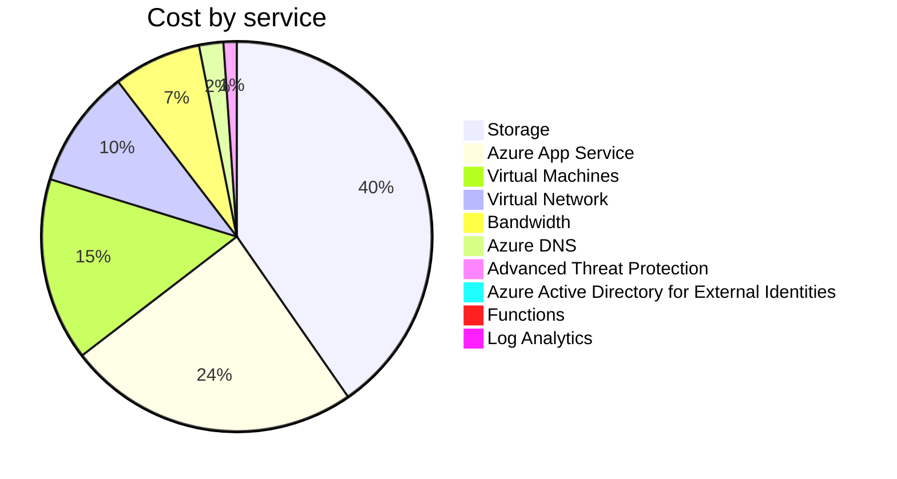

Fetching subscription details...
Fetching cost data...
Fetching forecasted cost data...
Fetching cost data by service name...
Fetching cost data by location...
Fetching cost data by resource group...
# Azure Cost Overview

> Accumulated cost for subscription id `JPF Pay-As-You-Go` from **10/01/2023** to **10/17/2023**

## Totals

|Period|Amount|
|---|---:|
|Today|0.10 USD|
|Yesterday|1.58 USD|
|Last 7 days|14.35 USD|
|Last 30 days|38.27 USD|

## By Service Name

|Service|Amount|
|---|---:|
|Storage|15.44 USD|
|Azure App Service|9.27 USD|
|Virtual Machines|5.81 USD|
|Virtual Network|3.77 USD|
|Bandwidth|2.79 USD|
|Azure DNS|0.77 USD|
|Advanced Threat Protection|0.42 USD|
|Azure Active Directory for External Identities|0.00 USD|
|Functions|0.00 USD|
|Log Analytics|0.00 USD|

## By Location

|Location|Amount|
|---|---:|
|US North Central|27.61 USD|
|US Central|9.31 USD|
|Unknown|0.77 USD|
|Unassigned|0.42 USD|
|US East|0.15 USD|
|AP East|0.00 USD|
|EU West|0.00 USD|
|US East 2|0.00 USD|
|US West 2|0.00 USD|

## By Resource Group

|Resource Group|Amount|
|---|---:|
|personal-network|27.87 USD|
|personal-site|9.31 USD|
|personal-dns|0.51 USD|
||0.42 USD|
|cloud-shell-storage-eastus|0.15 USD|

Generated at 2023-10-17 11:30:25 for subscription with id `4913be3f-a345-4652-9bba-767418dd25e3`
