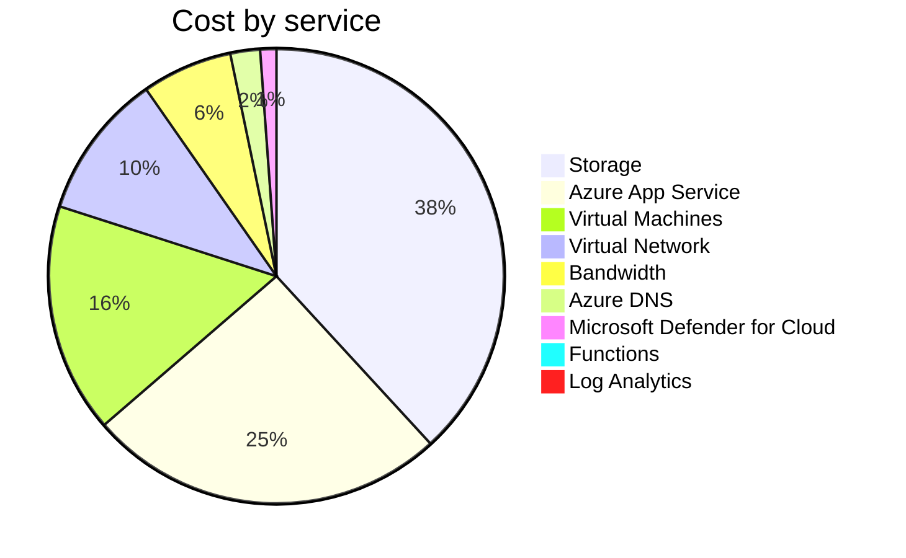

Fetching subscription details...
Fetching cost data...
Fetching forecasted cost data...
Fetching cost data by service name...
Fetching cost data by location...
Fetching cost data by resource group...
# Azure Cost Overview

> Accumulated cost for subscription id `JPF Pay-As-You-Go` from **11/01/2023** to **11/27/2023**

## Totals

|Period|Amount|
|---|---:|
|Today|0.09 USD|
|Yesterday|2.08 USD|
|Last 7 days|15.79 USD|
|Last 30 days|60.20 USD|

```mermaid
gantt
   title Accumulated cost
   dateFormat  X
   axisFormat %s
   section 01 Nov
   USD 2.50 :0, 250
   section 02 Nov
   USD 4.87 :0, 487
   section 03 Nov
   USD 7.51 :0, 751
   section 04 Nov
   USD 9.95 :0, 995
   section 05 Nov
   USD 12.34 :0, 1234
   section 06 Nov
   USD 14.80 :0, 1480
   section 07 Nov
   USD 17.20 :0, 1720
   section 08 Nov
   USD 19.70 :0, 1970
   section 09 Nov
   USD 22.16 :0, 2216
   section 10 Nov
   USD 24.40 :0, 2440
   section 11 Nov
   USD 26.63 :0, 2663
   section 12 Nov
   USD 28.89 :0, 2889
   section 13 Nov
   USD 31.15 :0, 3115
   section 14 Nov
   USD 33.31 :0, 3331
   section 15 Nov
   USD 35.54 :0, 3554
   section 16 Nov
   USD 37.75 :0, 3775
   section 17 Nov
   USD 39.98 :0, 3998
   section 18 Nov
   USD 42.19 :0, 4219
   section 19 Nov
   USD 44.41 :0, 4441
   section 20 Nov
   USD 46.66 :0, 4666
   section 21 Nov
   USD 49.02 :0, 4902
   section 22 Nov
   USD 51.24 :0, 5124
   section 23 Nov
   USD 53.54 :0, 5354
   section 24 Nov
   USD 55.77 :0, 5577
   section 25 Nov
   USD 58.02 :0, 5802
   section 26 Nov
   USD 60.11 :0, 6011
   section 27 Nov
   USD 60.20 :0, 6020
   section 28 Nov
   USD 62.49 : done, 0, 6249
   section 29 Nov
   USD 64.77 : done, 0, 6477
   section 30 Nov
   USD 67.01 : done, 0, 6701
```

## By Service Name

|Service|Amount|
|---|---:|
|Storage|22.98 USD|
|Azure App Service|15.34 USD|
|Virtual Machines|9.82 USD|
|Virtual Network|6.23 USD|
|Bandwidth|3.87 USD|
|Azure DNS|1.27 USD|
|Microsoft Defender for Cloud|0.69 USD|
|Functions|0.00 USD|
|Log Analytics|0.00 USD|

## By Location

|Location|Amount|
|---|---:|
|US North Central|42.58 USD|
|US Central|15.40 USD|
|Unknown|1.27 USD|
|Unassigned|0.69 USD|
|US East|0.26 USD|
|AP East|0.00 USD|
|EU West|0.00 USD|
|US East 2|0.00 USD|
|US West 2|0.00 USD|

## By Resource Group

|Resource Group|Amount|
|---|---:|
|personal-network|43.00 USD|
|personal-site|15.40 USD|
|personal-dns|0.85 USD|
||0.69 USD|
|cloud-shell-storage-eastus|0.26 USD|

Generated at 2023-11-27 11:35:32 for subscription with id `4913be3f-a345-4652-9bba-767418dd25e3`
