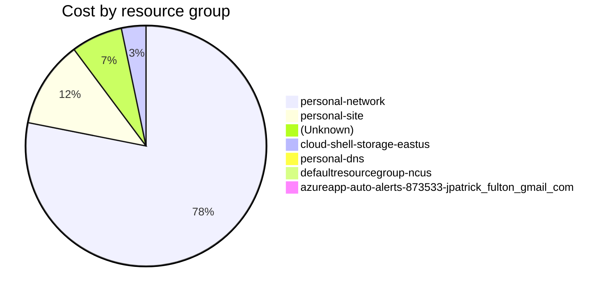

Fetching subscription details...
Fetching cost data...
Fetching forecasted cost data...
Fetching cost data by service name...
Fetching cost data by location...
Fetching cost data by resource group...
# Azure Cost Overview

> Accumulated cost for subscription id `JPF Pay-As-You-Go` from **09/01/2023** to **09/16/2023**

## Totals

|Period|Amount|
|---|---:|
|Today|0.03 USD|
|Yesterday|5.78 USD|
|Last 7 days|118.95 USD|
|Last 30 days|168.82 USD|

## By Service Name

|Service|Amount|
|---|---:|
|Storage|113.69 USD|
|Security Center|19.78 USD|
|Advanced Threat Protection|11.73 USD|
|Azure App Service|8.83 USD|
|Virtual Machines|5.71 USD|
|Virtual Network|5.66 USD|
|Bandwidth|2.69 USD|
|Azure DNS|0.73 USD|
|Insight and Analytics|0.00 USD|
|Others|0.00 USD|

## By Location

|Location|Amount|
|---|---:|
|US North Central|131.25 USD|
|US Central|19.67 USD|
|Unassigned|11.63 USD|
|US East|5.54 USD|
|Unknown|0.73 USD|
|AP East|0.00 USD|
|EU West|0.00 USD|
|Intercontinental|0.00 USD|
|US East 2|0.00 USD|
|US West 2|0.00 USD|

## By Resource Group

|Resource Group|Amount|
|---|---:|
|personal-network|131.49 USD|
|personal-site|19.67 USD|
||11.63 USD|
|cloud-shell-storage-eastus|5.54 USD|
|personal-dns|0.49 USD|
|defaultresourcegroup-ncus|0.00 USD|
|azureapp-auto-alerts-873533-jpatrick_fulton_gmail_com|0.00 USD|

Generated at 2023-09-16 11:35:14 for subscription with id `4913be3f-a345-4652-9bba-767418dd25e3`
