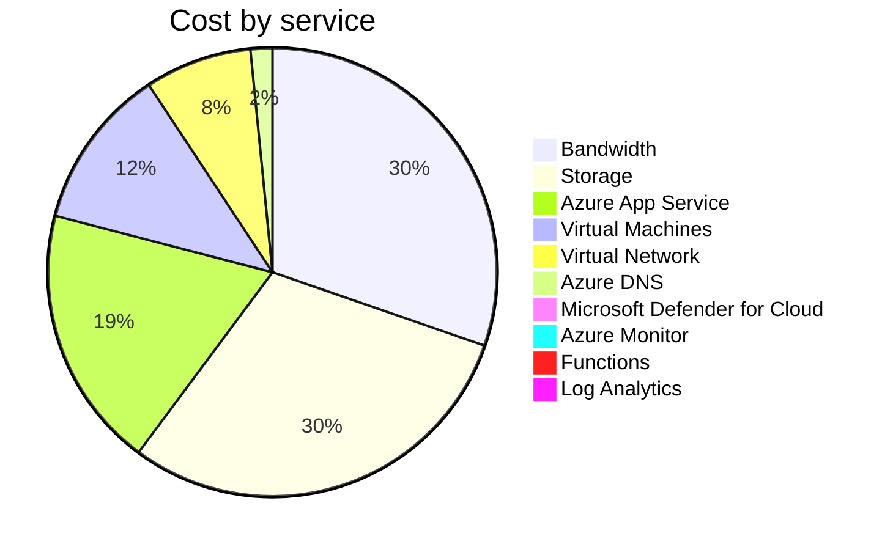
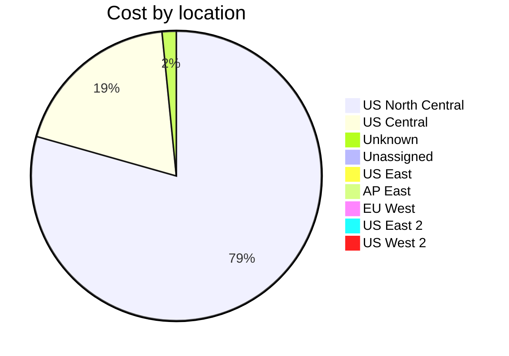

Fetching subscription details...
Fetching cost data...
Fetching forecasted cost data...
Fetching cost data by service name...
Fetching cost data by location...
Fetching cost data by resource group...
# Azure Cost Overview

> Accumulated cost for subscription id `JPF Pay-As-You-Go` from **02/01/2024** to **02/09/2024**

## Totals

|Period|Amount|
|---|---:|
|Today|0.09 USD|
|Yesterday|3.32 USD|
|Last 7 days|22.00 USD|
|Last 30 days|24.98 USD|

```mermaid
gantt
   title Accumulated cost
   dateFormat  X
   axisFormat %s
   section 01 Feb
   USD 2.98 :0, 298
   section 02 Feb
   USD 6.65 :0, 665
   section 03 Feb
   USD 9.78 :0, 978
   section 04 Feb
   USD 12.79 :0, 1279
   section 05 Feb
   USD 15.85 :0, 1585
   section 06 Feb
   USD 18.67 :0, 1867
   section 07 Feb
   USD 21.58 :0, 2158
   section 08 Feb
   USD 24.89 :0, 2489
   section 09 Feb
   USD 24.98 :0, 2498
   section 10 Feb
   USD 28.68 : done, 0, 2868
   section 11 Feb
   USD 31.78 : done, 0, 3178
   section 12 Feb
   USD 34.68 : done, 0, 3468
   section 13 Feb
   USD 37.77 : done, 0, 3777
   section 14 Feb
   USD 40.58 : done, 0, 4058
   section 15 Feb
   USD 43.65 : done, 0, 4365
   section 16 Feb
   USD 46.98 : done, 0, 4698
   section 17 Feb
   USD 50.76 : done, 0, 5076
   section 18 Feb
   USD 53.93 : done, 0, 5393
   section 19 Feb
   USD 56.89 : done, 0, 5689
   section 20 Feb
   USD 60.06 : done, 0, 6006
   section 21 Feb
   USD 62.93 : done, 0, 6293
   section 22 Feb
   USD 66.08 : done, 0, 6608
   section 23 Feb
   USD 69.48 : done, 0, 6948
   section 24 Feb
   USD 73.33 : done, 0, 7333
   section 25 Feb
   USD 76.57 : done, 0, 7657
   section 26 Feb
   USD 79.60 : done, 0, 7960
   section 27 Feb
   USD 82.84 : done, 0, 8284
   section 28 Feb
   USD 85.78 : done, 0, 8578
   section 29 Feb
   USD 89.00 : done, 0, 8900
```

## By Service Name

|Service|Amount|
|---|---:|
|Bandwidth|7.51 USD|
|Storage|7.40 USD|
|Azure App Service|4.68 USD|
|Virtual Machines|2.89 USD|
|Virtual Network|1.91 USD|
|Azure DNS|0.39 USD|
|Microsoft Defender for Cloud|0.20 USD|
|Azure Monitor|0.00 USD|
|Functions|0.00 USD|
|Log Analytics|0.00 USD|

## By Location

|Location|Amount|
|---|---:|
|US North Central|19.61 USD|
|US Central|4.70 USD|
|Unknown|0.39 USD|
|Unassigned|0.20 USD|
|US East|0.08 USD|
|AP East|0.00 USD|
|EU West|0.00 USD|
|US East 2|0.00 USD|
|US West 2|0.00 USD|

## By Resource Group

|Resource Group|Amount|
|---|---:|
|personal-network|19.74 USD|
|personal-site|4.70 USD|
|personal-dns|0.26 USD|
||0.20 USD|
|cloud-shell-storage-eastus|0.08 USD|
|azureapp-auto-alerts-873533-jpatrick_fulton_gmail_com|0.00 USD|

Generated at 2024-02-09 11:33:24 for subscription with id `4913be3f-a345-4652-9bba-767418dd25e3`
