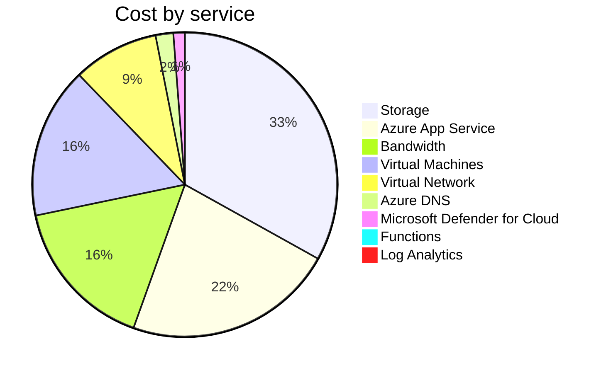

Fetching subscription details...
Fetching cost data...
Fetching forecasted cost data...
Fetching cost data by service name...
Fetching cost data by location...
Fetching cost data by resource group...
# Azure Cost Overview

> Accumulated cost for subscription id `JPF Pay-As-You-Go` from **01/01/2024** to **01/12/2024**

## Totals

|Period|Amount|
|---|---:|
|Today|0.09 USD|
|Yesterday|2.02 USD|
|Last 7 days|17.89 USD|
|Last 30 days|28.77 USD|

## By Service Name

|Service|Amount|
|---|---:|
|Storage|9.52 USD|
|Azure App Service|6.44 USD|
|Bandwidth|4.68 USD|
|Virtual Machines|4.62 USD|
|Virtual Network|2.62 USD|
|Azure DNS|0.54 USD|
|Microsoft Defender for Cloud|0.35 USD|
|Functions|0.00 USD|
|Log Analytics|0.00 USD|

## By Location

|Location|Amount|
|---|---:|
|US North Central|21.32 USD|
|US Central|6.46 USD|
|Unknown|0.54 USD|
|Unassigned|0.35 USD|
|US East|0.11 USD|
|AP East|0.00 USD|
|EU West|0.00 USD|
|US East 2|0.00 USD|
|US West 2|0.00 USD|

## By Resource Group

|Resource Group|Amount|
|---|---:|
|personal-network|21.50 USD|
|personal-site|6.46 USD|
|personal-dns|0.36 USD|
||0.35 USD|
|cloud-shell-storage-eastus|0.11 USD|

Generated at 2024-01-12 11:37:09 for subscription with id `4913be3f-a345-4652-9bba-767418dd25e3`
