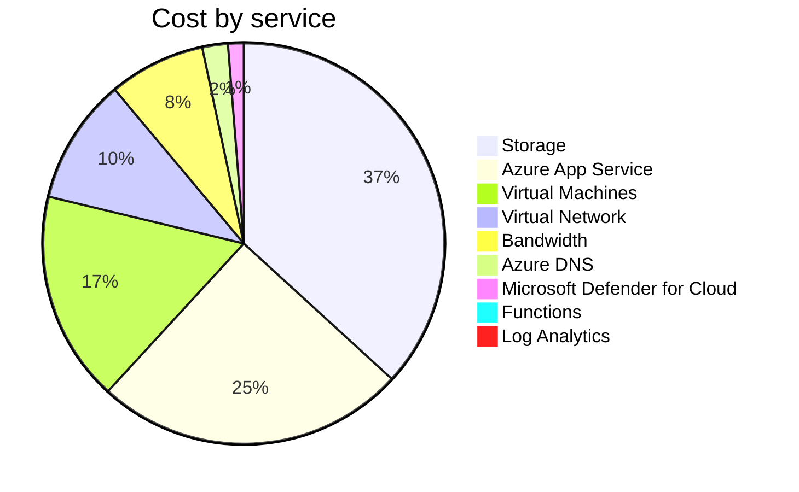

Fetching subscription details...
Fetching cost data...
Fetching forecasted cost data...
Fetching cost data by service name...
Fetching cost data by location...
Fetching cost data by resource group...
# Azure Cost Overview

> Accumulated cost for subscription id `JPF Pay-As-You-Go` from **12/01/2023** to **12/16/2023**

## Totals

|Period|Amount|
|---|---:|
|Today|0.02 USD|
|Yesterday|1.75 USD|
|Last 7 days|15.15 USD|
|Last 30 days|34.88 USD|

```mermaid
gantt
   title Accumulated cost
   dateFormat  X
   axisFormat %s
   section 01 Dec
   USD 2.41 :0, 241
   section 02 Dec
   USD 4.93 :0, 493
   section 03 Dec
   USD 7.79 :0, 779
   section 04 Dec
   USD 10.04 :0, 1004
   section 05 Dec
   USD 12.27 :0, 1227
   section 06 Dec
   USD 15.11 :0, 1511
   section 07 Dec
   USD 17.58 :0, 1758
   section 08 Dec
   USD 19.73 :0, 1973
   section 09 Dec
   USD 22.14 :0, 2214
   section 10 Dec
   USD 24.36 :0, 2436
   section 11 Dec
   USD 26.56 :0, 2656
   section 12 Dec
   USD 28.75 :0, 2875
   section 13 Dec
   USD 30.93 :0, 3093
   section 14 Dec
   USD 33.12 :0, 3312
   section 15 Dec
   USD 34.86 :0, 3486
   section 16 Dec
   USD 34.88 :0, 3488
   section 17 Dec
   USD 37.10 : done, 0, 3710
   section 18 Dec
   USD 39.23 : done, 0, 3923
   section 19 Dec
   USD 41.64 : done, 0, 4164
   section 20 Dec
   USD 43.82 : done, 0, 4382
   section 21 Dec
   USD 46.03 : done, 0, 4603
   section 22 Dec
   USD 48.29 : done, 0, 4829
   section 23 Dec
   USD 50.57 : done, 0, 5057
   section 24 Dec
   USD 52.73 : done, 0, 5273
   section 25 Dec
   USD 54.79 : done, 0, 5479
   section 26 Dec
   USD 57.14 : done, 0, 5714
   section 27 Dec
   USD 59.26 : done, 0, 5926
   section 28 Dec
   USD 61.40 : done, 0, 6140
   section 29 Dec
   USD 63.60 : done, 0, 6360
   section 30 Dec
   USD 65.82 : done, 0, 6582
   section 31 Dec
   USD 67.92 : done, 0, 6792
```

## By Service Name

|Service|Amount|
|---|---:|
|Storage|12.84 USD|
|Azure App Service|8.73 USD|
|Virtual Machines|5.91 USD|
|Virtual Network|3.54 USD|
|Bandwidth|2.71 USD|
|Azure DNS|0.72 USD|
|Microsoft Defender for Cloud|0.44 USD|
|Functions|0.00 USD|
|Log Analytics|0.00 USD|

## By Location

|Location|Amount|
|---|---:|
|US North Central|24.82 USD|
|US Central|8.76 USD|
|Unknown|0.72 USD|
|Unassigned|0.44 USD|
|US East|0.14 USD|
|AP East|0.00 USD|
|EU West|0.00 USD|
|US East 2|0.00 USD|
|US West 2|0.00 USD|

## By Resource Group

|Resource Group|Amount|
|---|---:|
|personal-network|25.05 USD|
|personal-site|8.76 USD|
|personal-dns|0.49 USD|
||0.44 USD|
|cloud-shell-storage-eastus|0.14 USD|

Generated at 2023-12-16 11:35:18 for subscription with id `4913be3f-a345-4652-9bba-767418dd25e3`
