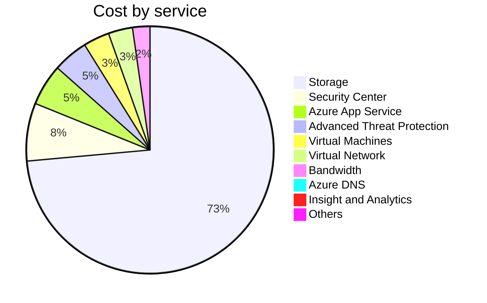

Fetching subscription details...
Fetching cost data...
Fetching forecasted cost data...
Fetching cost data by service name...
Fetching cost data by location...
Fetching cost data by resource group...
# Azure Cost Overview

> Accumulated cost for subscription id `JPF Pay-As-You-Go` from **09/01/2023** to **09/25/2023**

## Totals

|Period|Amount|
|---|---:|
|Today|0.09 USD|
|Yesterday|3.35 USD|
|Last 7 days|50.21 USD|
|Last 30 days|262.52 USD|

```mermaid
gantt
   title Accumulated cost
   dateFormat  X
   axisFormat %s
   section 01 Sep
   USD 6.35 :0, 635
   section 02 Sep
   USD 12.48 :0, 1248
   section 03 Sep
   USD 18.76 :0, 1876
   section 04 Sep
   USD 24.93 :0, 2493
   section 05 Sep
   USD 31.24 :0, 3124
   section 06 Sep
   USD 37.37 :0, 3737
   section 07 Sep
   USD 43.61 :0, 4361
   section 08 Sep
   USD 49.87 :0, 4987
   section 09 Sep
   USD 56.01 :0, 5601
   section 10 Sep
   USD 62.03 :0, 6203
   section 11 Sep
   USD 68.13 :0, 6813
   section 12 Sep
   USD 81.48 :0, 8148
   section 13 Sep
   USD 128.45 :0, 12845
   section 14 Sep
   USD 163.70 :0, 16370
   section 15 Sep
   USD 170.08 :0, 17008
   section 16 Sep
   USD 183.99 :0, 18399
   section 17 Sep
   USD 212.31 :0, 21231
   section 18 Sep
   USD 227.87 :0, 22787
   section 19 Sep
   USD 243.72 :0, 24372
   section 20 Sep
   USD 247.45 :0, 24745
   section 21 Sep
   USD 251.32 :0, 25132
   section 22 Sep
   USD 255.50 :0, 25550
   section 23 Sep
   USD 259.08 :0, 25908
   section 24 Sep
   USD 262.43 :0, 26243
   section 25 Sep
   USD 262.52 :0, 26252
   section 26 Sep
   USD 281.12 : done, 0, 28112
   section 27 Sep
   USD 296.33 : done, 0, 29633
   section 28 Sep
   USD 311.89 : done, 0, 31189
   section 29 Sep
   USD 327.89 : done, 0, 32789
   section 30 Sep
   USD 344.04 : done, 0, 34404
```

## By Service Name

|Service|Amount|
|---|---:|
|Storage|192.24 USD|
|Security Center|19.78 USD|
|Azure App Service|14.15 USD|
|Advanced Threat Protection|12.03 USD|
|Virtual Machines|8.92 USD|
|Virtual Network|8.29 USD|
|Bandwidth|5.94 USD|
|Azure DNS|1.17 USD|
|Insight and Analytics|0.00 USD|
|Others|0.00 USD|

## By Location

|Location|Amount|
|---|---:|
|US North Central|218.76 USD|
|US Central|25.02 USD|
|Unassigned|11.94 USD|
|US East|5.63 USD|
|Unknown|1.17 USD|
|AP East|0.00 USD|
|EU West|0.00 USD|
|Intercontinental|0.00 USD|
|US East 2|0.00 USD|
|Others|0.00 USD|

## By Resource Group

|Resource Group|Amount|
|---|---:|
|personal-network|219.15 USD|
|personal-site|25.02 USD|
||11.94 USD|
|cloud-shell-storage-eastus|5.63 USD|
|personal-dns|0.78 USD|
|defaultresourcegroup-ncus|0.00 USD|
|azureapp-auto-alerts-873533-jpatrick_fulton_gmail_com|0.00 USD|

Generated at 2023-09-25 11:34:42 for subscription with id `4913be3f-a345-4652-9bba-767418dd25e3`
