Fetching subscription details...
Fetching cost data...
Fetching forecasted cost data...
Fetching cost data by service name...
Fetching cost data by location...
Fetching cost data by resource group...
# Azure Cost Overview

> Accumulated cost for subscription id `JPF Pay-As-You-Go` from **01/01/2024** to **01/09/2024**

## Totals

|Period|Amount|
|---|---:|
|Today|0.10 USD|
|Yesterday|2.96 USD|
|Last 7 days|19.14 USD|
|Last 30 days|21.80 USD|

```mermaid
gantt
   title Accumulated cost
   dateFormat  X
   axisFormat %s
   section 01 Jan
   USD 2.66 :0, 266
   section 02 Jan
   USD 5.78 :0, 578
   section 03 Jan
   USD 8.25 :0, 825
   section 04 Jan
   USD 10.83 :0, 1083
   section 05 Jan
   USD 13.43 :0, 1343
   section 06 Jan
   USD 16.33 :0, 1633
   section 07 Jan
   USD 18.74 :0, 1874
   section 08 Jan
   USD 21.70 :0, 2170
   section 09 Jan
   USD 21.80 :0, 2180
   section 10 Jan
   USD 24.15 : done, 0, 2415
   section 11 Jan
   USD 26.51 : done, 0, 2651
   section 12 Jan
   USD 28.91 : done, 0, 2891
   section 13 Jan
   USD 31.53 : done, 0, 3153
   section 14 Jan
   USD 33.98 : done, 0, 3398
   section 15 Jan
   USD 36.65 : done, 0, 3665
   section 16 Jan
   USD 39.32 : done, 0, 3932
   section 17 Jan
   USD 41.65 : done, 0, 4165
   section 18 Jan
   USD 44.00 : done, 0, 4400
   section 19 Jan
   USD 46.39 : done, 0, 4639
   section 20 Jan
   USD 49.00 : done, 0, 4900
   section 21 Jan
   USD 51.44 : done, 0, 5144
   section 22 Jan
   USD 54.10 : done, 0, 5410
   section 23 Jan
   USD 56.75 : done, 0, 5675
   section 24 Jan
   USD 59.08 : done, 0, 5908
   section 25 Jan
   USD 61.41 : done, 0, 6141
   section 26 Jan
   USD 63.79 : done, 0, 6379
   section 27 Jan
   USD 66.38 : done, 0, 6638
   section 28 Jan
   USD 68.82 : done, 0, 6882
   section 29 Jan
   USD 71.46 : done, 0, 7146
   section 30 Jan
   USD 74.10 : done, 0, 7410
   section 31 Jan
   USD 76.42 : done, 0, 7642
```

## By Service Name

|Service|Amount|
|---|---:|
|Storage|6.97 USD|
|Azure App Service|4.68 USD|
|Bandwidth|4.20 USD|
|Virtual Machines|3.40 USD|
|Virtual Network|1.91 USD|
|Azure DNS|0.39 USD|
|Microsoft Defender for Cloud|0.25 USD|
|Functions|0.00 USD|
|Log Analytics|0.00 USD|

## By Location

|Location|Amount|
|---|---:|
|US North Central|16.38 USD|
|US Central|4.70 USD|
|Unknown|0.39 USD|
|Unassigned|0.25 USD|
|US East|0.08 USD|
|AP East|0.00 USD|
|EU West|0.00 USD|
|US East 2|0.00 USD|
|US West 2|0.00 USD|

## By Resource Group

|Resource Group|Amount|
|---|---:|
|personal-network|16.51 USD|
|personal-site|4.70 USD|
|personal-dns|0.26 USD|
||0.25 USD|
|cloud-shell-storage-eastus|0.08 USD|

Generated at 2024-01-09 11:35:20 for subscription with id `4913be3f-a345-4652-9bba-767418dd25e3`
