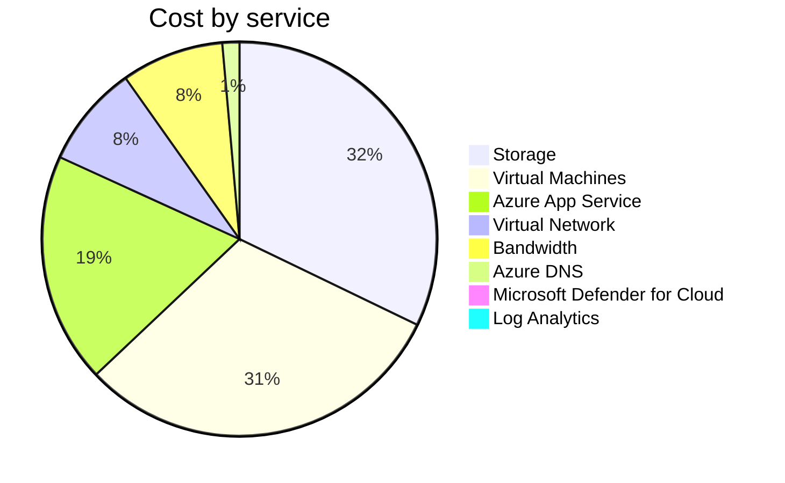
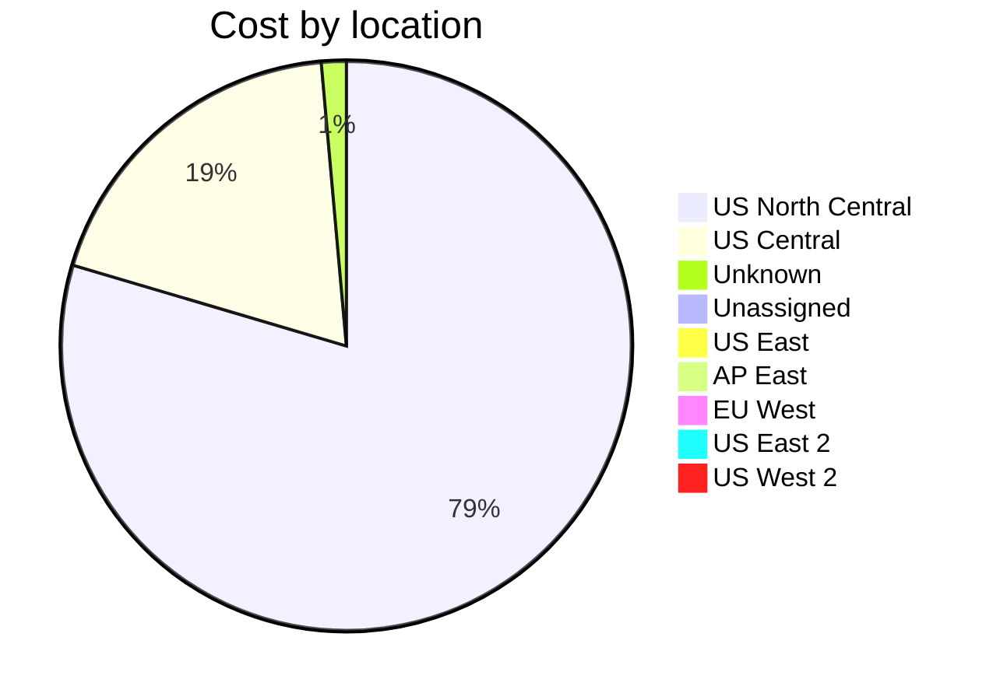
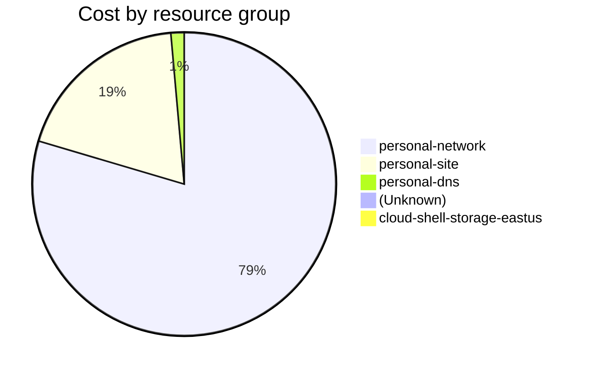

Fetching subscription details...
Fetching cost data...
Fetching forecasted cost data...
Fetching cost data by service name...
Fetching cost data by location...
Fetching cost data by resource group...
# Azure Cost Overview

> Accumulated cost for subscription id `JPF Pay-As-You-Go` from **02/01/2024** to **02/02/2024**

## Totals

|Period|Amount|
|---|---:|
|Today|0.09 USD|
|Yesterday|1.35 USD|
|Last 7 days|1.44 USD|
|Last 30 days|1.44 USD|

```mermaid
gantt
   title Accumulated cost
   dateFormat  X
   axisFormat %s
   section 01 Feb
   USD 1.35 :0, 135
   section 02 Feb
   USD 1.44 :0, 144
   section 03 Feb
   USD 4.79 : done, 0, 479
   section 04 Feb
   USD 7.47 : done, 0, 747
   section 05 Feb
   USD 10.13 : done, 0, 1013
   section 06 Feb
   USD 12.95 : done, 0, 1295
   section 07 Feb
   USD 15.54 : done, 0, 1554
   section 08 Feb
   USD 18.28 : done, 0, 1828
   section 09 Feb
   USD 21.13 : done, 0, 2113
   section 10 Feb
   USD 24.49 : done, 0, 2449
   section 11 Feb
   USD 27.19 : done, 0, 2719
   section 12 Feb
   USD 29.88 : done, 0, 2988
   section 13 Feb
   USD 32.72 : done, 0, 3272
   section 14 Feb
   USD 35.32 : done, 0, 3532
   section 15 Feb
   USD 38.09 : done, 0, 3809
   section 16 Feb
   USD 40.95 : done, 0, 4095
   section 17 Feb
   USD 44.33 : done, 0, 4433
   section 18 Feb
   USD 47.05 : done, 0, 4705
   section 19 Feb
   USD 49.76 : done, 0, 4976
   section 20 Feb
   USD 52.62 : done, 0, 5262
   section 21 Feb
   USD 55.24 : done, 0, 5524
   section 22 Feb
   USD 58.02 : done, 0, 5802
   section 23 Feb
   USD 60.91 : done, 0, 6091
   section 24 Feb
   USD 64.31 : done, 0, 6431
   section 25 Feb
   USD 67.05 : done, 0, 6705
   section 26 Feb
   USD 69.77 : done, 0, 6977
   section 27 Feb
   USD 72.65 : done, 0, 7265
   section 28 Feb
   USD 75.29 : done, 0, 7529
   section 29 Feb
   USD 78.10 : done, 0, 7810
```

## By Service Name

|Service|Amount|
|---|---:|
|Storage|0.46 USD|
|Virtual Machines|0.44 USD|
|Azure App Service|0.27 USD|
|Virtual Network|0.12 USD|
|Bandwidth|0.12 USD|
|Azure DNS|0.02 USD|
|Microsoft Defender for Cloud|0.01 USD|
|Log Analytics|0.00 USD|

## By Location

|Location|Amount|
|---|---:|
|US North Central|1.13 USD|
|US Central|0.27 USD|
|Unknown|0.02 USD|
|Unassigned|0.01 USD|
|US East|0.00 USD|
|AP East|0.00 USD|
|EU West|0.00 USD|
|US East 2|0.00 USD|
|US West 2|0.00 USD|

## By Resource Group

|Resource Group|Amount|
|---|---:|
|personal-network|1.13 USD|
|personal-site|0.27 USD|
|personal-dns|0.02 USD|
||0.01 USD|
|cloud-shell-storage-eastus|0.00 USD|

Generated at 2024-02-02 11:36:12 for subscription with id `4913be3f-a345-4652-9bba-767418dd25e3`
