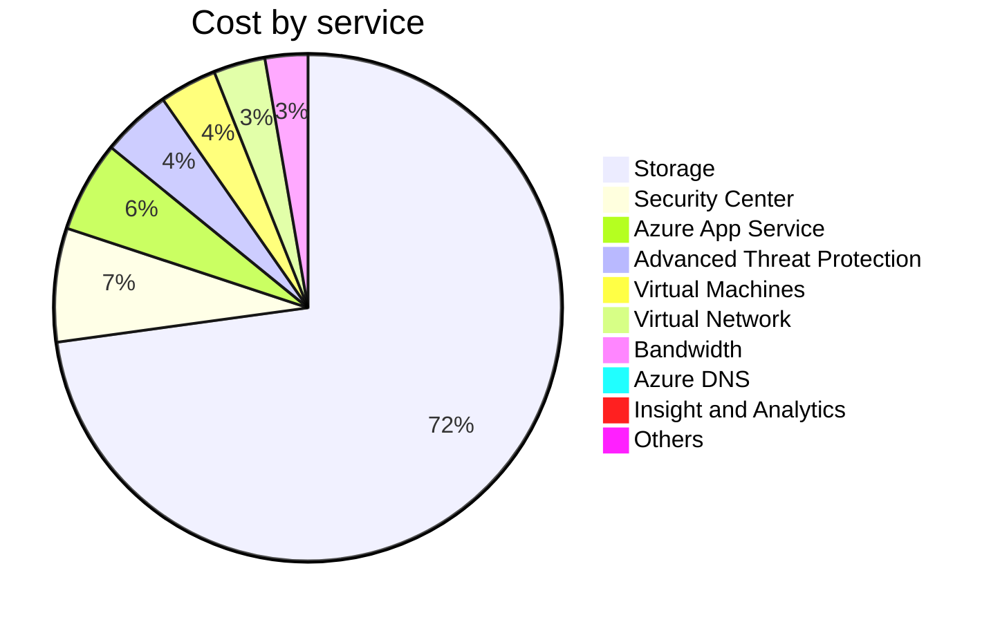

Fetching subscription details...
Fetching cost data...
Fetching forecasted cost data...
Fetching cost data by service name...
Fetching cost data by location...
Fetching cost data by resource group...
# Azure Cost Overview

> Accumulated cost for subscription id `JPF Pay-As-You-Go` from **09/01/2023** to **09/28/2023**

## Totals

|Period|Amount|
|---|---:|
|Today|0.10 USD|
|Yesterday|3.09 USD|
|Last 7 days|26.18 USD|
|Last 30 days|274.25 USD|

```mermaid
gantt
   title Accumulated cost
   dateFormat  X
   axisFormat %s
   section 01 Sep
   USD 6.35 :0, 635
   section 02 Sep
   USD 12.48 :0, 1248
   section 03 Sep
   USD 18.76 :0, 1876
   section 04 Sep
   USD 24.93 :0, 2493
   section 05 Sep
   USD 31.24 :0, 3124
   section 06 Sep
   USD 37.37 :0, 3737
   section 07 Sep
   USD 43.61 :0, 4361
   section 08 Sep
   USD 49.87 :0, 4987
   section 09 Sep
   USD 56.02 :0, 5602
   section 10 Sep
   USD 62.07 :0, 6207
   section 11 Sep
   USD 68.22 :0, 6822
   section 12 Sep
   USD 81.60 :0, 8160
   section 13 Sep
   USD 128.61 :0, 12861
   section 14 Sep
   USD 163.91 :0, 16391
   section 15 Sep
   USD 170.32 :0, 17032
   section 16 Sep
   USD 184.30 :0, 18430
   section 17 Sep
   USD 212.68 :0, 21268
   section 18 Sep
   USD 228.37 :0, 22837
   section 19 Sep
   USD 244.27 :0, 24427
   section 20 Sep
   USD 248.07 :0, 24807
   section 21 Sep
   USD 252.04 :0, 25204
   section 22 Sep
   USD 256.41 :0, 25641
   section 23 Sep
   USD 260.02 :0, 26002
   section 24 Sep
   USD 263.66 :0, 26366
   section 25 Sep
   USD 267.36 :0, 26736
   section 26 Sep
   USD 271.05 :0, 27105
   section 27 Sep
   USD 274.15 :0, 27415
   section 28 Sep
   USD 274.25 :0, 27425
   section 29 Sep
   USD 285.87 : done, 0, 28587
   section 30 Sep
   USD 297.42 : done, 0, 29742
```

## By Service Name

|Service|Amount|
|---|---:|
|Storage|198.78 USD|
|Security Center|19.78 USD|
|Azure App Service|15.85 USD|
|Advanced Threat Protection|12.12 USD|
|Virtual Machines|9.98 USD|
|Virtual Network|8.99 USD|
|Bandwidth|7.44 USD|
|Azure DNS|1.31 USD|
|Insight and Analytics|0.00 USD|
|Others|0.00 USD|

## By Location

|Location|Amount|
|---|---:|
|US North Central|228.53 USD|
|US Central|26.72 USD|
|Unassigned|12.03 USD|
|US East|5.66 USD|
|Unknown|1.31 USD|
|AP East|0.00 USD|
|EU West|0.00 USD|
|Intercontinental|0.00 USD|
|US East 2|0.00 USD|
|Others|0.00 USD|

## By Resource Group

|Resource Group|Amount|
|---|---:|
|personal-network|228.96 USD|
|personal-site|26.72 USD|
||12.03 USD|
|cloud-shell-storage-eastus|5.66 USD|
|personal-dns|0.88 USD|
|defaultresourcegroup-ncus|0.00 USD|
|azureapp-auto-alerts-873533-jpatrick_fulton_gmail_com|0.00 USD|

Generated at 2023-09-28 11:27:24 for subscription with id `4913be3f-a345-4652-9bba-767418dd25e3`
