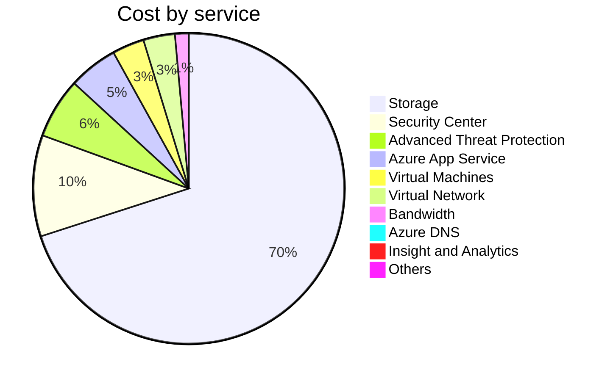
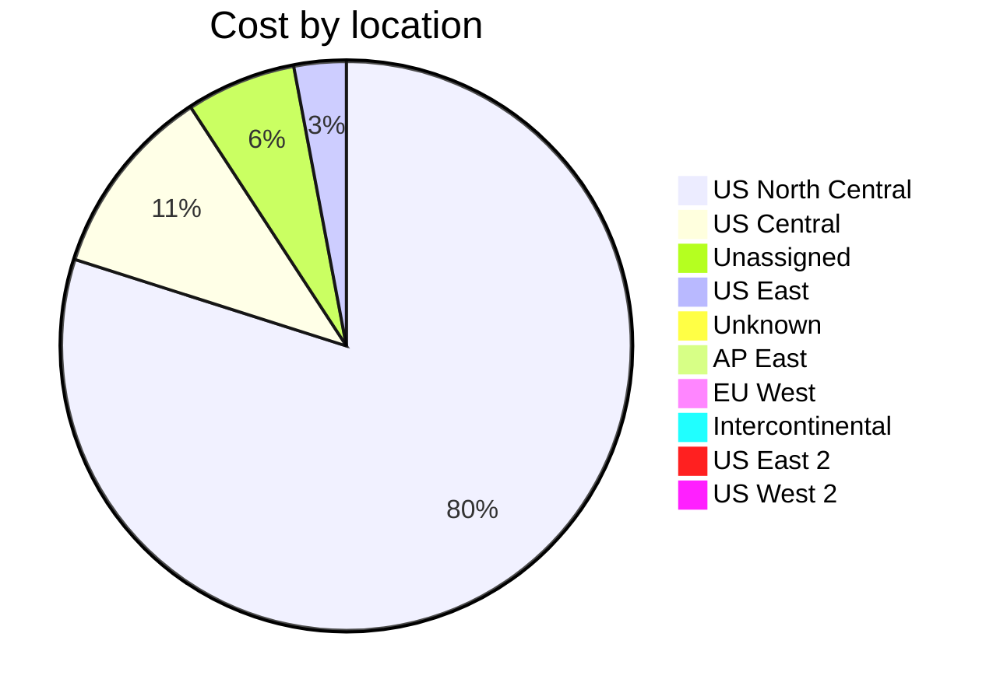
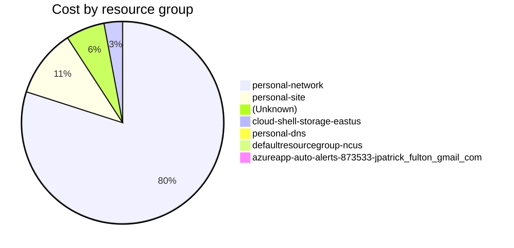

Fetching subscription details...
Fetching cost data...
Fetching forecasted cost data...
Fetching cost data by service name...
Fetching cost data by location...
Fetching cost data by resource group...
# Azure Cost Overview

> Accumulated cost for subscription id `JPF Pay-As-You-Go` from **09/01/2023** to **09/17/2023**

## Totals

|Period|Amount|
|---|---:|
|Today|5.58 USD|
|Yesterday|13.68 USD|
|Last 7 days|132.52 USD|
|Last 30 days|188.52 USD|

```mermaid
gantt
   title Accumulated cost
   dateFormat  X
   axisFormat %s
   section 01 Sep
   USD 6.35 :0, 635
   section 02 Sep
   USD 12.48 :0, 1248
   section 03 Sep
   USD 18.76 :0, 1876
   section 04 Sep
   USD 24.93 :0, 2493
   section 05 Sep
   USD 31.24 :0, 3124
   section 06 Sep
   USD 37.37 :0, 3737
   section 07 Sep
   USD 43.61 :0, 4361
   section 08 Sep
   USD 49.87 :0, 4987
   section 09 Sep
   USD 56.00 :0, 5600
   section 10 Sep
   USD 61.91 :0, 6191
   section 11 Sep
   USD 67.84 :0, 6784
   section 12 Sep
   USD 81.11 :0, 8111
   section 13 Sep
   USD 127.92 :0, 12792
   section 14 Sep
   USD 163.01 :0, 16301
   section 15 Sep
   USD 169.25 :0, 16925
   section 16 Sep
   USD 182.94 :0, 18294
   section 17 Sep
   USD 188.52 :0, 18852
   section 18 Sep
   USD 204.97 : done, 0, 20497
   section 19 Sep
   USD 221.93 : done, 0, 22193
   section 20 Sep
   USD 239.40 : done, 0, 23940
   section 21 Sep
   USD 257.32 : done, 0, 25732
   section 22 Sep
   USD 275.76 : done, 0, 27576
   section 23 Sep
   USD 294.62 : done, 0, 29462
   section 24 Sep
   USD 313.85 : done, 0, 31385
   section 25 Sep
   USD 333.45 : done, 0, 33345
   section 26 Sep
   USD 353.57 : done, 0, 35357
   section 27 Sep
   USD 374.19 : done, 0, 37419
   section 28 Sep
   USD 395.26 : done, 0, 39526
   section 29 Sep
   USD 416.86 : done, 0, 41686
   section 30 Sep
   USD 438.86 : done, 0, 43886
```

## By Service Name

|Service|Amount|
|---|---:|
|Storage|131.45 USD|
|Security Center|19.78 USD|
|Advanced Threat Protection|11.78 USD|
|Azure App Service|9.62 USD|
|Virtual Machines|6.25 USD|
|Virtual Network|6.16 USD|
|Bandwidth|2.69 USD|
|Azure DNS|0.79 USD|
|Insight and Analytics|0.00 USD|
|Others|0.00 USD|

## By Location

|Location|Amount|
|---|---:|
|US North Central|150.02 USD|
|US Central|20.46 USD|
|Unassigned|11.69 USD|
|US East|5.56 USD|
|Unknown|0.79 USD|
|AP East|0.00 USD|
|EU West|0.00 USD|
|Intercontinental|0.00 USD|
|US East 2|0.00 USD|
|US West 2|0.00 USD|

## By Resource Group

|Resource Group|Amount|
|---|---:|
|personal-network|150.29 USD|
|personal-site|20.46 USD|
||11.69 USD|
|cloud-shell-storage-eastus|5.56 USD|
|personal-dns|0.53 USD|
|defaultresourcegroup-ncus|0.00 USD|
|azureapp-auto-alerts-873533-jpatrick_fulton_gmail_com|0.00 USD|

Generated at 2023-09-17 20:44:36 for subscription with id `4913be3f-a345-4652-9bba-767418dd25e3`
