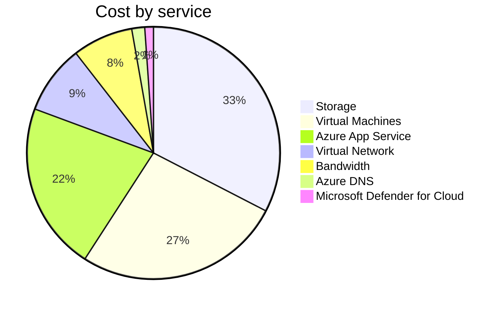
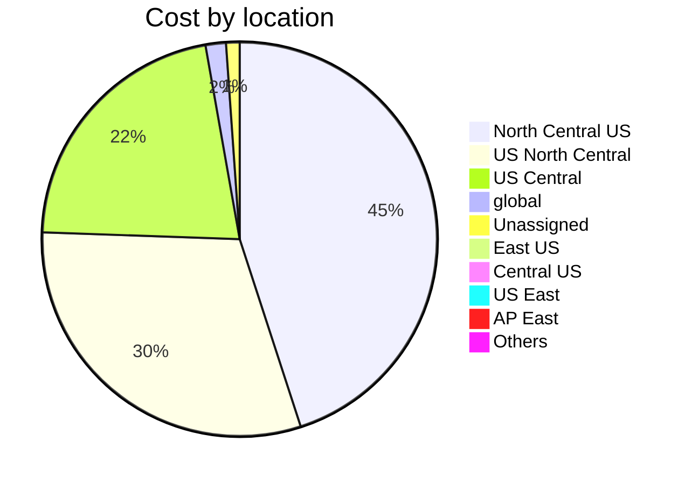

Fetching subscription details...
Fetching cost data...
Fetching forecasted cost data...
Fetching cost data by service name...
Fetching cost data by location...
Fetching cost data by resource group...
# Azure Cost Overview

> Accumulated cost for subscription id `JPF Pay-As-You-Go` from **11/01/2023** to **11/02/2023**

## Totals

|Period|Amount|
|---|---:|
|Today|0.11 USD|
|Yesterday|1.71 USD|
|Last 7 days|1.82 USD|
|Last 30 days|1.82 USD|

```mermaid
gantt
   title Accumulated cost
   dateFormat  X
   axisFormat %s
   section 01 Nov
   USD 1.71 :0, 171
   section 02 Nov
   USD 1.82 :0, 182
   section 03 Nov
   USD 4.02 : done, 0, 402
   section 04 Nov
   USD 6.09 : done, 0, 609
   section 05 Nov
   USD 7.96 : done, 0, 796
   section 06 Nov
   USD 9.95 : done, 0, 995
   section 07 Nov
   USD 11.98 : done, 0, 1198
   section 08 Nov
   USD 14.06 : done, 0, 1406
   section 09 Nov
   USD 16.10 : done, 0, 1610
   section 10 Nov
   USD 18.17 : done, 0, 1817
   section 11 Nov
   USD 20.10 : done, 0, 2010
   section 12 Nov
   USD 21.85 : done, 0, 2185
   section 13 Nov
   USD 23.71 : done, 0, 2371
   section 14 Nov
   USD 25.61 : done, 0, 2561
   section 15 Nov
   USD 27.55 : done, 0, 2755
   section 16 Nov
   USD 29.46 : done, 0, 2946
   section 17 Nov
   USD 31.40 : done, 0, 3140
   section 18 Nov
   USD 33.20 : done, 0, 3320
   section 19 Nov
   USD 34.81 : done, 0, 3481
   section 20 Nov
   USD 36.54 : done, 0, 3654
   section 21 Nov
   USD 38.31 : done, 0, 3831
   section 22 Nov
   USD 40.12 : done, 0, 4012
   section 23 Nov
   USD 41.89 : done, 0, 4189
   section 24 Nov
   USD 43.70 : done, 0, 4370
   section 25 Nov
   USD 45.37 : done, 0, 4537
   section 26 Nov
   USD 46.85 : done, 0, 4685
   section 27 Nov
   USD 48.45 : done, 0, 4845
   section 28 Nov
   USD 50.09 : done, 0, 5009
   section 29 Nov
   USD 51.77 : done, 0, 5177
   section 30 Nov
   USD 53.41 : done, 0, 5341
```

## By Service Name

|Service|Amount|
|---|---:|
|Storage|0.59 USD|
|Virtual Machines|0.48 USD|
|Azure App Service|0.39 USD|
|Virtual Network|0.16 USD|
|Bandwidth|0.14 USD|
|Azure DNS|0.03 USD|
|Microsoft Defender for Cloud|0.02 USD|

## By Location

|Location|Amount|
|---|---:|
|North Central US|0.81 USD|
|US North Central|0.55 USD|
|US Central|0.39 USD|
|global|0.03 USD|
|Unassigned|0.02 USD|
|East US|0.01 USD|
|Central US|0.00 USD|
|US East|0.00 USD|
|AP East|0.00 USD|
|Others|0.00 USD|

## By Resource Group

|Resource Group|Amount|
|---|---:|
|personal-network|1.37 USD|
|personal-site|0.40 USD|
|personal-dns|0.02 USD|
||0.02 USD|
|cloud-shell-storage-eastus|0.01 USD|

Generated at 2023-11-02 11:34:47 for subscription with id `4913be3f-a345-4652-9bba-767418dd25e3`
