Fetching subscription details...
Fetching cost data...
Fetching forecasted cost data...
Fetching cost data by service name...
Fetching cost data by location...
Fetching cost data by resource group...
# Azure Cost Overview

> Accumulated cost for subscription id `JPF Pay-As-You-Go` from **02/01/2024** to **02/28/2024**

## Totals

|Period|Amount|
|---|---:|
|Today|0.10 USD|
|Yesterday|2.04 USD|
|Last 7 days|16.14 USD|
|Last 30 days|70.86 USD|

```mermaid
gantt
   title Accumulated cost
   dateFormat  X
   axisFormat %s
   section 01 Feb
   USD 2.99 :0, 299
   section 02 Feb
   USD 6.68 :0, 668
   section 03 Feb
   USD 9.81 :0, 981
   section 04 Feb
   USD 12.83 :0, 1283
   section 05 Feb
   USD 15.90 :0, 1590
   section 06 Feb
   USD 18.73 :0, 1873
   section 07 Feb
   USD 21.64 :0, 2164
   section 08 Feb
   USD 25.07 :0, 2507
   section 09 Feb
   USD 27.84 :0, 2784
   section 10 Feb
   USD 30.50 :0, 3050
   section 11 Feb
   USD 32.67 :0, 3267
   section 12 Feb
   USD 34.81 :0, 3481
   section 13 Feb
   USD 37.49 :0, 3749
   section 14 Feb
   USD 40.04 :0, 4004
   section 15 Feb
   USD 42.46 :0, 4246
   section 16 Feb
   USD 45.08 :0, 4508
   section 17 Feb
   USD 47.38 :0, 4738
   section 18 Feb
   USD 49.80 :0, 4980
   section 19 Feb
   USD 52.21 :0, 5221
   section 20 Feb
   USD 54.72 :0, 5472
   section 21 Feb
   USD 57.09 :0, 5709
   section 22 Feb
   USD 59.29 :0, 5929
   section 23 Feb
   USD 61.44 :0, 6144
   section 24 Feb
   USD 63.78 :0, 6378
   section 25 Feb
   USD 66.59 :0, 6659
   section 26 Feb
   USD 68.72 :0, 6872
   section 27 Feb
   USD 70.75 :0, 7075
   section 28 Feb
   USD 70.86 :0, 7086
   section 29 Feb
   USD 73.21 : done, 0, 7321
```

## By Service Name

|Service|Amount|
|---|---:|
|Storage|24.77 USD|
|Azure App Service|15.93 USD|
|Bandwidth|12.23 USD|
|Virtual Machines|9.56 USD|
|Virtual Network|6.47 USD|
|Azure DNS|1.32 USD|
|Microsoft Defender for Cloud|0.58 USD|
|Azure Monitor|0.00 USD|
|Functions|0.00 USD|
|Log Analytics|0.00 USD|

## By Location

|Location|Amount|
|---|---:|
|US North Central|52.68 USD|
|US Central|15.99 USD|
|Unknown|1.32 USD|
|Unassigned|0.58 USD|
|US East|0.28 USD|
|AP East|0.00 USD|
|EU West|0.00 USD|
|US East 2|0.00 USD|
|US West|0.00 USD|
|US West 2|0.00 USD|

## By Resource Group

|Resource Group|Amount|
|---|---:|
|personal-network|53.11 USD|
|personal-site|15.99 USD|
|personal-dns|0.89 USD|
||0.58 USD|
|cloud-shell-storage-eastus|0.28 USD|
|azureapp-auto-alerts-873533-jpatrick_fulton_gmail_com|0.00 USD|

Generated at 2024-02-28 11:36:06 for subscription with id `4913be3f-a345-4652-9bba-767418dd25e3`
