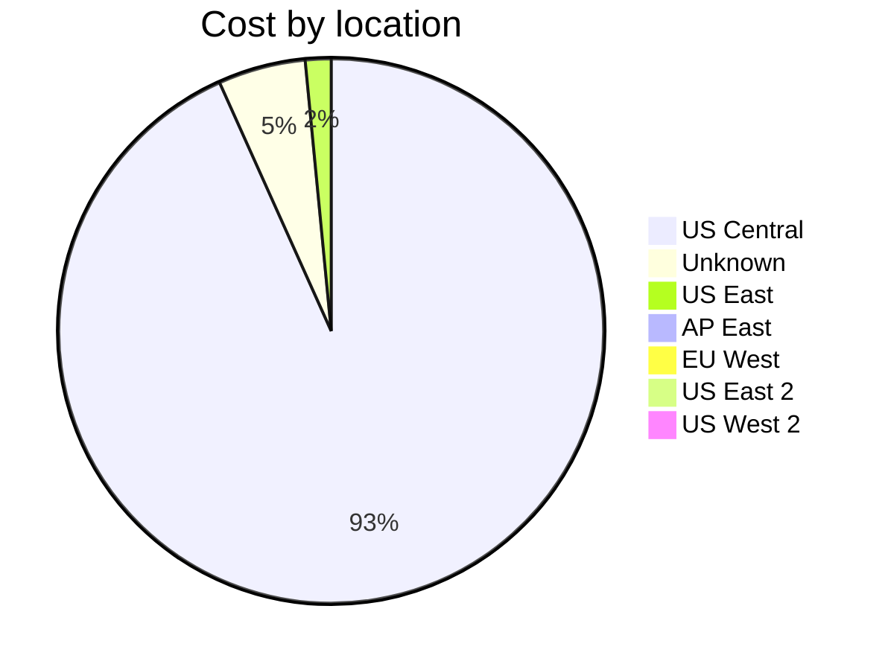

Fetching subscription details...
Fetching cost data...
Fetching forecasted cost data...
Fetching cost data by service name...
Fetching cost data by location...
Fetching cost data by resource group...
# Azure Cost Overview

> Accumulated cost for subscription id `JPF Pay-As-You-Go` from **07/01/2024** to **07/11/2024**

## Totals

|Period|Amount|
|---|---:|
|Today|0.00 USD|
|Yesterday|0.19 USD|
|Last 7 days|4.00 USD|
|Last 30 days|6.55 USD|

## By Service Name

|Service|Amount|
|---|---:|
|Azure App Service|6.09 USD|
|Azure DNS|0.34 USD|
|Storage|0.12 USD|
|Bandwidth|0.00 USD|
|Functions|0.00 USD|
|Log Analytics|0.00 USD|

## By Location

|Location|Amount|
|---|---:|
|US Central|6.11 USD|
|Unknown|0.34 USD|
|US East|0.10 USD|
|AP East|0.00 USD|
|EU West|0.00 USD|
|US East 2|0.00 USD|
|US West 2|0.00 USD|

## By Resource Group

|Resource Group|Amount|
|---|---:|
|personal-site|6.11 USD|
|personal-dns|0.34 USD|
|cloud-shell-storage-eastus|0.10 USD|

Generated at 2024-07-12 11:23:02 for subscription with id `4913be3f-a345-4652-9bba-767418dd25e3`
