Fetching subscription details...
Fetching cost data...
Fetching forecasted cost data...
Fetching cost data by service name...
Fetching cost data by location...
Fetching cost data by resource group...
# Azure Cost Overview

> Accumulated cost for subscription id `JPF Pay-As-You-Go` from **12/01/2023** to **12/21/2023**

## Totals

|Period|Amount|
|---|---:|
|Today|0.10 USD|
|Yesterday|2.05 USD|
|Last 7 days|15.33 USD|
|Last 30 days|46.44 USD|

```mermaid
gantt
   title Accumulated cost
   dateFormat  X
   axisFormat %s
   section 01 Dec
   USD 2.41 :0, 241
   section 02 Dec
   USD 4.93 :0, 493
   section 03 Dec
   USD 7.79 :0, 779
   section 04 Dec
   USD 10.04 :0, 1004
   section 05 Dec
   USD 12.27 :0, 1227
   section 06 Dec
   USD 15.11 :0, 1511
   section 07 Dec
   USD 17.58 :0, 1758
   section 08 Dec
   USD 19.73 :0, 1973
   section 09 Dec
   USD 22.14 :0, 2214
   section 10 Dec
   USD 24.43 :0, 2443
   section 11 Dec
   USD 26.71 :0, 2671
   section 12 Dec
   USD 28.92 :0, 2892
   section 13 Dec
   USD 31.12 :0, 3112
   section 14 Dec
   USD 33.32 :0, 3332
   section 15 Dec
   USD 35.47 :0, 3547
   section 16 Dec
   USD 37.65 :0, 3765
   section 17 Dec
   USD 39.82 :0, 3982
   section 18 Dec
   USD 42.07 :0, 4207
   section 19 Dec
   USD 44.30 :0, 4430
   section 20 Dec
   USD 46.34 :0, 4634
   section 21 Dec
   USD 46.44 :0, 4644
   section 22 Dec
   USD 48.54 : done, 0, 4854
   section 23 Dec
   USD 50.80 : done, 0, 5080
   section 24 Dec
   USD 52.88 : done, 0, 5288
   section 25 Dec
   USD 54.90 : done, 0, 5490
   section 26 Dec
   USD 56.88 : done, 0, 5688
   section 27 Dec
   USD 58.95 : done, 0, 5895
   section 28 Dec
   USD 61.06 : done, 0, 6106
   section 29 Dec
   USD 63.05 : done, 0, 6305
   section 30 Dec
   USD 65.20 : done, 0, 6520
   section 31 Dec
   USD 67.18 : done, 0, 6718
```

## By Service Name

|Service|Amount|
|---|---:|
|Storage|17.30 USD|
|Azure App Service|11.79 USD|
|Virtual Machines|7.95 USD|
|Virtual Network|4.78 USD|
|Bandwidth|3.02 USD|
|Azure DNS|0.98 USD|
|Microsoft Defender for Cloud|0.63 USD|
|Functions|0.00 USD|
|Log Analytics|0.00 USD|

## By Location

|Location|Amount|
|---|---:|
|US North Central|32.81 USD|
|US Central|11.83 USD|
|Unknown|0.98 USD|
|Unassigned|0.63 USD|
|US East|0.19 USD|
|AP East|0.00 USD|
|EU West|0.00 USD|
|US East 2|0.00 USD|
|US West 2|0.00 USD|

## By Resource Group

|Resource Group|Amount|
|---|---:|
|personal-network|33.13 USD|
|personal-site|11.83 USD|
|personal-dns|0.66 USD|
||0.63 USD|
|cloud-shell-storage-eastus|0.19 USD|

Generated at 2023-12-21 11:36:17 for subscription with id `4913be3f-a345-4652-9bba-767418dd25e3`
