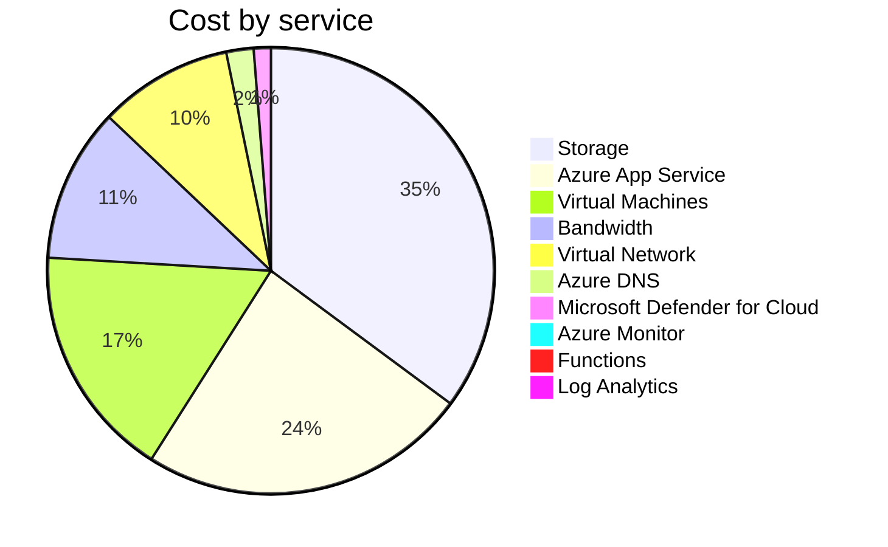

Fetching subscription details...
Fetching cost data...
Fetching forecasted cost data...
Fetching cost data by service name...
Fetching cost data by location...
Fetching cost data by resource group...
# Azure Cost Overview

> Accumulated cost for subscription id `JPF Pay-As-You-Go` from **01/01/2024** to **01/18/2024**

## Totals

|Period|Amount|
|---|---:|
|Today|0.10 USD|
|Yesterday|2.10 USD|
|Last 7 days|15.32 USD|
|Last 30 days|41.99 USD|

```mermaid
gantt
   title Accumulated cost
   dateFormat  X
   axisFormat %s
   section 01 Jan
   USD 2.68 :0, 268
   section 02 Jan
   USD 5.81 :0, 581
   section 03 Jan
   USD 8.29 :0, 829
   section 04 Jan
   USD 10.88 :0, 1088
   section 05 Jan
   USD 13.49 :0, 1349
   section 06 Jan
   USD 16.41 :0, 1641
   section 07 Jan
   USD 18.82 :0, 1882
   section 08 Jan
   USD 21.90 :0, 2190
   section 09 Jan
   USD 24.47 :0, 2447
   section 10 Jan
   USD 26.66 :0, 2666
   section 11 Jan
   USD 28.86 :0, 2886
   section 12 Jan
   USD 31.03 :0, 3103
   section 13 Jan
   USD 33.23 :0, 3323
   section 14 Jan
   USD 35.39 :0, 3539
   section 15 Jan
   USD 37.56 :0, 3756
   section 16 Jan
   USD 39.78 :0, 3978
   section 17 Jan
   USD 41.88 :0, 4188
   section 18 Jan
   USD 41.99 :0, 4199
   section 19 Jan
   USD 44.42 : done, 0, 4442
   section 20 Jan
   USD 46.99 : done, 0, 4699
   section 21 Jan
   USD 49.28 : done, 0, 4928
   section 22 Jan
   USD 51.71 : done, 0, 5171
   section 23 Jan
   USD 54.29 : done, 0, 5429
   section 24 Jan
   USD 56.53 : done, 0, 5653
   section 25 Jan
   USD 58.78 : done, 0, 5878
   section 26 Jan
   USD 61.20 : done, 0, 6120
   section 27 Jan
   USD 63.76 : done, 0, 6376
   section 28 Jan
   USD 66.04 : done, 0, 6604
   section 29 Jan
   USD 68.46 : done, 0, 6846
   section 30 Jan
   USD 71.03 : done, 0, 7103
   section 31 Jan
   USD 73.26 : done, 0, 7326
```

## By Service Name

|Service|Amount|
|---|---:|
|Storage|14.75 USD|
|Azure App Service|10.01 USD|
|Virtual Machines|7.11 USD|
|Bandwidth|4.68 USD|
|Virtual Network|4.07 USD|
|Azure DNS|0.83 USD|
|Microsoft Defender for Cloud|0.52 USD|
|Azure Monitor|0.00 USD|
|Functions|0.00 USD|
|Log Analytics|0.00 USD|

## By Location

|Location|Amount|
|---|---:|
|US North Central|30.42 USD|
|US Central|10.05 USD|
|Unknown|0.83 USD|
|Unassigned|0.52 USD|
|US East|0.16 USD|
|AP East|0.00 USD|
|EU West|0.00 USD|
|US East 2|0.00 USD|
|US West|0.00 USD|
|US West 2|0.00 USD|

## By Resource Group

|Resource Group|Amount|
|---|---:|
|personal-network|30.69 USD|
|personal-site|10.05 USD|
|personal-dns|0.56 USD|
||0.52 USD|
|cloud-shell-storage-eastus|0.16 USD|
|azureapp-auto-alerts-873533-jpatrick_fulton_gmail_com|0.00 USD|

Generated at 2024-01-18 11:35:46 for subscription with id `4913be3f-a345-4652-9bba-767418dd25e3`
