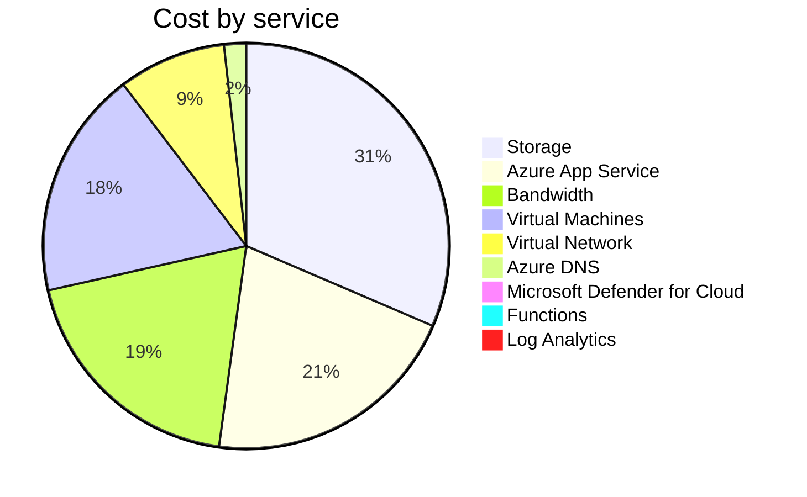

Fetching subscription details...
Fetching cost data...
Fetching forecasted cost data...
Fetching cost data by service name...
Fetching cost data by location...
Fetching cost data by resource group...
# Azure Cost Overview

> Accumulated cost for subscription id `JPF Pay-As-You-Go` from **01/01/2024** to **01/03/2024**

## Totals

|Period|Amount|
|---|---:|
|Today|0.10 USD|
|Yesterday|2.53 USD|
|Last 7 days|5.17 USD|
|Last 30 days|5.17 USD|

```mermaid
gantt
   title Accumulated cost
   dateFormat  X
   axisFormat %s
   section 01 Jan
   USD 2.54 :0, 254
   section 02 Jan
   USD 5.07 :0, 507
   section 03 Jan
   USD 5.17 :0, 517
   section 04 Jan
   USD 7.39 : done, 0, 739
   section 05 Jan
   USD 9.49 : done, 0, 949
   section 06 Jan
   USD 11.81 : done, 0, 1181
   section 07 Jan
   USD 14.14 : done, 0, 1414
   section 08 Jan
   USD 16.55 : done, 0, 1655
   section 09 Jan
   USD 18.74 : done, 0, 1874
   section 10 Jan
   USD 20.92 : done, 0, 2092
   section 11 Jan
   USD 23.08 : done, 0, 2308
   section 12 Jan
   USD 25.12 : done, 0, 2512
   section 13 Jan
   USD 27.39 : done, 0, 2739
   section 14 Jan
   USD 29.66 : done, 0, 2966
   section 15 Jan
   USD 32.01 : done, 0, 3201
   section 16 Jan
   USD 34.15 : done, 0, 3415
   section 17 Jan
   USD 36.27 : done, 0, 3627
   section 18 Jan
   USD 38.38 : done, 0, 3838
   section 19 Jan
   USD 40.37 : done, 0, 4037
   section 20 Jan
   USD 42.58 : done, 0, 4258
   section 21 Jan
   USD 44.79 : done, 0, 4479
   section 22 Jan
   USD 47.09 : done, 0, 4709
   section 23 Jan
   USD 49.18 : done, 0, 4918
   section 24 Jan
   USD 51.24 : done, 0, 5124
   section 25 Jan
   USD 53.30 : done, 0, 5330
   section 26 Jan
   USD 55.23 : done, 0, 5523
   section 27 Jan
   USD 57.38 : done, 0, 5738
   section 28 Jan
   USD 59.54 : done, 0, 5954
   section 29 Jan
   USD 61.79 : done, 0, 6179
   section 30 Jan
   USD 63.81 : done, 0, 6381
   section 31 Jan
   USD 65.82 : done, 0, 6582
```

## By Service Name

|Service|Amount|
|---|---:|
|Storage|1.61 USD|
|Azure App Service|1.06 USD|
|Bandwidth|0.99 USD|
|Virtual Machines|0.93 USD|
|Virtual Network|0.44 USD|
|Azure DNS|0.09 USD|
|Microsoft Defender for Cloud|0.05 USD|
|Functions|0.00 USD|
|Log Analytics|0.00 USD|

## By Location

|Location|Amount|
|---|---:|
|US North Central|3.95 USD|
|US Central|1.06 USD|
|Unknown|0.09 USD|
|Unassigned|0.05 USD|
|US East|0.02 USD|
|AP East|0.00 USD|
|EU West|0.00 USD|
|US East 2|0.00 USD|
|US West 2|0.00 USD|

## By Resource Group

|Resource Group|Amount|
|---|---:|
|personal-network|3.98 USD|
|personal-site|1.06 USD|
|personal-dns|0.06 USD|
||0.05 USD|
|cloud-shell-storage-eastus|0.02 USD|

Generated at 2024-01-03 11:34:30 for subscription with id `4913be3f-a345-4652-9bba-767418dd25e3`
