Fetching subscription details...
Fetching cost data...
Fetching forecasted cost data...
Fetching cost data by service name...
Fetching cost data by location...
Fetching cost data by resource group...
# Azure Cost Overview

> Accumulated cost for subscription id `JPF Pay-As-You-Go` from **05/01/2024** to **05/06/2024**

## Totals

|Period|Amount|
|---|---:|
|Today|0.00 USD|
|Yesterday|0.56 USD|
|Last 7 days|3.74 USD|
|Last 30 days|3.74 USD|

```mermaid
gantt
   title Accumulated cost
   dateFormat  X
   axisFormat %s
   section 01 May
   USD 0.64 :0, 64
   section 02 May
   USD 1.27 :0, 127
   section 03 May
   USD 1.91 :0, 191
   section 04 May
   USD 2.55 :0, 255
   section 05 May
   USD 3.18 :0, 318
   section 06 May
   USD 3.74 :0, 374
   section 07 May
   USD 4.38 : done, 0, 438
   section 08 May
   USD 5.01 : done, 0, 501
   section 09 May
   USD 5.65 : done, 0, 565
   section 10 May
   USD 6.29 : done, 0, 629
   section 11 May
   USD 6.92 : done, 0, 692
   section 12 May
   USD 7.56 : done, 0, 756
   section 13 May
   USD 8.20 : done, 0, 820
   section 14 May
   USD 8.83 : done, 0, 883
   section 15 May
   USD 9.47 : done, 0, 947
   section 16 May
   USD 10.11 : done, 0, 1011
   section 17 May
   USD 10.74 : done, 0, 1074
   section 18 May
   USD 11.38 : done, 0, 1138
   section 19 May
   USD 12.02 : done, 0, 1202
   section 20 May
   USD 12.65 : done, 0, 1265
   section 21 May
   USD 13.29 : done, 0, 1329
   section 22 May
   USD 13.93 : done, 0, 1393
   section 23 May
   USD 14.56 : done, 0, 1456
   section 24 May
   USD 15.20 : done, 0, 1520
   section 25 May
   USD 15.84 : done, 0, 1584
   section 26 May
   USD 16.47 : done, 0, 1647
   section 27 May
   USD 17.11 : done, 0, 1711
   section 28 May
   USD 17.75 : done, 0, 1775
   section 29 May
   USD 18.38 : done, 0, 1838
   section 30 May
   USD 19.02 : done, 0, 1902
   section 31 May
   USD 19.65 : done, 0, 1965
```

## By Service Name

|Service|Amount|
|---|---:|
|Azure App Service|3.48 USD|
|Azure DNS|0.19 USD|
|Storage|0.07 USD|
|Bandwidth|0.00 USD|
|Functions|0.00 USD|
|Log Analytics|0.00 USD|

## By Location

|Location|Amount|
|---|---:|
|US Central|3.49 USD|
|Unknown|0.19 USD|
|US East|0.06 USD|
|AP East|0.00 USD|
|EU West|0.00 USD|
|US East 2|0.00 USD|
|US West 2|0.00 USD|

## By Resource Group

|Resource Group|Amount|
|---|---:|
|personal-site|3.49 USD|
|personal-dns|0.19 USD|
|cloud-shell-storage-eastus|0.06 USD|

Generated at 2024-05-07 11:22:09 for subscription with id `4913be3f-a345-4652-9bba-767418dd25e3`
