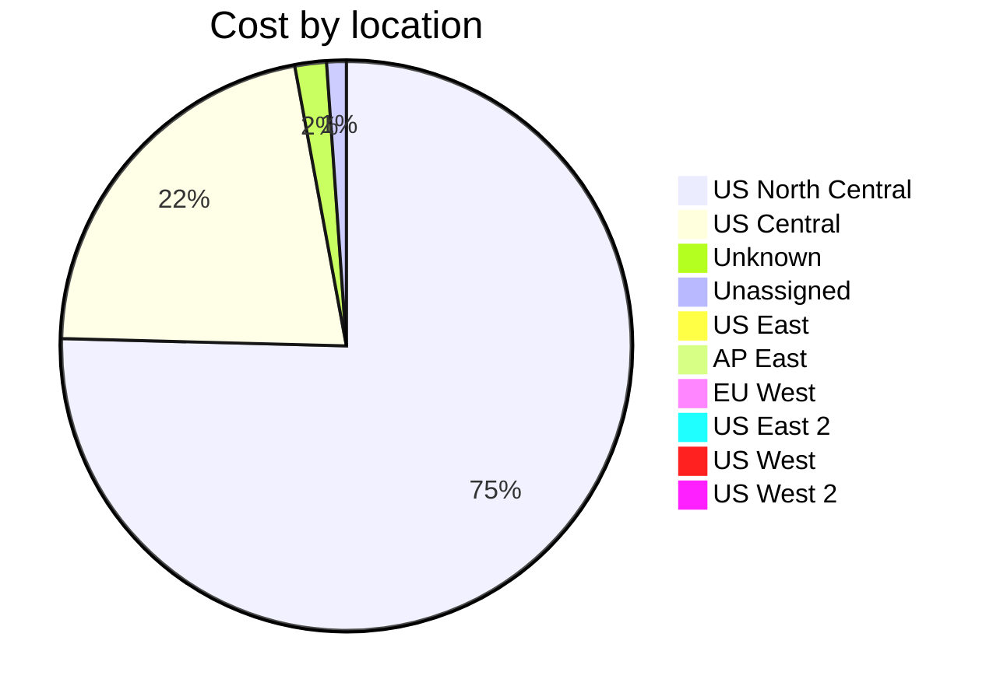

Fetching subscription details...
Fetching cost data...
Fetching forecasted cost data...
Fetching cost data by service name...
Fetching cost data by location...
Fetching cost data by resource group...
# Azure Cost Overview

> Accumulated cost for subscription id `JPF Pay-As-You-Go` from **01/01/2024** to **01/28/2024**

## Totals

|Period|Amount|
|---|---:|
|Today|0.09 USD|
|Yesterday|3.68 USD|
|Last 7 days|19.63 USD|
|Last 30 days|74.02 USD|

```mermaid
gantt
   title Accumulated cost
   dateFormat  X
   axisFormat %s
   section 01 Jan
   USD 2.68 :0, 268
   section 02 Jan
   USD 5.81 :0, 581
   section 03 Jan
   USD 8.29 :0, 829
   section 04 Jan
   USD 10.88 :0, 1088
   section 05 Jan
   USD 13.49 :0, 1349
   section 06 Jan
   USD 16.41 :0, 1641
   section 07 Jan
   USD 18.82 :0, 1882
   section 08 Jan
   USD 21.90 :0, 2190
   section 09 Jan
   USD 24.54 :0, 2454
   section 10 Jan
   USD 26.86 :0, 2686
   section 11 Jan
   USD 29.45 :0, 2945
   section 12 Jan
   USD 32.06 :0, 3206
   section 13 Jan
   USD 35.16 :0, 3516
   section 14 Jan
   USD 37.36 :0, 3736
   section 15 Jan
   USD 39.67 :0, 3967
   section 16 Jan
   USD 43.10 :0, 4310
   section 17 Jan
   USD 45.87 :0, 4587
   section 18 Jan
   USD 48.53 :0, 4853
   section 19 Jan
   USD 51.23 :0, 5123
   section 20 Jan
   USD 54.39 :0, 5439
   section 21 Jan
   USD 57.08 :0, 5708
   section 22 Jan
   USD 59.79 :0, 5979
   section 23 Jan
   USD 62.44 :0, 6244
   section 24 Jan
   USD 64.87 :0, 6487
   section 25 Jan
   USD 67.35 :0, 6735
   section 26 Jan
   USD 70.26 :0, 7026
   section 27 Jan
   USD 73.94 :0, 7394
   section 28 Jan
   USD 74.02 :0, 7402
   section 29 Jan
   USD 76.76 : done, 0, 7676
   section 30 Jan
   USD 79.70 : done, 0, 7970
   section 31 Jan
   USD 82.20 : done, 0, 8220
```

## By Service Name

|Service|Amount|
|---|---:|
|Storage|23.50 USD|
|Azure App Service|15.93 USD|
|Bandwidth|14.74 USD|
|Virtual Machines|11.22 USD|
|Virtual Network|6.48 USD|
|Azure DNS|1.32 USD|
|Microsoft Defender for Cloud|0.82 USD|
|Azure Monitor|0.00 USD|
|Functions|0.00 USD|
|Log Analytics|0.00 USD|

## By Location

|Location|Amount|
|---|---:|
|US North Central|55.62 USD|
|US Central|15.99 USD|
|Unknown|1.32 USD|
|Unassigned|0.82 USD|
|US East|0.26 USD|
|AP East|0.00 USD|
|EU West|0.00 USD|
|US East 2|0.00 USD|
|US West|0.00 USD|
|US West 2|0.00 USD|

## By Resource Group

|Resource Group|Amount|
|---|---:|
|personal-network|56.06 USD|
|personal-site|15.99 USD|
|personal-dns|0.89 USD|
||0.82 USD|
|cloud-shell-storage-eastus|0.26 USD|
|azureapp-auto-alerts-873533-jpatrick_fulton_gmail_com|0.00 USD|

Generated at 2024-01-28 11:36:08 for subscription with id `4913be3f-a345-4652-9bba-767418dd25e3`
